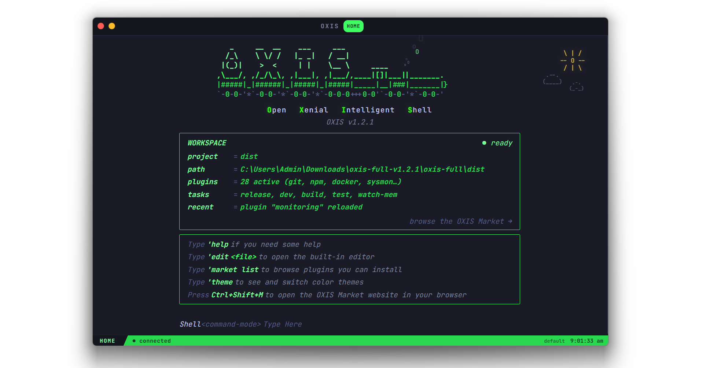
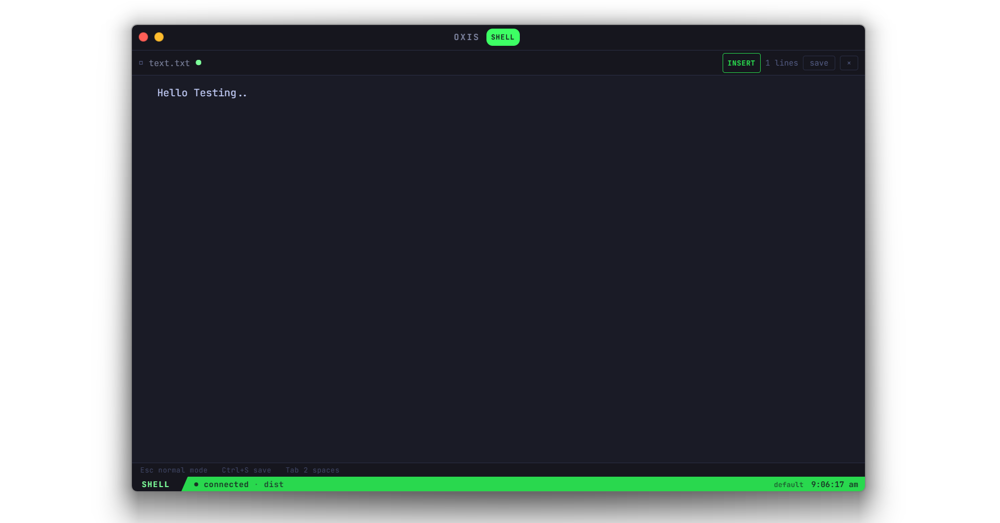
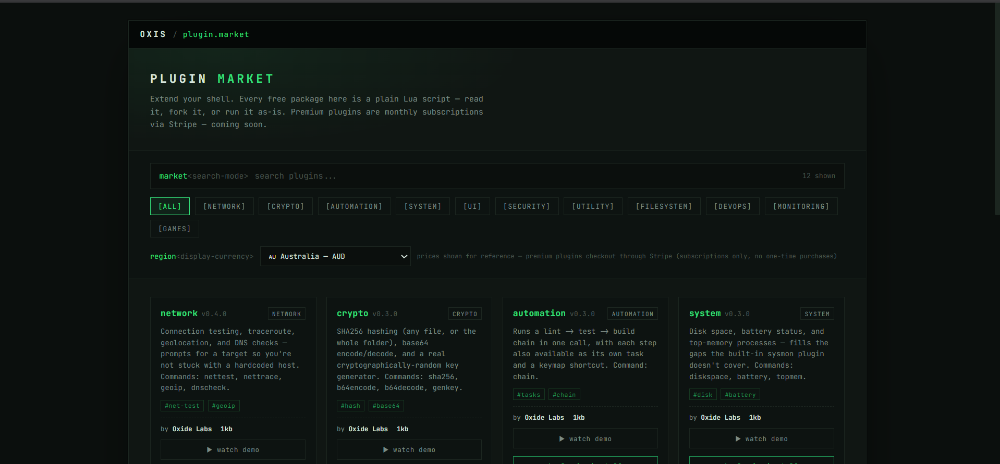

# OXIS

**OXIS is a terminal app for Windows and Linux** — the same
kind of program as Command Prompt, PowerShell, or iTerm2, except it's
built to be customized. It works as a normal terminal right out of
the box (every command you already know still works, unchanged), and
on top of that it adds its own commands, a built-in code editor, a
plugin system, and a marketplace to install other people's plugins —
all of it scriptable using [Lua](https://www.lua.org/), a small,
easy-to-learn language. ("OXIS" stands for **O**pen **X**enial
**I**ntelligent **S**hell — the name you'll see spelled out inside
the app itself.)

> Terminals were the beginning.

## What can it actually do?

- **It's a real terminal first.** Open OXIS and you get your actual
  PowerShell or bash shell running exactly as it always has —
  nothing about your existing commands, scripts, or muscle memory
  changes.
- **It also has its own commands.** Type an apostrophe (`'`) and
  OXIS's own commands take over: `'edit` opens a file in the built-in
  editor, `'market` browses installable plugins, `'theme` changes how
  everything looks, and there are dozens more — type `'help` any
  time to see them.
- **A built-in code editor** — `'edit myfile.txt` opens it right
  there in the same window, with real syntax highlighting and proper
  multi-line editing, no separate app to switch to.
- **Plugins, written in Lua.** Anyone can write a small script that
  adds a new command, a keyboard shortcut, or an automatic behavior.
  Browse and install other people's plugins for free from the
  built-in Market (`'market list`), or write your own (`'plugin new`).
- **Workspaces** save a project's own setup — its commands, tasks,
  and plugins — so opening that project's folder again automatically
  sets everything back up the way you left it.
- **Runs as a real desktop app** on Windows and Linux (pre-built
  binaries for both — see [Getting Started](#getting-started) for the
  honest caveat on macOS), or as a plain web page in a browser with
  reduced functionality (no filesystem access) if that's all you have.

New here and just want to try it? [Getting Started](#getting-started)
has the actual install/build steps. Everything past that point in
this document is a deep technical reference — how the terminal, the
plugin system, the Lua API, and everything else actually works —
aimed at people writing plugins or contributing to OXIS itself, not
required reading just to use it day to day.

---

Status tags used throughout this document: **[shipped]** — in the
current codebase today, **[in progress]** — partially built, **[planned]**
— designed and specified here, not yet implemented. See the
[Roadmap Status Key](#roadmap-status-key) at the bottom for the full list.

---

## Table of Contents

- [What can it actually do?](#what-can-it-actually-do)
- [Overview](#overview)
- [Available Now — v1.2.1](#available-now--v121)
- [Coming Soon — v1.2.2](#coming-soon--v122)
- [Architecture](#architecture)
- [Input Modes](#input-modes)
- [Browser Mode](#browser-mode)
- [Home Screen & Workspace Panel](#home-screen--workspace-panel)
- [Plugin Marketplace](#plugin-marketplace)
- [Directory Structure](#directory-structure)
- [Cloudflare Deployment](#cloudflare-deployment)
- [Getting Started](#getting-started)
- [Continuous Integration](#continuous-integration)
- [Plugin System](#plugin-system)
- [Core System APIs](#core-system-apis)
- [Lua API](#lua-api)
- [Theme System](#theme-system)
- [Workspace System](#workspace-system)
- [Command Registry](#command-registry)
- [Event System](#event-system)
- [Keybind System](#keybind-system)
- [Git Integration](#git-integration)
- [PTY Architecture](#pty-architecture)
- [Task Runner](#task-runner)
- [Built-in Editor](#built-in-editor)
- [Diagnostics & Plugin Doctor](#diagnostics--plugin-doctor)
- [Backup, Restore & Export](#backup-restore--export)
- [Settings](#settings)
- [Auto-Update](#auto-update)
- [Session Management](#session-management)
- [OXIS Market — Subscriptions & Premium Plugins](#oxis-market--subscriptions--premium-plugins)
- [Premium Plugin Licensing & Encryption](#premium-plugin-licensing--encryption)
- [AI DevOps (Flagship Plugin)](#ai-devops-flagship-plugin)
- [Third-Party Developer Marketplace](#third-party-developer-marketplace)
- [Open Source & Licensing Model](#open-source--licensing-model)
- [Plugin Development Guide](#plugin-development-guide)
- [Theme Creation Guide](#theme-creation-guide)
- [Workspace Creation Guide](#workspace-creation-guide)
- [Contribution Guide](#contribution-guide)
- [Roadmap Status Key](#roadmap-status-key)

---

## Overview

The plain-language version of this is above, in [What can it actually
do?](#what-can-it-actually-do). This section is the same idea stated
as an engineering philosophy, for anyone who wants that framing: OXIS
treats the terminal, editor, themes, commands, keymaps, plugins, and
workspaces as one connected system, and makes all of it scriptable
through Lua rather than locking any of it behind native-code-only
configuration.

```
OxiShell Core
├── Terminal (PTY ↔ WebSocket ↔ Browser)
├── Editor   (built-in, no external app)
├── Workspaces
├── Commands (registry + Lua)
├── Themes   (JSON + hot-reload)
├── Keymaps  (user-defined via Lua)
└── Plugins
      ↓
     Lua
```

---

## Available Now — v1.2.1

Everything in this list is real, working code in this repository
today, not a roadmap item:

- **Full programmable terminal** — real PTY (PowerShell/bash) behind
  a WebSocket, with Command Mode (`'command`) layered on top of
  ordinary Shell Mode — see [Input Modes](#input-modes)
- **Lua plugins** — a real embedded Lua VM (fengari) per plugin, with
  a genuine API surface: commands (now with real argument passing),
  keymaps scoped per input mode, tasks, events, themes, workspace
  hooks, and permissioned `oxis.fs`/`oxis.process`/`oxis.net`/`oxis.system`
  access — see [Plugin System](#plugin-system) and [Core System
  APIs](#core-system-apis)
- **Free OXIS Market** — `'market list/search/info/install` really
  fetch and install community Lua plugins over HTTPS — see [Plugin
  Marketplace](#plugin-marketplace)
- **Workspaces** — `'workspace init/info/reload/close`, real
  `.oxis/workspace.lua` files, and automatic detection when you `cd`
  into a project that has one — see [Workspace System](#workspace-system)
- **Editor** — built-in, with real modal Normal/Insert/Visual editing
  (not just a plain textarea) — see [Built-in Editor](#built-in-editor)
- **Auto-update check** — compares the running build against
  `gitlab.com/oxidelab/oxis`'s latest published Release and surfaces a
  one-line notice + `'update` to open the download — see
  [Auto-Update](#auto-update)
- **Themes** — JSON-defined, hot-reloadable, Lua-controllable
- **Automation** — tasks, keymaps, and event hooks (`oxis.autocmd`)
  that plugins and workspace files can register
- **Tasks** — `'task <name>`, declared via `oxis.task(...)` from any
  plugin or workspace file
- **Sessions** — tabs, active theme, workspace path, and command
  history persist across restarts
- **Browser mode** — OXIS also runs as a plain web page (no native
  window), with graceful degradation for anything that needs real
  filesystem access — see [Browser Mode](#browser-mode)

## Coming Soon — v1.2.2

These are **not purchasable or usable yet** — every one is marked
`comingSoon: true` in the Market and blocked from checkout — but the
underlying infrastructure is already built and integrated against
Stripe **test mode** today, not just designed on paper:

- **Premium Market subscriptions** — real Stripe Checkout session
  creation, a real webhook that issues licenses on `checkout.session.completed`,
  and real KV-backed license storage all exist now
  ([OXIS Market](#oxis-market--subscriptions--premium-plugins))
- **AI DevOps subscription** — the plugin itself is real and makes
  real AI API calls (bring your own key) today; what's missing is a
  live Stripe Price to subscribe to ([AI DevOps](#ai-devops-flagship-plugin))
- **Third-party paid plugins** — Stripe Connect Express onboarding
  and account-status checking are real, working endpoints; what's
  missing is a publishing UI for developers to list a plugin against
  their own account ([Third-Party Developer Marketplace](#third-party-developer-marketplace))
- **Developer payouts** — the 75/25 split is implemented via Stripe
  Connect destination charges (`application_fee_percent` +
  `transfer_data.destination`) and has been verified to produce
  correct request payloads; it activates the moment a developer's
  Connect account passes verification and their plugin gets a real
  Stripe Price ID

Production payments stay off until Stripe account verification is
complete — see [OXIS Market](#oxis-market--subscriptions--premium-plugins)
for exactly what's real vs. what's gated.

---

## Architecture

OXIS runs as a single native desktop window, built with [Wails v2](https://wails.io) — a Go backend driving a Chromium/WebKit webview, with no browser tab, no Electron, and no separate server process to manage day-to-day.

```
┌────────────────────────────────────────────────────────┐
│   OXIS  (native window — frameless, custom titlebar)     │
│                                                            │
│  ┌──────────────────────────────────────────────────┐   │
│  │  React + TypeScript (Vite)                         │   │
│  │                                                     │   │
│  │  Titlebar (traffic lights, drag) · tabs · home     │   │
│  │  terminal · editor · status                        │   │
│  │                                                     │   │
│  │  terminal/   plugins/   themes/   pty/              │   │
│  └───────────────────────┬──────────────────────────────┘   │
│                          │ Wails' own AssetServer —          │
│                          │ direct in-process request          │
│                          │ interception, no TCP socket        │
└──────────────────────────┼──────────────────────────────────┘
                           │
                           │  (separately, for the PTY only)
                           ▼
┌──────────────────────────────────────────────────────────┐
│  internal/server.Listen()  — a real TCP listener on        │
│  127.0.0.1, started alongside the native window             │
│                                                              │
│  /ws  → PTY (PowerShell/bash)     everything else → the      │
│  same frontend build, so a plain browser pointed at          │
│  http://127.0.0.1:1420 gets the full app too                 │
└──────────────────────────────────────────────────────────┘
```

`internal/wailsapp` owns the window: it embeds the built frontend
directly as the window's `AssetServer.Assets` (Wails' standard
embedded-filesystem path), so `window.go`/`window.runtime` are
injected into the one document the window ever loads — no navigation,
no redirect. `cmd/oxi/main.go` is a two-line entry point that just
calls `wailsapp.Run()`.

Wails' `AssetServer` intercepts requests through the native webview's
own API rather than a real `net.Conn`, so it can't perform the
`Hijack` a WebSocket upgrade needs. `internal/server.Listen()` runs a
second, genuine HTTP server on a real port (127.0.0.1:1420 by
default) purely for that — and, since it needs a real socket anyway,
also serves the same frontend build on it. That's what makes
`http://127.0.0.1:1420` work as a quick way to open OXIS in an
ordinary browser tab, completely independent of the native window
(see [Browser Mode](#browser-mode)).

The custom titlebar (`components/Titlebar.tsx`) only renders inside
the native window — a plain browser tab has its own chrome and
doesn't need one (see `isNativeApp()` in `frontend/src/native.ts`).
Where it does render, it exists because the native window is
frameless: Wails injects `window.runtime`, which gives the titlebar
direct access to `WindowMinimise` / `Quit` for its window controls,
and a `--wails-draggable: drag` CSS property makes the bar itself
draggable. (There's deliberately no maximise control — the window's
size is locked.)

---

## Input Modes

OXIS is not a single-mode command box. A shell that only understood
`'commands` and nothing else would be little more than a launcher —
so OXIS is built around several distinct input modes, each with a
clear purpose. The status bar always shows which mode is active.

| Mode          | Status        | Trigger                     | Purpose                                                             |
|---------------|---------------|------------------------------|----------------------------------------------------------------------|
| **Shell Mode**    | [shipped]     | default, in any terminal tab | Raw passthrough to the PTY (PowerShell/bash) — ordinary shell usage, no OXIS involvement |
| **Command Mode**  | [shipped]     | line starts with `'`         | Dispatches to the OXIS command registry (`'plugin`, `'theme`, `'market`, `'workspace`, Lua-registered commands, etc.) |
| **Home Mode**     | [shipped]     | `view === "home"`            | The dashboard/workspace screen shown on launch and via `'home` |
| **Normal Mode**   | [shipped]     | built-in editor, default     | Vim-style navigation/editing inside `'edit <file>` — hjkl/0/$/gg/G/w/b motion, x/dd/dw/o/O edits; no text is inserted |
| **Insert Mode**   | [shipped]     | `i`/`a`/`o`/etc. from Normal Mode | Free text entry inside the built-in editor — the textarea is `readOnly` outside this mode, so typing literally can't reach the buffer except here |
| **Visual Mode**   | [shipped]     | `v` from Normal Mode         | Character-range selection for delete (`d`/`x`) and yank (`y`, via the real clipboard) |
| **Search Mode**   | [planned]     | `/` in terminal or editor    | Incremental search through scrollback, command history, or open buffer |

Command Mode is deliberately just one of these, not the whole
interface — it's the entry point for OXIS's own functionality
(plugins, themes, the market, workspaces), while Shell Mode stays a
completely unmodified terminal for everything else. The editor's
Normal/Insert/Visual split follows the same reasoning: navigating,
editing, and selecting text are different enough tasks that
overloading them onto one mode makes both harder to use. Lua plugins
can register keymaps per-mode (`oxis.keymap("normal", ...)`,
`oxis.keymap("insert", ...)`, `oxis.keymap("visual", ...)`) — this is
real and enforced: `keybinds.ts` tracks which mode is currently
"live" and a mode-scoped bind simply doesn't fire outside it, rather
than the mode argument being silently ignored (which is what it
actually did before this was wired up).

Mode transitions fire a real `"mode_changed"` event (see [Event
System](#event-system)) that plugins can subscribe to — for example,
a status-line plugin can change color per-mode, or a plugin can
disable certain keymaps while in Insert Mode to avoid colliding with
normal typing.

---

## Browser Mode

OXIS doesn't strictly require the native window. With `oxis.exe`
running, point any browser at:

```
http://127.0.0.1:1420
```

and you get the same app — same terminal, same plugins, same PTY —
served by the same local HTTP server the native window uses for its
own PTY connection (see [Architecture](#architecture)). The custom
titlebar is skipped in this mode (an ordinary browser tab already has
window controls), and OXIS stops intercepting OS/browser shortcuts
like Ctrl+W or Ctrl+R, since those belong to the browser here, not to
OXIS.

If port 1420 is already taken, OXIS tries the next few ports up —
check the terminal output (or Task Manager) for the one actually
bound if 1420 doesn't respond.

---

## Home Screen & Workspace Panel

**[shipped]** — the ASCII banner, help box, command line, and the
Workspace panel itself all ship today.

**[shipped]** `'hide workspace` hides the WORKSPACE panel on Home;
`'show workspace` brings it back. Persisted (survives a restart) via
the same option store `'config`/`oxis.getOption` use, under its own
key rather than a formal setting — a small, dedicated toggle rather
than something that needed its own `'config set` entry.

**[fixed]** Home's layout could genuinely overflow into scrolling —
root cause found, not just spacing trimmed. The ASCII banner, the
WORKSPACE panel's rows, and the help box were all sized with
`var(--fs)`, the same variable `'config set fontSize` controls for
the terminal and editor. Turning that up for readability while
coding (a completely reasonable thing to do) would inflate Home's
banner and text too, with no logical connection between "I want
bigger terminal text" and "I want the dashboard to be bigger" — on a
smaller window this alone could push Home tall enough to need
scrolling. Split into a separate, fixed `--home-fs`/`--home-lh` pair
that `'config set fontSize` doesn't touch at all (the command line
itself stays tied to `--fs`, deliberately — typing there is more like
the terminal than like reading a dashboard). Also trimmed padding/
margins throughout, and added `@media (max-height: ...)` rules for
genuinely short windows that scale the banner down and compact
further, rather than hiding anything outright.

**[shipped]** The command line auto-focuses on Home — retried twice
(40ms, then 250ms) rather than once, since a single attempt could
lose a race with something else mounting right after (the banner
animation, a panel re-render) that steals focus back. **Ctrl+I** is a
reliable manual fallback from anywhere on Home, shown right in the
input's own placeholder ("Type Here or Ctrl+I") so it's discoverable
without already knowing it — guarded so it only acts while Home is
actually the visible screen (Home stays mounted-but-hidden behind the
terminal, and Ctrl+I is literally the Tab byte at the terminal level —
without that guard this would have broken tab-completion there).

The Home screen is OXIS's landing view (`view === "home"`, see
[Input Modes](#input-modes)) and is meant to feel like the central
hub of a development session, not a splash screen. There's no
donation section here at all anymore — see [OXIS
Market](#oxis-market--subscriptions--premium-plugins) for how OXIS
actually funds continued development now (Stripe subscriptions, not
donations).

In place of the old donation box, Home now surfaces a **Workspace
panel** built from the same box/ASCII styling as everything else
(`oxis-box`, terminal-aesthetic borders, no rounded skeuomorphic
cards). It shows, live:

- **Active workspace** — the named workspace currently switched to
  (`'workspace switch <name>`), or "default" if none — pulled
  straight from `workspaceManager.getActiveNamed()`, not inferred, so
  it's unambiguous once more than one named workspace exists
- **Current workspace/project** — the `.oxis/workspace.lua` directory's
  name (for a named workspace, this is the same name as above; for an
  ad-hoc directory-based workspace with no name, it's just the
  directory), or "No project loaded"
- **Project path** — the resolved `.oxis/workspace.lua` directory, if any
- **Active plugins** — count + names of currently enabled plugins
- **Available tasks** — task names defined by the workspace (`'task <name>`)
- **Current theme** — the active theme name (also shown in the status bar)
- **Recent workspace activity** — the last few `WorkspaceLoaded` / task-run / plugin-reload events
- **Workspace status** — ready / loading / no workspace detected

```
┌ WORKSPACE ──────────────────────────────────────┐
│ workspace   my-app                                │
│ project     oxis                                  │
│ path        C:\dev\oxis\.oxis\workspace.lua       │
│ theme       midnight                              │
│ plugins     6 active  (git, docker, npm, ...)     │
│ tasks       dev, build, test                      │
│ status      ● ready                               │
│ recent      workspace loaded · task "dev" run      │
└────────────────────────────────────────────────────┘
```

The panel is read-only by design — it reflects `workspaceManager` /
`pluginManager` state rather than accepting input directly, so it
stays fast and doesn't compete with Command Mode for focus. Quick
actions (`'market`, `'theme`, `'help`) remain available beneath it
exactly as before.

---

## Plugin Marketplace

`'market` browses and installs community plugins from
[oxis-market.pages.dev](https://oxis-market.pages.dev):

```
'market list              browse everything, grouped by category
'market search <query>    search by name / description / category
'market info <name>       show details for one plugin
'market install <name>    download, register, and enable a plugin
'market update <name>     check for and apply an update
'market update all        update every installed plugin with one available
```

Installed plugins become ordinary user Lua plugins — same as anything
created with `'plugin new` — so `'plugin list`, `'plugin disable`, and
`'plugin reload` all work on them afterward.

### Updates and rollback

**[shipped]** `'market update <name>` (`frontend/src/plugins/marketUpdate.ts`):
checks the installed version against the Market's current one, and —
only if a newer one's actually available — downloads it, parses its
manifest, and refuses the update up front if it fails an OXIS-version,
OS, or dependency check (the same checks a fresh install goes
through, just run against the new source before anything installed
gets touched). Before replacing anything, the currently-working
version is backed up; if the new version fails to load, that backup
is restored automatically — you're never left with a broken plugin
because an update went wrong. `'market update all` does the same for
every Market-installed plugin, reporting already-current ones as
such rather than skipping them silently.

`'plugin rollback <name>` restores that same backup manually, any
time after an update (not just automatically right after a failed
one) — useful if a new version loads fine but you don't actually want
it. One backup per plugin (the version from right before the last
update), not a full version history.

### Marketplace site contract

`oxis-market.pages.dev` is expected to serve a static index plus raw
`.lua` files (this is what the client in `frontend/src/plugins/market.ts`
fetches):

```
GET /index.json
  → [
      {
        "name":    "docker-compose",
        "desc":    "Shortcuts for docker compose workflows",
        "category":"devops",
        "version": "1.0.0",
        "author":  "someone",
        "file":    "plugins/docker-compose.lua"
      },
      ...
    ]

GET /plugins/docker-compose.lua
  → raw Lua source (same format as any built-in plugin, see
    [Plugin Development Guide](#plugin-development-guide))
```

Since it's served from Cloudflare Pages, publishing a new plugin is
just committing `index.json` + the `.lua` file to that repo — no API,
no backend, no auth.

---

## Directory Structure

```
oxis/
├── cmd/oxi/
│   ├── main.go                 Entry point — calls wailsapp.Run()
│   └── windows.go              Windows console-hiding build tag
├── internal/
│   ├── wailsapp/
│   │   └── app.go              Native Wails v2 window + bound window-control/file/plugin/update methods
│   ├── update/
│   │   └── update.go           GitLab Releases check (gitlab.com/oxidelab/oxis) — see Auto-Update
│   ├── server/
│   │   └── server.go           /ws (PTY) + frontend, on a real 127.0.0.1 port — see Browser Mode
│   └── pty/
│       ├── pty.go              Shared types + ANSI stripping (both platforms)
│       ├── pty_windows.go      ConPTY (PowerShell/cmd)
│       └── pty_unix.go         creack/pty (bash, for build-linux.sh)
├── frontend/
│   ├── public/
│   ├── src/
│   │   ├── App.tsx             Root application component
│   │   ├── index.css           Complete stylesheet
│   │   ├── main.tsx
│   │   ├── native.ts           Go-bound native calls + isNativeApp() detection
│   │   ├── components/
│   │   │   └── Titlebar.tsx    Frameless custom titlebar (traffic lights, drag region) — native window only
│   │   ├── terminal/
│   │   │   ├── terminal.ts     Line model, ANSI, banner, output processing
│   │   │   ├── tabs.ts         Tab creation, switching, persistence
│   │   │   ├── history.ts      Command history + search + persistence
│   │   │   ├── keybinds.ts     Keyboard shortcuts + user-defined mappings
│   │   │   ├── commandRegistry.ts  Unified command registry
│   │   │   ├── events.ts       Event bus
│   │   │   ├── themeManager.ts Theme loading, switching, validation
│   │   │   └── sessionManager.ts   Session save/restore
│   │   ├── plugins/
│   │   │   ├── pluginManager.ts    Discovery, load, unload, enable, disable, disk persistence
│   │   │   ├── luaRuntime.ts       Real Lua 5.3 VM (fengari) — see Plugin System
│   │   │   ├── pluginAPI.ts        All oxis.* APIs exposed to Lua
│   │   │   ├── loader.ts           Built-in + user plugin bootstrapper
│   │   │   ├── market.ts           oxis-market.pages.dev client
│   │   │   └── builtins/
│   │   │       ├── git.lua                 npm.lua              docker.lua
│   │   │       ├── sysmon.lua              network.lua          files.lua
│   │   │       ├── python.lua              go.lua               winutil.lua
│   │   │       ├── fuzzy.lua               git_advanced.lua     lsp_diag.lua
│   │   │       ├── http.lua                session_notes.lua    env_manager.lua
│   │   │       ├── benchmark.lua           process_manager.lua  project_init.lua
│   │   │       ├── clipboard.lua           todo.lua             docker_compose.lua
│   │   │       ├── file_ops.lua            system_health.lua    snippets.lua
│   │   │       ├── ssh_manager.lua
│   │   │       ├── config.lua      User startup config template
│   │   │       └── workspace.lua   Per-project workspace template
│   │   ├── pty/
│   │   │   └── ptyClient.ts    WebSocket ↔ PTY bridge (no UI code)
│   │   └── themes/
│   │       ├── default.json
│   │       ├── midnight.json
│   │       └── custom/
│   ├── index.html
│   ├── vite.config.ts
│   └── tsconfig.json
├── scripts/
│   ├── setup.js                One-command dependency checker
│   ├── build-go.js             Builds dist/oxis(.exe)
│   ├── dev.js                  Watch + rebuild + relaunch loop (no true HMR — see Getting Started)
│   └── build-msi.js            NSIS installer builder — bundles full source
├── dist/                        See "dist/ layout" just below for the full, runtime-grown tree
├── cloudflare/                  OXIS Market website + backend — see Cloudflare Deployment.
│   │                           One repo, independently deployable: Cloudflare Pages
│   │                           points its "Root directory" build setting at this folder.
│   ├── index.html              The Market website itself
│   ├── index.json              Plugin catalog (free + premium/comingSoon entries)
│   ├── functions/              Cloudflare Pages Functions (real Stripe backend)
│   │   ├── checkout.js         Creates a Stripe Checkout session (handles the 75/25 split)
│   │   ├── webhook.js          Verifies Stripe signatures, issues licenses to KV
│   │   ├── verify-license.js   Read-only license check the desktop app calls
│   │   ├── premium-plugin.js   Serves premium plugin source (license-gated, not a static file)
│   │   ├── connect-onboarding.js  Stripe Connect Express account creation
│   │   ├── connect-status.js      Verification-status gate for production payouts
│   │   └── lib/
│   │       ├── stripe.js       Dependency-free Stripe REST client + webhook signature verification
│   │       └── licenses.js     KV-backed license read/write
│   ├── premium-source/         Premium plugin .lua source — NOT served as static files;
│   │   └── ai_devops.lua       published into the OXIS_PREMIUM_SOURCE KV namespace instead
│   ├── plugins/                Free plugin .lua files — these ARE served as static files
│   ├── wrangler.toml           KV namespace binding declarations (no secrets)
│   ├── .dev.vars.example       Placeholder env vars for local `wrangler pages dev`
│   └── .gitignore entries live in the root .gitignore (see below), not a nested file
├── go.mod
├── go.sum
└── README.md
```

### dist/ layout

`dist/` is what a build actually produces, and what a user installs
and runs — a self-contained, organized folder, not files loose next
to whatever else lands in a build output directory. Everything below
`oxis.exe` grows lazily at runtime (a folder like `created-plugins/`
simply doesn't exist until you've made your first plugin) rather than
being pre-created by the build:

```
dist/
├── oxis.exe                  the app itself (dist/oxis on Linux, no extension)
├── logo.png
├── plugins/                  market-installed plugins ('market install) — see Plugin System
├── created-documents/        files 'new creates, with no workspace active
├── created-plugins/          plugins the Plugin Creator writes, with no workspace active
├── workspaces/                every named workspace — see Named Workspaces
│   ├── registry.json          the list of named workspaces (name, created date, link if any)
│   └── <name>/
│       ├── .oxis/workspace.lua
│       ├── documents/
│       ├── plugins/
│       ├── scripts/
│       ├── tasks/
│       └── workflows/
├── source/                   full project source, bundled by the Windows installer only
│                              (see Installer & bundled source) — NOT the same thing as any
│                              folder above; this is a snapshot of THIS repo, not your data
├── wix/                       WiX-generated installer files (Windows only)
│   ├── oxis-product.wxs
│   ├── oxis-source-fragment.wxs
│   ├── *.wixobj
│   └── oxis-<version>.msi     the actual installer
├── nsis/                      NSIS-generated installer files (Windows only, used if WiX isn't installed)
│   ├── oxis-setup.nsi
│   └── oxis-<version>-setup.exe
└── deb/                       Linux only — mirrors wix/ and nsis/'s "own subfolder" pattern
    ├── oxis_<version>_amd64/   staging tree dpkg-deb builds from (not shipped itself)
    └── oxis_<version>_amd64.deb   the actual installer
```

A few things worth calling out:

- **`created-documents/`, `created-plugins/`, and everything under
  `workspaces/`** are built from generic native file operations
  (`AppDir`/`ReadFile`/`WriteFile`/`ListDir`/`MakeDir`/`DeletePath` in
  `internal/wailsapp/app.go`) resolved against wherever `oxis.exe`
  currently is (see `resolvePath` in that file) — **moving the whole
  `dist/` folder anywhere else doesn't break any of it**: the next
  read/write just resolves against the new location automatically,
  the same way `plugins/` already did before any of this.
- **`created-documents/`/`created-plugins/` vs. a named workspace's
  `documents/`/`plugins/`**: only one is "active" at a time. With no
  workspace switched on (the default), `'new` and the Plugin Creator
  use the top-level folders; `'workspace switch <name>` redirects both
  to that workspace's own folders until you switch back to `default`.
- **Documents, workspaces, and plugins made this way are plain files
  on disk** — open and edit any of them directly with `'edit
  created-documents/notes.md`, `'edit workspaces/my-app/tasks/deploy.ps1`,
  etc., exactly like any other file (see `'edit` below).
- **`plugins/` (market-installed) is separate from `created-plugins/`
  (yours)** on purpose, so `'market install` and the Plugin Creator
  never collide or overwrite each other, and so it's obvious at a
  glance which plugins came from where.

---

## Cloudflare Deployment

**[shipped]** — the OXIS Market website and its entire Stripe backend
live in `cloudflare/`, inside this same repository
(`gitlab.com/oxidelab/oxis`) — there is no second repository to keep
in sync. Cloudflare Pages deploys straight from this repo by pointing
its build configuration at that one subdirectory.

### Cloudflare Pages project settings

| Setting | Value |
|---|---|
| Framework preset | None (static site + Functions) |
| Build command | *(none — no build step, plain HTML/CSS/JS)* |
| Build output directory | `cloudflare` |
| Root directory | `cloudflare` |
| Functions directory | auto-detected (`cloudflare/functions/`) |

### Checking your own setup: `GET /health`

**[shipped]** `oxis-market.pages.dev/health` — a self-diagnostic that
reports which secrets and KV namespace bindings are actually present
(never their values, just whether each one exists), so a missing
binding shows up in one request instead of only being discovered when
a real Stripe webhook or `'plugin publish` submission silently fails.
Returns `200` with `{ ok: true, ... }` when everything expected is
bound, `503` with a `missing` list and a `whatBreaks` map (which
endpoints depend on each missing piece) otherwise. It only checks
*presence* — a secret that's bound but wrong (an expired GitLab token,
a live-mode Stripe key where you meant test-mode) still needs a real
end-to-end test to catch, not just this.

Connect the Pages project directly to the `gitlab.com/oxidelab/oxis`
repository (Cloudflare Pages supports GitLab as a Git provider the
same way it supports GitHub) and set **Root directory** to
`cloudflare` — this is what lets one repository serve both the
desktop app and the Market site without duplicating any source.

### Required configuration (Pages -> Settings)

**Environment variables** (Production and Preview; use test-mode
`sk_test_...` values until account verification is complete):

```
STRIPE_SECRET_KEY       sk_test_... (server-side only — never in this repo)
STRIPE_WEBHOOK_SECRET   whsec_...   (from the Stripe Dashboard webhook endpoint)
```

**KV namespace bindings** (Settings -> Functions -> KV namespace bindings):

```
OXIS_LICENSES         — created via: wrangler kv namespace create OXIS_LICENSES
OXIS_PREMIUM_SOURCE    — created via: wrangler kv namespace create OXIS_PREMIUM_SOURCE
```

**Stripe Dashboard webhook endpoint**, once deployed:

```
https://<your-pages-domain>/webhook
Subscribe to: checkout.session.completed, customer.subscription.updated, customer.subscription.deleted
```

### Local development

```
cp cloudflare/.dev.vars.example cloudflare/.dev.vars
# fill in real sk_test_.../whsec_... values, then:
cd cloudflare && npx wrangler pages dev . --kv OXIS_LICENSES --kv OXIS_PREMIUM_SOURCE
```

`cloudflare/.dev.vars` is gitignored at the repository root (see
`.gitignore`'s Cloudflare section) — it is never committed, matching
the rule that no secret ever lives in this repository regardless of
which part of the project it belongs to.

### Publishing a premium plugin's source (manual today, see [Third-Party Developer Marketplace](#third-party-developer-marketplace))

```
wrangler kv key put --binding=OXIS_PREMIUM_SOURCE "ai-devops" --path=cloudflare/premium-source/ai_devops.lua
```

---

## Getting Started

**Pre-built binaries are only provided for Windows and Linux** — see
[Install & Run](#install--run) for Windows (built locally, distributed
via GitLab Releases) and [Continuous Integration](#continuous-integration)
for Linux (built automatically by GitLab CI on every push, `.deb`
included). **There is currently no macOS build** — no CI job, no
build script, nothing pre-packaged. A Mac user who wants to run OXIS
needs to clone this repository and build it themselves from source,
same steps as below; [Wails](https://wails.io) (the framework OXIS is
built on) does support macOS as a target, so building it yourself
should work, it just isn't a maintained, tested, or officially
distributed path the way Windows and Linux are.

### Before installing a new build — clean up stale data

**If you download and run OXIS as a portable `dist/` folder** (extract
a zip, run `oxis.exe` directly) rather than through the real MSI
installer, workspace/plugin data living alongside the exe can silently
persist across "new" downloads if a new zip lands in or on top of an
old folder without clearing it first — this is a real, reported cause
of confusion (an old task or workspace showing up in what looked like
a fresh install). `scripts/clean-install.ps1` removes that stale data
safely — it only ever touches OXIS's own known files (never a project
you've connected via `'workspace link`), always shows what it found
and asks before deleting anything (unless run with `-Force`):

```powershell
.\scripts\clean-install.ps1 -DistPath "C:\path\to\old\dist"
```

Run it with no `-DistPath` to just clean up a previous MSI
installation and its registry keys before running a newly downloaded
`.msi` — the MSI's own `MajorUpgrade` element normally handles this
automatically when both the old and new install go through the MSI
properly (see `dist/oxis-product.wxs`); this script is specifically
for the case where that path wasn't used.

### Prerequisites

- Go 1.22+
- Node.js 18+ / npm
- PowerShell (Windows) or bash (Linux/macOS)
- WebView2 runtime (bundled with Windows 10/11 by default; older installs may need it separately)

### Install & Run

```bash
# Clone
git clone https://gitlab.com/yourorg/oxis.git
cd oxis

# One-command setup check
node scripts/setup.js

# Install frontend deps
cd frontend && npm install && cd ..

# Run (development — rebuilds + relaunches the window on file changes)
npm run dev

# Build frontend + single native binary
npm run build          # → dist/oxis.exe

# Build installer (Windows, NSIS required)
node scripts/build-msi.js
```

Note: the frontend is embedded into the Go binary at compile time
(`go:embed`), so there's no live hot-reload — `npm run dev` watches
`frontend/src`, `cmd/`, and `internal/`, and does a full rebuild +
relaunch on every change (a couple seconds, not instant).

### Installer & bundled source

`node scripts/build-msi.js` bundles the *entire OXIS project source* —
not just the binary — into `dist/source/` and installs it alongside
`oxis.exe` under `%PROGRAMFILES64%\OXIS\source\` (excluded:
`node_modules/`, `.git/`, `dist/`, build artifacts). This means
installing OXIS also gets you the app's own code: to read, to fork,
to write plugins against, or to rebuild from scratch with
`npm install && npm run build` in that directory. Uninstalling removes
it along with everything else.

**[shipped]** Both installer paths create real launch shortcuts —
neither leaves users to go dig `oxis.exe` out of Program Files
themselves:

- **WiX (`.msi`)**: `OxisShortcuts` component creates a Start Menu
  shortcut and an uninstall shortcut; a separate `OxisDesktopShortcut`
  component adds the Desktop shortcut. Both target `oxis.exe`
  directly via `[INSTALLFOLDER]`.
- **NSIS (`.exe`, used when WiX's `candle`/`light` aren't available)**:
  the install section runs three `CreateShortcut` calls — Start Menu,
  Desktop, and an uninstall entry under `$SMPROGRAMS\OXIS\` — plus a
  full `Add/Remove Programs` registry entry
  (`HKLM\...\Uninstall\OXIS`) and a `$PROGRAMFILES64\OXIS` PATH
  addition. The uninstall section deletes all three shortcuts and the
  Start Menu folder alongside everything else — nothing is left
  behind.

### Windows Defender / antivirus false positives

**Known issue, honestly scoped**: `oxis.exe` isn't code-signed, and
Windows Defender/SmartScreen (and some other antivirus engines)
sometimes flag unsigned, freshly-built Go binaries as suspicious —
this is a reputation/heuristic false positive, not an actual finding,
but it's a real thing people hit with this kind of app and deserves a
straight answer instead of a link to a support article.

What's already in place to minimize it, and was checked/fixed as part
of this:
- A real Windows version resource is embedded in every build
  (`cmd/oxi/versioninfo.json` — company name, product name,
  description, version — via `goversioninfo`, see `build-go.js` step
  4), which was pointing at a stale, nonexistent icon filename
  (`oxishell.ico` instead of the real `oxis.ico`) until this was
  caught and fixed; the actual build wasn't affected (`build-go.js`
  passes `-icon=oxis.ico` explicitly, which takes precedence), but the
  metadata itself is correct now.
- Build flags (`-s -w -H windowsgui`) are the completely standard set
  for a Go GUI app (strip debug symbols, suppress the console window)
  — not something unusual added on top that would raise suspicion
  further.

**What would actually fix it, and hasn't been done**: code-signing the
binary with a real certificate from a Certificate Authority. That's
what actually builds reputation with Windows Defender/SmartScreen over
time — nothing else here substitutes for it, and doing it requires
purchasing a signing certificate and adding a signing step to the
release process, neither of which exists yet.

In the meantime, if Defender flags a build you've compiled yourself:
[submit it to Microsoft for analysis](https://www.microsoft.com/en-us/wdsi/filesubmission)
(usually resolves within a day or two once enough submissions build up
reputation), or add a local Defender exclusion for `dist\oxis.exe`
while you're developing against it.

### User Config Directory

OXIS creates and reads from:

```
%USERPROFILE%\.oxis\
├── config.lua          Startup configuration
├── themes\             User JSON themes
└── workspaces\         Saved workspace state
```

User and market-installed **plugins** live somewhere different — a
`plugins\` folder next to `oxis.exe` itself (not under
`%USERPROFILE%`), since that's stable regardless of what directory
you happened to launch OXIS from:

```
<OXIS install dir>\
├── oxis.exe
└── plugins\
    ├── mynewplugin.lua      'plugin new mynewplugin
    └── games.lua            'market install games
```

`'plugin new` and `'market install` both write real `.lua` files
there — see [Plugin System](#plugin-system).

---

## Continuous Integration

**[migrated to GitHub Actions]** — `.gitlab-ci.yml` has been removed;
`.github/workflows/build.yml` replaces it, building the Linux binary
+ `.deb` on every push:

| Job            | Runs on              | Produces                                                    |
|----------------|-----------------------|--------------------------------------------------------------|
| `build-linux`  | `ubuntu-latest`       | `dist/oxis` (binary), `dist/deb/oxis_*_amd64.deb`, uploaded as a workflow artifact (30-day retention) |

**New, and not something the old GitLab CI job did**: on a push to
the default branch specifically (never on a pull request), the
workflow also publishes the built binary/`.deb` to a single,
continuously-overwritten release called `latest-build` — this is what
the redesigned, commit-based [Auto-Update](#auto-update) mechanism
actually checks against. See that section for the full design and
what's still missing on the client side (`internal/update.ProjectPath`
is a placeholder until the real GitHub repo path is known).

**Windows builds are still local, not CI** — same reasoning as
before: build `dist/oxis.exe` (and the installer, via `npm run
build:msi` — see [Installer & bundled source](#installer--bundled-source))
with Visual Studio / `npm run build` on your own Windows machine,
rather than maintaining a dedicated Windows GitHub Actions runner for
a build you can already make locally.

---

## Plugin System

OXIS plugins are real Lua 5.3 scripts, run by an actual embedded Lua
VM ([fengari](https://fengari.io)) — not a transpiler, not a subset,
not "Lua-flavored JS". Anything valid Lua supports (closures, proper
`for`/`while` loops, `[[ ]]` long-bracket strings, real tables) works.

Two kinds ship with OXIS:

- **TypeScript shortcut plugins** (`git`, `npm`, `docker`, `sysmon`,
  `network`, `files`, `python`, `go`, `winutil`, `rust`) — thin
  one-line-per-command tables that just run a shell command. Fast,
  simple, not meant to be edited.
- **Lua plugins** (`fuzzy`, `git_advanced`, `lsp_diag`, `http`,
  `session_notes`, `env_manager`, `benchmark`, `process_manager`,
  `project_init`, `clipboard`, `todo`, `docker_compose`, `file_ops`,
  `system_health`, `snippets`, `ssh_manager`) — full Lua source,
  fully editable, disabled by default (`'plugin enable <name>`).

User and market-installed plugins are Lua files too — real `.lua`
files on disk (see [dist/ layout](#dist-layout)): market-installed
ones in `plugins/` next to `oxis.exe`, and plugins you make yourself
(via the Plugin Creator / `'plugin new`) in `created-plugins/` (or the
active workspace's own `plugins/` if one is switched on) — kept
separate on purpose so the two never collide or overwrite each other.
Either way: real files, not localStorage, not anything tied to one
particular window session.

### Plugin Structure

```
src/plugins/
├── pluginManager.ts    Discovery, loading, unloading, enable/disable, reload, disk persistence
├── luaRuntime.ts        Real Lua 5.3 VM (fengari) + the oxis.* table's Lua<->JS boundary
├── pluginAPI.ts         What each oxis.* call actually does inside OXIS
├── manifest.ts           Manifest parsing + semantic version comparison — see Plugin Manifests below
├── permissions.ts        Per-plugin permission grants + declared-permission enforcement
├── loader.ts            Bootstrap built-ins + user plugins
└── builtins/
    ├── git.lua
    ├── npm.lua
    └── ... (see Directory Structure)
```

### Creating a Plugin

**[shipped]** `'plugin new myplugin` (optionally `--template=basic|dev|devops|system`
— see [Plugin Templates](#plugin-templates)) writes a real, working
starter plugin for that category to
`created-plugins\myplugin.lua` (or the active workspace's `plugins\`
— see [dist/ layout](#dist-layout)), registers and loads it live
immediately (so it works right away, even before you've changed a
line of the template), and opens that file in the **file Editor** —
the exact same Editor `'edit` opens, not a second, separate "Plugin
Creator" editor. Saving a plugin's `.lua` file (Ctrl+S) reloads it
live too, same as the old dedicated "save & load" button used to —
the Editor doesn't know or care the file it's editing happens to be a
plugin; that's handled entirely by matching the saved path against
what's actually registered (see `findPluginForPath` in `App.tsx`).
Running `'plugin new` on a name that already exists opens the
existing file for editing instead of overwriting it.

One trade-off from unifying these: there's no longer an inline
"change the name and regenerate from the template" text box — the
name is chosen once, as `'plugin new <name>`, same as any other
file's name is chosen once when it's created.

```lua
-- myplugin.lua

-- Register a command — the 3rd argument (a real description) is
-- required for good 'help output; a command registered without one
-- still works, but gets a generic auto-generated description and a
-- one-time warning telling you to add a real one.
oxis.command("hello", function()
    oxis.echo("Hello from my plugin!")
end, "say hello")

-- Run a shell command
oxis.command("myls", function()
    oxis.run("Get-ChildItem")
end, "list the current directory")

-- Listen to events
oxis.autocmd("ShellOpen", function()
    oxis.echo("Shell is ready")
end)

-- Add a keymap
oxis.keymap("normal", "<C-g>", function()
    oxis.run("git status")
end)

-- Define a task
oxis.task("dev", "npm run dev", "start the dev server")
```

Usage:

```
'hello
'myls
'task dev
```

### Plugin Templates

**[shipped]** `'plugin new <name> --template=X` picks which starter
you get — each one a real, different, working plugin (not the same
file with a different comment), demonstrating the manifest fields and
API calls actually relevant to that category:

| Template  | Category | Demonstrates |
|-----------|----------|--------------|
| `basic` (default) | `plugin` | A command, a shell command via `oxis.run()`, an `autocmd`, commented-out keymap/task examples |
| `dev`     | `dev`    | Git shortcuts via `oxis.run()` + a keymap — no permissions needed at all |
| `devops`  | `devops` | `oxis.fs.read()` + `oxis.process.list()` — declares `fs, process` |
| `system`  | `system` | `oxis.system.info()` — declares `system` |

Each template includes a `--[[@manifest ... ]]` block (see Plugin
Manifests above) with a real `version`/`description`/`author`/
`category`, and — for `devops`/`system` — a real `permissions:` list
matching what the template's own code actually calls, so a new plugin
built from one starts out correctly declared rather than needing the
author to figure out the manifest format from scratch.

### Plugin Commands

```
'plugin list                    List all plugins and status
'plugin enable <name>           Enable a plugin
'plugin enable all              Enable every registered plugin
'plugin disable <name>          Disable a plugin
'plugin reload <name>           Reload a plugin without restart
'plugin reloadall               Reload all plugins
'plugin new <name> [--template=basic|dev|devops|system]   Create a new Lua plugin in-app
'plugin uninstall <name> [--force]   Remove it — refuses if another installed plugin depends on it
'plugin delete <name>           Alias for uninstall
'plugin info <name>             Full metadata: version, permissions, dependencies, dependents
'plugin docs <name>             A plugin's own documentation, if its manifest declares any
'plugin validate <name>         Check manifest/Lua-syntax/dependencies/compatibility WITHOUT loading it
'plugin test <name>             Actually load it and report what it registered (restores prior enabled state after)
'plugin permissions <name>      See/grant/revoke fs, process, net, system, workspace, editor, terminal
```

### Plugin Manifests

**[shipped]** A plugin can OPTIONALLY declare metadata in a structured
comment block at the top of its Lua source:

```lua
--[[@manifest
version: 1.0.0
description: does something useful
author: you
category: dev
min_oxis_version: 1.2.1
os: windows, unix
permissions: fs, net
dependencies: git_advanced>=1.0.0, lsp_diag^1.2.0
]]
```

This is parsed BEFORE any of the plugin's own Lua ever runs — parsed,
not executed, so a plugin can't fake its own manifest by computing it
at runtime. Every field is optional; a plugin with no manifest block
at all (every plugin shipped before this, including every built-in) is
treated as **legacy**: unrestricted Core System API access exactly as
before (see Plugin Permissions below), no declared version/OS/
dependencies to check against anything. Writing a manifest is opt-in,
not required to keep an existing plugin working.

`'plugin info <name>` shows everything a manifest declares;
`'plugin validate <name>` checks it's well-formed and compatible
without loading the plugin at all.

### Plugin Permissions

**[shipped]** Every Core System API call (`oxis.fs.*`, `oxis.process.*`,
`oxis.net.*`, `oxis.system.*`, plus `oxis.workspace()`,
`oxis.newTerminal()`, `oxis.run()`, and `oxis.task()`) is gated behind
a per-plugin, per-namespace permission — a plugin can't reach any of
these until that namespace has been granted for it specifically.
There are eight namespaces: `fs`, `process`, `net`, `system`,
`workspace`, `editor` (reserved — nothing currently in the Lua API
needs it, since there's no editor-opening call exposed to plugins
yet), `terminal`, and `shell`.

`shell` (gating `oxis.run()`/`oxis.task()` — arbitrary command
execution, the single most-used capability in the whole plugin
system) is deliberately NOT subject to the same manifest-based
hard-deny the other seven namespaces use (see "A plugin with a
manifest" below) — every plugin, whatever its manifest does or
doesn't declare, gets the same fair one-time prompt instead. Reusing
the stricter rule would have hard-broken every already-published
plugin whose manifest doesn't list a namespace that didn't exist when
that manifest was written, which is worse than the gap it would have
closed. Built-in plugins and OXIS's own workspace/task/workflow
loading (the user's own local files, not third-party code) skip this
prompt entirely, same as they always have.

**Legacy plugins** (no manifest — see Plugin Manifests above) work
exactly as they always have: the first time one of these calls
actually runs, OXIS asks with a one-time confirmation ("Plugin X wants
to read/write files on your computer. Allow?"), and the answer is
remembered (`'plugin permissions <name>` to see/change it later). This
is real, persisted (`localStorage`).

**A plugin with a manifest** gets stricter: whatever it declares in
`permissions:` (even an empty list, if it declares a manifest but no
permissions at all) is the ONLY thing it can ever be granted — trying
to use anything else is a hard, silent-to-the-user-dialog DENIAL, not
a prompt, with an error explaining exactly why:

```
Plugin Error
Plugin: example-plugin
Command: deploy
Permission: process

Permission denied: process

This plugin attempted to use "process" but does not declare the
"process" permission in its manifest.
```

`oxis.command()`/`oxis.task()`/`oxis.echo()`/`oxis.run()`/`oxis.theme()`/
`oxis.keymap()`/`oxis.autocmd()`/`oxis.option()`/`oxis.dashboard()`/
`oxis.plugin.enable`/`disable()` need no permission at all — they don't
touch the filesystem, processes, network, or another workspace, so
there's nothing to gate (this is also why a plugin that's "just
shortcuts for shell commands" needs no `permissions:` line whatsoever;
declaring an empty one is only meaningful once a plugin ALSO calls
something from the gated list).

**Not implemented**: true Lua-VM sandboxing. Every plugin still runs
in the same fengari interpreter process as every other plugin — the
permission system above is a real, enforced gate in front of the JS
implementations of fs/process/net/system/workspace/terminal (a plugin
without the "process" grant simply never reaches
`ListProcesses`/`KillProcess` at all, regardless of what its Lua source
tries to call), which is the boundary that actually matters for
"can this plugin touch my files/processes/network" — but it does not
protect plugins from each other at the Lua-execution level (e.g. one
plugin's Lua code could not currently be stopped from trying to
interfere with another's in-memory state, though there's no exposed
API for a plugin to even find another plugin's internals to try). A
Lua error inside one plugin's command handler is caught and reported
without crashing the session (see `formatPluginError` in
`pluginManager.ts`) — that isolation is real — but full sandboxing
(memory/CPU limits, blocking cross-plugin interference) is not.

### Plugin Dependencies

**[shipped, partial]** A manifest can declare dependencies on other
plugins by name and version range:

```lua
dependencies: git_advanced>=1.0.0, lsp_diag^1.2.0
```

Before a manifest'd plugin loads, OXIS:

- **Detects missing dependencies** — refuses to load with a clear
  message naming exactly which one and how to get it.
- **Detects incompatible versions** — compares the dependency's own
  declared `version:` against the required range using real semantic
  version comparison (`>=`, `^`, or an exact match), not string
  comparison.
- **Detects dependency cycles** — A depends on B depends on A (however
  deep the chain) is refused with the full cycle shown, not a silent
  infinite loop or a crash.
- **Enables an already-installed-but-disabled dependency
  automatically** — if it's present and compatible, just disabled, it
  gets enabled (and its own dependencies resolved the same way) rather
  than making you do it by hand first.

**What this does NOT do**: automatically install a genuinely missing
dependency from the Market. `'market install <name>` is still a
separate, manual step OXIS tells you to run — reaching out to the
Market mid-load, choosing the right version, and handling a failed
download safely is real additional work this doesn't attempt to fake.
`'market update`/`'market update all` (checking for and applying
plugin updates) and `'plugin rollback` (reverting a bad update) are
**not implemented** — see the roadmap note at the end of this section.

### Built-in Plugins

**TypeScript shortcuts** (fast, one command = one shell command):

| Plugin   | Category | Default  | Shortcuts                         |
|----------|----------|----------|-----------------------------------|
| git      | dev      | enabled  | gs, gl, gd, ga, gp, gpl, gb, gst |
| npm      | dev      | enabled  | ni, nb, nd, nt, nr, nls           |
| docker   | devops   | disabled | dps, dimg, dup, ddown, dlog, dsh  |
| sysmon   | system   | enabled  | top, mem, cpu, uptime             |
| network  | system   | disabled | myip, wifi, ports, ping, dns      |
| files    | files    | enabled  | fsize, fopen, fhash, flatest, fbig|
| python   | dev      | disabled | py, pip, venv, act, freeze, pipu  |
| go       | dev      | disabled | gobuild, gorun, gotest, gotidy    |
| winutil  | system   | disabled | admin, events, sfc, winver        |
| rust     | dev      | disabled | cb, cr, ct, cc, cbr               |

**Lua plugins** (full source, disabled by default — `'plugin enable <name>`):

| Plugin           | Category | Example commands                          |
|------------------|----------|--------------------------------------------|
| fuzzy            | files    | ff, fd, frec                                |
| git_advanced     | dev      | glog, gwip, gunwip, gcln, grebase, gstash  |
| lsp_diag         | dev      | tsc, eslint, pycheck, golint, audit         |
| http             | dev      | get                                         |
| session_notes    | utility  | note, notenew, notels, notecat              |
| env_manager      | dev      | envload, envshow, envcheck                  |
| benchmark        | system   | time, bench                                 |
| process_manager  | system   | ptop, pnet, pwatch, pfind                   |
| project_init     | dev      | initts, initreact, initgo, initpy, initgit  |
| clipboard        | utility  | clip, clipclear, cliphex, clipfile          |
| todo             | dev      | todos, fixmes                               |
| docker_compose   | devops   | dcup, dcdown, dclogs, dcstats, dcexec       |
| file_ops         | files    | dup, tree, flatten, biggest, dupes          |
| system_health    | system   | health, temps                               |
| snippets         | utility  | snipset, snipget, snipls, sniprm            |
| ssh_manager      | system   | sshls, sshadd, sshkeygen, sshcopy           |

---

### The Plugin Ecosystem — Building Toward a Real Platform

Plugins are not treated as a minor extra. The intent is that if OXIS
doesn't do something out of the box, there's a plugin for it — or
you can build one — the same relationship VS Code has with
extensions. Today's `pluginManager.ts`/`pluginAPI.ts`/`luaRuntime.ts`
trio already covers discovery, load/unload, enable/disable, reload,
and disk persistence (see above). Turning that into a full ecosystem
means layering on:

| Capability                        | Status         | Notes |
|-----------------------------------|----------------|-------|
| Enable/disable/reload/list        | [shipped]      | `'plugin enable/disable/reload/list` |
| Local plugin creation             | [shipped]      | `'plugin new` |
| Community plugin install          | [shipped]      | `'market install`, see [Plugin Marketplace](#plugin-marketplace) |
| Plugin metadata (author, version, category, description) | [shipped] | real manifests (`--[[@manifest ...]]`) — see [Plugin Manifests](#plugin-manifests) |
| Plugin templates                  | [planned]      | `'plugin new <name> --template=devops` scaffolds a starter file per category |
| Plugin dependencies                | [shipped]      | a plugin declares others it needs in its manifest; version compatibility and dependency-cycle checking are real (`checkCompatibility` in `pluginManager.ts`) |
| Plugin versioning & updates        | [shipped]      | semver in the manifest; `'market update <name>` / `'market update all` are real, with compatibility checks, a backup before replacing, and auto-rollback on failure |
| Plugin permissions                 | [shipped]      | manifest declares which `oxis.*` namespaces a plugin may call — see [Core System APIs](#core-system-apis) and [Plugin Permissions](#plugin-permissions) |
| Plugin sandboxing                  | [planned]      | every plugin currently shares ONE Lua VM process — real, per-plugin isolation (each running with only the capabilities its permissions grant) doesn't exist yet |
| Plugin search                      | [in progress]  | `'market search <query>` exists; local `'plugin search` does not yet |
| Plugin documentation               | [shipped]      | `'plugin docs <name>` renders a plugin's manifest description |
| Plugin compatibility info          | [shipped]      | minimum OXIS version + OS support declared in the manifest, checked before load (`manifest.ts`'s `satisfiesMin`/`satisfiesRange`) |
| Plugin categories                  | [shipped]      | already used for built-ins and market listings |
| Free / community / premium plugins | [planned]      | see [OXIS Market](#oxis-market--subscriptions--premium-plugins) |
| Plugin marketplace integration     | [shipped]      | a curated static `index.json`, PLUS a real self-service backend (`'plugin publish` opens an actual GitLab merge request — see [Third-Party Developer Marketplace](#third-party-developer-marketplace)), a `/health` self-diagnostic, and real subscriber counts on paid listings |

Plugins can already reach commands, the terminal (`oxis.run`,
`oxis.echo`), themes, events, and tasks. To make "build a serious
tool as a plugin" actually true rather than aspirational, the API
surface is expanding to reach the rest of OXIS too — the built-in
editor, keybindings, workspaces, dashboards, and other plugins — see
[Core System APIs](#core-system-apis) and the extended [Lua
API](#lua-api) reference below.

---

## Core System APIs

**Correction**: this section used to describe filesystem access,
process management, permissions, networking, and device/system APIs
as `[planned]` — that was stale. All five are `[shipped]` today; see
[Plugin Permissions](#plugin-permissions) for the real, working
version (`oxis.fs.*`, `oxis.process.*`, `oxis.net.*`, `oxis.system.*`,
plus `oxis.run()`/`oxis.task()`, all permission-gated). What's left
below is what's genuinely still unbuilt on top of that:

| System                     | Covers |
|----------------------------|--------|
| **Plugin sandboxing**      | Every plugin currently shares ONE fengari VM process — there's no per-plugin isolation yet, so this is a real, open gap, not just a nice-to-have. The plan: each plugin gets its own VM instance, with cross-plugin calls going through `oxis.plugins.call(name, ...)` rather than shared globals, so a misbehaving plugin can't corrupt another's state |
| **Full package-manager-style dependency resolution** | Basic version compatibility checking against a plugin's declared dependencies already exists (see [Plugin Manifests](#plugin-manifests) — `checkCompatibility`, cycle detection included) — what's NOT built is a full resolution/lock-file layer that could, say, fetch a missing declared dependency automatically from the Market rather than just erroring that it's absent |
| **Workspace/session management APIs for plugins** | `oxis.workspace(path)` exists as a one-way signal a workspace file sends; a plugin querying the active workspace's own state (its tasks, other workspace-scoped data) back from Lua doesn't exist yet |

---

## Lua API

All OXIS APIs are available to Lua plugins under the `oxis` global table.

### Commands

```lua
-- Register a command (invoked with '<name>)
oxis.command("name", function()
    -- handler
end)
```

### Shell Execution

```lua
-- Send a command to the active PTY shell
oxis.run("git status")

-- Print a message to the terminal
oxis.echo("Hello World")
```

### Platform Detection

**[shipped]** `oxis.platform` is a plain string, `"windows"` or
`"unix"` — check it before writing a `oxis.run()`/`oxis.task()` script
so the same plugin can offer both a PowerShell and a bash version
instead of only working on whichever platform it was written on:

```lua
-- oxis.task() takes a fixed command string, so branch once at
-- registration time, picking whichever line actually gets registered
if oxis.platform == "windows" then
  oxis.task("watch-mem", "while ($true) { Get-Process | Sort-Object WS -Descending | Select-Object -First 5 Name,WS; Start-Sleep 5 }", "top 5 memory users, every 5s")
else
  oxis.task("watch-mem", "while true; do ps -eo comm,%mem --sort=-%mem | head -n 6; sleep 5; done", "top 5 memory users, every 5s")
end

-- oxis.command()'s handler is a real function, so it can just branch inline
oxis.command("healthcheck", function()
  if oxis.platform == "windows" then
    oxis.run([[ Invoke-WebRequest http://localhost:3000/health -UseBasicParsing | Select-Object StatusCode ]])
  else
    oxis.run([[ curl -s -o /dev/null -w "%{http_code}\n" http://localhost:3000/health ]])
  end
end)
```

See `cloudflare/plugins/monitoring.lua` for a complete example
(`'tail`, `'healthcheck`, `'task watch-mem`) — this was added
specifically because that plugin (and several other builtins) only
ever wrote PowerShell, so those commands didn't just work worse on
Linux/macOS, they didn't work at all (PowerShell syntax errors, or an
interactive `Read-Host` prompt bash has no equivalent for). Other
builtin plugins with the same PowerShell-only limitation
(`crypto.lua`, `network.lua`, `network-pro.lua`, `filesystem.lua`,
`utility.lua`, `security.lua`, `devops.lua`, and a few of the
Plugin-Creator-facing builtins under `frontend/src/plugins/builtins/`)
are good candidates for the same fix, using the same pattern.

### Themes

```lua
-- Switch to a named theme
oxis.theme("midnight")
```

### Options

```lua
-- Get or set runtime options
oxis.option("startupPage", "home")
oxis.option("shell", "powershell")

-- Read an option
local page = oxis.option("startupPage")
```

### Keymaps

```lua
-- Bind a key in normal mode
-- Supported: <C-x> (Ctrl), <A-x> (Alt), <S-x> (Shift)
oxis.keymap("normal", "<C-t>", function()
    oxis.newTerminal()
end)

oxis.keymap("normal", "<C-g>", function()
    oxis.run("git status")
end)
```

### Events (autocmd)

```lua
-- Register an event handler
oxis.autocmd("TerminalOpen", function()
    oxis.echo("Terminal opened")
end)

oxis.autocmd("ThemeChanged", function()
    oxis.echo("Theme was changed")
end)

oxis.autocmd("WorkspaceLoaded", function()
    oxis.echo("Project workspace loaded")
end)
```

### Tasks

```lua
-- Define a task (run with 'task <name>)
oxis.task("dev",     "npm run dev")
oxis.task("build",   "npm run build")
oxis.task("test",    "npm test")
oxis.task("backend", "go run .")
```

### Plugin Management

```lua
oxis.plugin.enable("docker")
oxis.plugin.disable("winutil")
```

### Workspace

```lua
-- Signal a workspace path to OXIS
oxis.workspace("C:/Projects/myapp")
```

### Terminal

```lua
-- Open a new terminal tab
oxis.newTerminal()

-- Get current working directory
local cwd = oxis.cwd()
```

### Dashboard

```lua
oxis.dashboard({
    header = "OXIS",
    theme  = "midnight",
    shortcuts = {
        "New Terminal",
        "Recent Projects",
        "Plugins"
    }
})
```

---

## Theme System

Themes are JSON objects defining 16 CSS custom properties.

### Built-in Themes

| Theme    | Style               |
|----------|---------------------|
| default  | Tokyo Night purple  |
| midnight | Deep black purple   |
| slate    | Cool blue-grey      |
| forest   | GitHub green        |
| ember    | Warm orange         |
| rose     | Soft pink           |
| dusk     | Deep violet         |
| void     | Pure black minimal  |

### Theme JSON Format

```json
{
  "name": "mytheme",
  "bg":      "#1e1e2e",
  "bg1":     "#232336",
  "bg2":     "#29293d",
  "bg3":     "#313148",
  "bg4":     "#3a3a54",
  "border":  "#45475a",
  "border2": "#8b5cf6",
  "text":    "#cdd6f4",
  "muted":   "#9399b2",
  "dim":     "#6c7086",
  "comment": "#585b70",
  "purple":  "#cba6f7",
  "purple2": "#8b5cf6",
  "purple3": "#d4bbff",
  "grey":    "#a6adc8",
  "grey2":   "#585b70"
}
```

Theme inheritance is supported via the `extends` key:

```json
{
  "name": "mytheme",
  "extends": "midnight",
  "purple": "#ff79c6"
}
```

### Theme Commands

```
'theme                  List all themes
'theme <name>           Switch theme
'theme new <name>       Open built-in theme editor
'theme delete <name>    Delete a custom theme
'theme export <name>    Export theme JSON to terminal
```

### Creating a Theme via Lua

```lua
-- In config.lua or a plugin
oxis.theme("midnight")
```

### Creating a Theme via Editor

Run `'theme new mytheme` to open the built-in visual theme editor. Adjust colors, preview live, then save. The theme is stored in localStorage and persists across restarts.

### Importing a Theme

Export JSON from another OXIS installation and run `'theme import` (planned), or paste the JSON into a `.json` file in `%USERPROFILE%\.oxis\themes\`.

---

## Workspace System

A workspace is a `workspace.lua` file that configures OXIS for a specific project. Place it at:

```
<project>/
└── .oxis/
    └── workspace.lua
```

### workspace.lua

```lua
-- Set project theme
oxis.theme("midnight")

-- Enable plugins for this project
oxis.plugin.enable("git")
oxis.plugin.enable("docker")
oxis.plugin.enable("npm")

-- Define project commands
oxis.command("dev", function()
    oxis.run("npm run dev")
end)

oxis.command("build", function()
    oxis.run("npm run build")
end)

oxis.command("deploy", function()
    oxis.run("./deploy.sh")
end)

-- Define tasks
oxis.task("frontend", "npm run dev")
oxis.task("backend",  "go run .")
oxis.task("test",     "npm test")

-- Startup notification
oxis.autocmd("WorkspaceLoaded", function()
    oxis.echo("my-project workspace loaded")
end)
```

Usage after loading the workspace:

```
'dev
'build
'deploy
'task frontend
'task backend
'task test
```

### Workspace Auto-Update

**[shipped]** Whenever OXIS itself has been updated since the last
launch (detected by comparing the running version against what was
last seen, stored locally), every named workspace's on-disk folder
layout is automatically brought up to date — the actual "auto-updater
for workspaces": if a workspace was created under an older OXIS
version that didn't yet have (say) `tasks/`/`workflows/` folders, or
the `.oxis/` project-layer folder, this fills those in. Purely
additive — it only ever creates folders that are missing; nothing
that already exists (a workspace's `workspace.lua`, its documents, any
tasks you've written) is ever touched, overwritten, or deleted.
Tracked per-workspace via a `schemaVersion` field in
`workspaces/registry.json`, so an already-up-to-date workspace costs
nothing beyond the registry read — the check, not the migration
itself, is what runs on every launch. A newly created workspace starts
already at the current version, so it's never migrated at all.

**Honest limitation**: the "N workspace(s) updated" notice is
best-effort and may not always be visible — it's printed through the
same channel terminal command output uses, which isn't guaranteed to
be initialized yet if OXIS opens straight to Home without the shell
ever having been used this session. The migration itself always runs
correctly regardless of whether the notice shows.

### Auto-Reload

**[shipped]** The active workspace watches its own `workspace.lua`
plus its `tasks/` and `workflows/` folders and reloads automatically
the moment any of them change on disk — edit `workspace.lua` in any
external editor, save, and OXIS picks it up within a few seconds, no
manual `'workspace reload` needed. A visible `⟳ workspace
auto-reloaded` line prints in the terminal when this fires. This is a
poll (every 3 seconds), not a real push-based file-system watcher —
an instant, native watcher would need a new Go dependency this
project doesn't have yet, so a change can take a few seconds to be
noticed rather than being instant.

### Named Workspaces

**[shipped]** On top of the single-project `.oxis/workspace.lua` file
above, OXIS also supports multiple **named** workspaces — separate
folders for separate apps, builds, or projects, each with its own
documents, plugins, scripts, tasks, and workflows, switchable without
touching the filesystem yourself:

```
'workspace init "my-app"        create a new named workspace
'workspace list                 list every named workspace ('*' marks the active one)
'workspace switch "my-app"      activate it (or 'workspace switch default to go back)
'workspace rename "my-app" "app2"
'workspace delete "my-app"
'workspace link "C:\Users\you\Projects\my-app"    connect it to an existing project directory
'workspace unlink                remove that link
'workspace newfile <relative-path>   create a file inside the CONNECTED directory
'workspace newdir <relative-path>    create a directory inside it
'workspace info                  show the active workspace (name, tasks, connected path if any)
```

**[fixed]** Which named workspace is active could get silently
out of sync with what's actually loaded — `cd`-ing in the shell into
an unrelated directory that happened to have its own
`.oxis/workspace.lua` would load it while OXIS kept reporting the
previous named workspace as still active. Fixed at the source (see
CHANGELOG for the full root-cause writeup), and auto-detection on
`cd` now deliberately stays off while a named workspace is active —
`'workspace switch default` first if you want that ad-hoc, cwd-based
behavior back.

**[fixed]** User-created plugins (Plugin Creator / `'plugin new`) now
actually follow workspace switches — each named workspace's own
`plugins/` folder is re-scanned every time you switch into it, and
the previous workspace's user plugins are cleared out first. Before
this, a plugin created under one workspace would stay registered and
enabled after switching to a different one, and the new workspace's
own plugins were never loaded at all — `loadUserPlugins()` only ever
ran once, at startup. Market-installed plugins were never affected
(they aren't workspace-scoped).

Each named workspace is a real folder, `workspaces/<name>/`, next to
`dist/oxis.exe` (see [dist/ layout](#dist-layout)):

```
workspaces/
└── my-app/
    ├── .oxis/workspace.lua   ← same format as the single-project version above
    ├── documents/            ← where 'new writes while this workspace is active
    ├── plugins/               ← where the Plugin Creator writes while this workspace is active
    ├── scripts/               ← your own script files — open/edit with 'edit
    ├── tasks/                 ← .lua files, each calling oxis.task(...) — see below
    └── workflows/             ← .lua files, each calling oxis.workflow(...) — see § Workflows
```

**[shipped]** `tasks/` and `workflows/` are real, loaded folders, not
just storage — any `.lua` file dropped in either one is loaded
whenever the workspace is switched to (each just calls
`oxis.task(...)`/`oxis.workflow(...)`, the same as anywhere else),
alongside whatever `.oxis/workspace.lua` itself registers directly.
`scripts/` is still plain storage — open/edit with `'edit`, run
however your tasks/workflows choose to invoke them.

**External project directories, with a real connector.**
`'workspace link "<path>"` connects the *active* workspace to an
existing project directory anywhere on disk, without moving or
copying it into `dist/`. This does three real things, not just an
internal pointer:

1. Records the link on the workspace's registry entry
   (`workspaces/registry.json`) — the authoritative source of truth,
   survives restarts.
2. Writes a small `.oxis-connector.json` marker *into* the connected
   directory itself (just the OXIS workspace name and when it was
   linked — nothing sensitive) — a human-discoverable record that a
   directory is linked to something, from the project's own side.
3. Adds a `.oxis-connector.json` rule to that directory's
   `.gitignore` — creating the file if it doesn't exist, appending
   only the missing rule if it does (every existing rule is left
   exactly as it was, and the rule is never duplicated on a second
   link) — so the connector marker never ends up committed to the
   project's actual repository.

`'workspace unlink` removes the registry entry and cleans up the
connector file — but never lets a missing/moved/inaccessible
directory block the unlink itself; the internal link is cleared
either way. `'workspace info`, and the Home screen's WORKSPACE panel,
both show the connected path clearly (`connected = C:\...`), or say
plainly that nothing's connected if it isn't.

Once connected, `'workspace newfile`/`'workspace newdir` create real
files/directories *inside that connected directory* — relative to the
connected path, not the app's own directory (`'edit`'s relative paths
resolve differently — see `'help edit`). Every path is checked before
touching disk: an absolute path or a `..` that would escape the
connected directory is refused outright, so these commands can't be
used to write somewhere OXIS wasn't actually pointed at. `'workspace
newfile` opens the new file in the Editor immediately; `'workspace
newdir` just confirms the directory was created.

With no workspace active — the default, and what every existing
install already has — `'new` and the Plugin Creator keep using the
shared top-level `created-documents/` and `created-plugins/` folders
exactly as before (see [dist/ layout](#dist-layout)). Switching to a
named workspace is opt-in, and switching back to `default` goes right
back to that shared context.

**[fixed]** A new workspace's `.oxis/workspace.lua` now starts with
its example tasks commented out, not three live `npm run dev`/`build`/
`test` tasks registered automatically. Assuming every new workspace is
an npm project was wrong regardless of how common that case is —
tasks should reflect what the specific project actually needs, added
deliberately. Existing workspace files already on disk are untouched
by this — only the template used for *newly created* ones changed.

### Workflows

**[shipped]** A workflow chains tasks, `'`-commands, and shell steps
into one runnable, named sequence — build on top of the exact same
mechanisms `'task` and `'`-commands already use, not a second,
parallel execution system:

```
'workflow list              List workflows loaded from the active workspace
'workflow <name>             Run one — e.g. 'workflow build
'workflow info <name>        Show its steps without running it
'workflow cancel             Stop whichever workflow is currently running
```

Workflows are declared in a workspace's `workflows/*.lua` files (one
call per workflow, loaded automatically when you `'workspace switch`
into that workspace):

```lua
-- workflows/build.lua
oxis.workflow("build", {
  env = { NODE_ENV = "production" },
  steps = {
    { task = "install" },                          -- run an existing oxis.task() by name
    { run = "npm run build", retry = 2 },           -- raw shell command, retried up to twice on failure
    { command = "version" },                        -- run an OXIS '-command
    { run = "npm test", continueOnError = true },    -- failure here doesn't stop the workflow
    { condition = "env:DEPLOY", run = "npm run deploy" }, -- skipped unless DEPLOY is set
    { parallel = {                                  -- see the parallel note below
        { command = "plugin list" },
        { command = "workspace info" },
      } },
  },
}, "build the project")
```

What's real here: sequential execution with useful step-by-step
output (which step is running, which succeeded, exactly where a
failure happened); real env vars (merged workflow → step, translated
into `$env:X = "y"` or `export X=y` ahead of the actual command);
`condition = "env:NAME"` (skips a step, not fails it, when that var
is empty — intentionally minimal, not a general expression
language); `retry`; `continueOnError`; and cancellation that actually
reaches a running shell command (`'workflow cancel` — or Ctrl+C,
which already interrupts the shell — both stop the current step
cleanly rather than leaving it running in the background; see
`scriptRunTracker.ts`'s `runAndAwait`, which is also what makes
`oxis.run()` itself properly awaitable now instead of fire-and-forget).

**What "parallel" honestly means.** OXIS has exactly one real PTY
shell. Two shell-touching steps (`run`/`task`) sent to it at the same
moment reproduces the exact corruption `scriptRunTracker.ts` exists to
prevent (a second command's launch line getting consumed as an
answer to the first's interactive prompt — the same class of bug
`'task watch-mem`/`'healthcheck` had) — so inside a `parallel` group,
shell-touching steps still run one at a time, in order; only `command`
steps (which call the real command registry directly — no PTY write)
genuinely run concurrently with each other and alongside whatever
shell step is currently executing. Claiming true parallel shell
execution on an architecture with one shared shell would be fake, so
this doesn't.

**Workspace isolation is real**: switching to a different workspace
(or closing one) clears every previously-loaded workflow before
loading the new workspace's own — one workspace's workflows can't
leak into another's, same guarantee named workspaces already give
documents/plugins/tasks.

**Not implemented**: a workflow step that runs another workflow
(no nested/composed workflows yet), and workflow *logs* are printed to
the terminal in real time but not separately saved anywhere for later
review (`'workflow info` shows the definition, not a run history).

### Project Layer

**[shipped]** A "project" is an existing directory anywhere on disk
that carries its own full OXIS setup, so a project can ship its own
tasks/workflows/scripts/plugins/documents alongside its actual code —
not just inside `dist/workspaces/`:

```
my-project/
└── .oxis/
    ├── workspace.lua   ← same format as any .oxis/workspace.lua — tasks, theme, commands
    ├── project.lua     ← project-level config that isn't really about the workspace itself (usually empty)
    ├── tasks/          ← each file just calls oxis.task(...), same as workflows/ files call oxis.workflow(...)
    ├── workflows/
    ├── scripts/
    ├── plugins/
    └── documents/
```

```
'project init [dir]      set up the full .oxis/ structure (current directory if omitted)
'project open [dir]      load it — workspace.lua, project.lua, tasks/, workflows/
'project run <name>      run a task or workflow by name (tries a workflow first, then a task)
'project task            list the active project's tasks
'project workflow        list the active project's workflows
```

**Deliberately thin, on purpose**: these are wrappers around the exact
same `load()`/task/workflow machinery `'workspace` and `'workflow`
already use — not a second, parallel system. `'project init` never
overwrites a `workspace.lua`/`project.lua` that's already there,
only fills in whatever's actually missing. `.oxis/tasks/*.lua` and
`.oxis/workflows/*.lua` work exactly like a named workspace's
`tasks/`/`workflows/` folders (in fact, loading a directory now checks
both conventions) — while fixing that in, a real pre-existing gap got
closed too: named workspaces' own `tasks/` folder was created but
nothing had ever actually loaded `.lua` files from it (only
`workflows/` was wired up) — task files in either convention are
loaded now.

### Workspace Persistence

OXIS saves and restores per-session:

- Open tabs and order
- Active tab
- Active theme
- Active workspace path
- Command history (up to 500 entries)

---

## Command Registry

All built-in and Lua plugin commands register through the same unified registry in `terminal/commandRegistry.ts`.

### Registration

```typescript
registry.register({
  name:        "theme",
  description: "Manage themes",
  category:    "themes",
  handler:     (args, rest) => { /* ... */ },
});
```

### Lua Registration

```lua
oxis.command("hello", function()
    oxis.echo("Hello!")
end)
```

Both are dispatched identically when the user runs `'hello`.

### Getting Help

**[shipped]** `'help` has three levels, from broadest to most specific:

```
'help                'help <command>          'help <plugin>
every command,        every way to use ONE      one plugin's own
grouped by category   command — every sub-      commands, pulled
                       command, what each does,  from what it
                       worked examples           actually registered
```

`'help <command>` is real per-command documentation for the commands
with actual subcommand structure worth documenting in depth —
`workspace`, `plugin`, `market`, `config`, `workflow`, `edit`, `task`
(see `COMMAND_DETAILS` in `App.tsx`) — each showing every syntax
variant, what it does, and worked examples, not just a one-line
description. Anything else you ask `'help` about falls through to
whatever's actually in the command registry (`registry.get()`) —
covers every builtin and every plugin-registered command by name,
even ones with no dedicated detail entry — so `'help <anything>`
never just says "no such command" for something that actually works.

### Built-in Command Categories

| Category  | Commands                                                   |
|-----------|------------------------------------------------------------|
| files     | new, touch, mkdir, rm, cat, ls, cd, pwd, cp, mv, write, edit, hash, size, update |
| shell     | clear, run, env, ps, kill, ip, disk, sysinfo, which, find, history, ports, user, path, alias, home |
| themes    | theme                                                      |
| plugins   | plugin, market                                              |
| workspace | task                                                       |
| info      | version, help, ?                                           |
| plugin    | All Lua-registered shortcuts                               |

---

## Event System

OXIS uses an event bus in `terminal/events.ts`. All subsystems communicate through it.

### Built-in Events

| Event               | Fired when                          |
|---------------------|-------------------------------------|
| terminal_open       | **Not actually emitted anywhere in the current code** — listed here but never fired |
| terminal_close      | **Not actually emitted anywhere in the current code** — listed here but never fired |
| tab_created         | **Not actually emitted anywhere in the current code** — this and `tab_closed` were only ever emitted by `terminal/tabs.ts`, a dead, unimported module removed as part of a dead-code audit (see CHANGELOG) |
| tab_closed          | Same as `tab_created` above — dead alongside `tabs.ts` |
| theme_changed       | The active theme changes            |
| plugin_loaded       | A plugin finishes loading           |
| plugin_unloaded     | A plugin is unloaded                |
| workspace_loaded    | A workspace.lua is applied          |
| workspace_unloaded  | Workspace is cleared                |
| command_executed    | Any command runs                    |
| shell_started       | PTY shell process starts            |
| shell_exited        | PTY shell process exits             |
| editor_opened       | Built-in editor opens               |
| editor_closed       | Built-in editor closes              |
| session_saved       | Session state is persisted          |
| session_restored    | Session state is restored           |

### TypeScript Usage

```typescript
import { events } from "./terminal/events";

// Subscribe
const unsub = events.on("theme_changed", (payload) => {
    console.log("theme is now", payload?.name);
});

// Emit
events.emit("theme_changed", { name: "midnight" });

// One-time
events.once("shell_started", () => console.log("shell ready"));

// Unsubscribe
unsub();
```

### Lua Usage

```lua
oxis.autocmd("ThemeChanged", function()
    oxis.echo("Theme changed!")
end)

oxis.autocmd("WorkspaceLoaded", function()
    oxis.echo("Workspace ready")
end)
```

---

## Keybind System

Keybinds live in `terminal/keybinds.ts`. Core binds are registered at startup; Lua plugins add their own.

### Built-in Keybinds

| Key      | Action              |
|----------|---------------------|
| Ctrl+T   | Open the shell (there is currently only ever one — see the correction below, not a new additional tab) |
| Ctrl+W   | Go back to Home from the shell |
| Ctrl+1–9 | **Not implemented** — wired to a literal no-op in the current code (`switchTab: () => {}`) |
| Ctrl+L   | Clear terminal      |
| Ctrl+C   | Interrupt (SIGINT)  |
| Ctrl+= / Ctrl+- | Terminal zoom in/out |
| Ctrl+0   | Reset zoom to default |
| Ctrl+F   | Find in on-screen output (scrollback) |
| Ctrl+R   | Search command HISTORY (different from Ctrl+F — see below) |
| ↑ / ↓   | Command history     |

**Correction, found during a dead-code audit**: there is currently no
real multi-tab terminal support anywhere in the app — a single
`view: "home" | "shell"` state, one shell that (per an actual comment
in the code) "only ever mounts once, then stays alive forever."
`oxis.newTerminal()` and Ctrl+T just switch to that one shell rather
than opening an additional one. `frontend/src/terminal/tabs.ts` and a
whole unused "TAB BAR" CSS section were leftover, apparently-abandoned
pieces of an attempt at building this properly, deleted as dead code
(see CHANGELOG). If multiple simultaneous terminal sessions is
something you actually want, that's a real, unbuilt feature, not a
small gap — worth treating as its own project rather than assuming
the scaffolding above means it's mostly there already.

**[shipped]** Output search (Ctrl+F) — searches the actual on-screen
scrollback (`lines`), not command history (that's Ctrl+R's
reverse-i-search, already shipped, a separate feature entirely).
Enter/Shift+Enter step through matches, wrapping around; matched
lines get a faint highlight so you can see all of them at a glance,
not just the current one. Esc closes it.

**[shipped]** Terminal zoom — Ctrl+=/Ctrl+- (the same keys every
browser already uses for page zoom), Ctrl+0 to reset. Not a separate
zoom-only mechanism — it directly adjusts the real `fontSize` setting
(`'config set fontSize <n>`), so it persists across restarts exactly
like setting it directly would, and `'config get fontSize` always
matches whatever zoom last left it at. In browser mode this competes
with the browser's own Ctrl+=/Ctrl+- page zoom, which `preventDefault`
usually — but not always, depending on the browser — succeeds in
overriding; reliable in the native app, where there's no browser
chrome to compete with it (same caveat as the Command Palette's
Ctrl+Shift+P).

**[shipped]** Clickable URLs and file paths in terminal output — a
`http(s)://...` opens in the real system browser; an absolute path
ending in a real file extension (`C:\...\file.txt`, `/etc/hosts` —
deliberately conservative about what counts as a path, so a stray `/`
in a CLI flag doesn't turn into a false-positive link) opens in the
built-in Editor. Both via the exact same `openUrl`/`openEditor` calls
used everywhere else, not a separate mechanism.

**[shipped]** Copy-on-select — finishing a text selection in the
terminal output copies it to the clipboard immediately, a real
terminal-emulator convention (X11 PRIMARY-selection-style), in
addition to (not instead of) Ctrl+C, which still works exactly as
before for anyone used to that instead.

### Editor Keybinds

The file Editor and Plugin Creator share one keybind set — see
[Editor Keybinds](#editor-keybinds-1) under Built-in Editor for the
full, current table (Normal/Insert/Visual modes, undo/redo, find/
replace/go to line). Not duplicated here to avoid the two tables
drifting out of sync with each other.

### Command Palette

**[shipped]** **Ctrl+Shift+P**, from anywhere, opens a searchable list
of commands. It searches the real command registry (`registry.all()`
— the exact same list `'`-command dispatch and Tab completion already
use), not a separate hand-curated action list, so nothing shown in it
can be something that doesn't actually work. Type to filter
(exact-prefix matches rank above substring matches, which rank above
description matches), **↑/↓** to move, **Enter** to run, **Esc** to
close. Running a command opens the shell tab if it isn't already open
and runs it exactly as if you'd typed it — including any usage error
for a command that needs arguments you didn't provide, same as typing
it directly would.

A few honest caveats: selecting a command while the file Editor or
Plugin Creator is the visible pane sends it to the shell running
*underneath* that pane, not something you'll see until you close the
editor — there's no editor-aware routing yet. And in browser mode
(not the native app), Ctrl+Shift+P collides with most browsers' own
"new private window" shortcut, which browsers generally don't let a
web page override; it works reliably in the native desktop app, where
there's no browser chrome to compete with it.

### Lua Keymaps

```lua
-- Bind Ctrl+G to git status
oxis.keymap("normal", "<C-g>", function()
    oxis.run("git status")
end)

-- Bind Ctrl+T to new terminal
oxis.keymap("normal", "<C-t>", function()
    oxis.newTerminal()
end)
```

### TypeScript Registration

```typescript
import { keybinds } from "./terminal/keybinds";

keybinds.register({
    key:         "g",
    ctrl:        true,
    description: "Git status",
    handler:     (e) => { e.preventDefault(); sendToShell("git status\r"); },
});
```

---

## Git Integration

**[shipped, needs a real build/test pass]** Real git integration —
`'workspace github`/`'workspace gitlab` for remote setup, and a
default `commit` task with an actual commit dialog — built on a new
Go binding, `RunCommand` (`internal/wailsapp/app.go`), that runs a
real external command and captures its output structurally:

```go
func (a *App) RunCommand(dir string, name string, args []string) (RunCommandResult, error)
```

Argv-based (a real `name` + `[]string` of args), never a
shell-interpreted string — a commit message or repo name can't break
out into a second command the way string-concatenated shell input
could. 30s timeout. A non-zero exit (e.g. `git commit` with nothing
staged) is a normal, structured result to inspect, not a thrown
error — only a genuine failure to start the command at all throws.
Exposed to the frontend as `runCommand()` (`native.ts`), and
`frontend/src/plugins/git.ts` builds the actual git operations on top
of it: `isGitRepo`, `getStatus` (real `git status --porcelain`,
parsed), `commitAll` (`git add -A` + `git commit -m`), `getRemotes`,
`setupRemote`.

**Honest caveat**: this Go binding could not be compiled or run in
the environment it was built in (no Go toolchain available there) —
only checked for balanced braces/parens as a syntax sanity check.
**Run a real `go build` and exercise every git command below before
relying on this.**

### `'workspace github` / `'workspace gitlab`

```
'workspace github <owner/repo or full URL> [--force]
'workspace gitlab  <owner/repo or full URL> [--force]
```

Configures the connected project's `origin` remote for the given
provider — initializing a real git repository first if one doesn't
exist yet (a fresh project connected to OXIS is a completely normal
starting point). Refuses to silently replace a DIFFERENT existing
`origin` — reports what it would overwrite and requires `--force` to
actually do it. A full URL (or an `git@host:...` SSH form) passes
through unchanged instead of being reinterpreted, so this works for
SSH remotes too, not just HTTPS. This configures the remote only — it
does not push, pull, or handle authentication; that needs real
credentials (an SSH key or credential helper) already set up on the
machine, which is out of scope here.

### The `commit` task

**[shipped]** New workspaces start with **no tasks at all** — nothing
is auto-generated by default, including `commit`. The moment
`'workspace github`/`'workspace gitlab` actually succeeds at
configuring a remote, a `commit` task is added automatically (a real
file, `tasks/commit.lua`, in the active workspace's own directory —
not a rewrite of `workspace.lua`'s text, so it can't clobber anything
hand-written there). The reasoning: a `commit` task has nothing to do
in a workspace with no git connection yet, so it doesn't exist until
one is actually made.

It runs `'git-commit-dialog`, a real dedicated command (not a raw
shell one-liner, since committing needs an actual UI) that:

1. Finds the active workspace's connected external project.
2. Runs real `git status`, parses it into structured file changes.
3. Shows those changes and a message field.
4. On Commit: real `git add -A` + `git commit -m "<message>"` in that
   project, reports the resulting commit hash.
5. Handles "not a project connected", "not a git repo yet", "nothing
   to commit", and git errors as distinct, clearly-worded states
   rather than one generic failure message.

**Nothing about this task is special or protected** once it exists —
it's a completely ordinary task file (`tasks/commit.lua`), openable
with `'edit` like any other file: rename it, change what it runs,
delete it, duplicate it, add more tasks alongside it. The one thing
preserved regardless of how it's edited: `git add -A` (real git, not
OXIS) only ever stages files inside the repository it's run in — a
task can't be edited into reaching outside the connected project's
boundary, because that
boundary is enforced by git itself, not by anything OXIS could
accidentally weaken through a task edit.

## PTY Architecture

The PTY layer (`pty/ptyClient.ts`) is a pure WebSocket bridge with no UI, no React, and no business logic. On the Go side, `internal/pty/pty.go` holds logic shared by both platform backends — message types and `stripCtrl`, which strips ANSI/VT escape sequences (SGR colors, OSC title-set, bracketed-paste toggles, etc.) before anything reaches the frontend, since OXIS renders its own theme-driven output and doesn't want raw terminal escapes leaking through. `pty_windows.go` (ConPTY) and `pty_unix.go` (creack/pty, used by `build-linux.sh`) both call into it, so output is identical on every platform.

### Shell Profile Support

**[shipped]** Which shell OXIS actually launches is configurable via
the `OXIS_SHELL` environment variable, set before starting OXIS —
overrides the normal auto-detection on both platforms:

- **Windows** (`pty_windows.go`'s `buildShellCmd`): normally tries
  PowerShell 7 → Windows PowerShell 5.1 → `cmd.exe`, in that order,
  using whichever is actually installed. `OXIS_SHELL` skips all of
  that and uses exactly what you set — e.g.
  `OXIS_SHELL="C:\Program Files\Git\bin\bash.exe"` for Git Bash, or
  `OXIS_SHELL=wsl.exe` for WSL. Passed through as a literal command
  line (same as the auto-detected candidates), so quote it yourself
  if the path has spaces.
- **Linux/Unix** (`pty_unix.go`): normally uses `$SHELL` (your
  system's own default), falling back to `/bin/bash`. `OXIS_SHELL`
  takes priority over `$SHELL`, so you can run OXIS with a different
  shell than your system default without changing that default.

Not validated or existence-checked — an invalid `OXIS_SHELL` just
fails to start the shell, the same as getting any other env var wrong
would.

### Protocol

**Client → Server:**

```json
{ "type": "init",   "cols": 200, "rows": 50 }
{ "type": "input",  "data": "ls\r" }
{ "type": "resize", "cols": 180, "rows": 48 }
{ "type": "kill" }
```

**Server → Client:**

```json
{ "type": "output", "data": "..." }
{ "type": "ready" }
{ "type": "exit",  "code": 0 }
{ "type": "error", "message": "..." }
```

### Usage

```typescript
import { openPty } from "./pty/ptyClient";

const session = openPty({
    cols:     200,
    rows:     50,
    onOutput: (data) => renderOutput(data),
    onReady:  ()     => setReady(true),
    onExit:   (code) => handleExit(code),
    onError:  (msg)  => showError(msg),
});

session.write("ls\r");
session.resize(180, 48);
session.kill();
```

---

## Task Runner

Tasks are named shell commands defined in `workspace.lua` or `config.lua`.

### Defining Tasks

```lua
oxis.task("dev",     "npm run dev")
oxis.task("build",   "npm run build")
oxis.task("backend", "go run .")
oxis.task("test",    "npm test")
oxis.task("deploy",  "./deploy.sh")
```

### Running Tasks

```
'task dev
'task build
'task backend
```

Tasks run in the active PTY shell — output appears in the terminal exactly like any other command.

---

## Built-in Editor

OXIS includes a built-in editor so you never need to leave the app to edit files. **This is the only editor** — the file Editor and plugin editing (`'plugin new`) are the exact same component; see [Creating a Plugin](#creating-a-plugin).

**[shipped]** HTML live preview — a `preview` button appears in the
editor's toolbar for any `.html`/`.htm` file. Toggling it opens a
split view: your code on the left, a live-rendered `<iframe>` of it
on the right, refreshing about 300ms after you stop typing (not on
every keystroke — a full preview reload is a heavier, more visually
disruptive operation than the syntax highlighter's own debounce, so
it gets a longer one). Off by default even when editing an HTML
file — it's a toggle, not automatic, since opening a file shouldn't
silently start executing whatever script tags are in it.

The preview iframe runs with `sandbox="allow-scripts"` and
deliberately nothing else — the previewed page's own JavaScript still
runs (genuinely useful for previewing more than static markup), but
without `allow-same-origin` it can't read OXIS's own DOM or storage,
and any request it makes back to "the same origin" resolves to
nothing meaningful rather than OXIS's own local server — the same
isolation model tools like CodePen or JSFiddle use for exactly this
kind of live preview. Form submission and top-level navigation are
both blocked by the same sandbox restriction (previewing is not the
same as using the page as a real app); a form-heavy page will still
render correctly, its submit button just won't navigate anywhere.
Switching files while the preview is open gets a fresh `<iframe>` per
file (keyed on the path) rather than one persistent frame silently
carrying over state, timers, or event listeners from whatever was
open before it.

**[shipped]** Resizable, and a fullscreen mode — the split isn't
fixed at 50/50: drag the handle between code and preview to resize
either pane (clamped to a 20-80% range so neither side can be dragged
down to nothing). A separate `⤢ full` button next to `preview` (or
**Ctrl+Shift+Enter**) expands the preview to fill the whole editor,
hiding the code pane rather than just pushing the split to its
resize limit — a deliberate, distinct "just show me the page" mode.
**Esc** exits fullscreen first before falling through to the editor's
normal Escape behavior (closing find, leaving Insert mode, etc.), so
it never accidentally closes the whole editor while you're just
trying to back out of a full-size preview; there's also a plain
"exit full (Esc)" button inside the preview bar itself for anyone who
didn't know the shortcut. The code pane is hidden with the HTML
`hidden` attribute while fullscreen is active, not unmounted, so
typed content, cursor position, and undo history are exactly where
you left them when you exit.

**[fixed]** Large-file performance — real, reported freezing/lag when
opening or typing in big files traced to two synchronous, whole-file
computations re-running on every keystroke: the syntax highlighter
(a single regex pass — O(n) in file size, not pathological, but still
real work on a big file) and the unsaved-change gutter's line diff (a
real LCS algorithm). Both now run against a **debounced** copy of the
content instead of the raw value on every keystroke — the actual
`<textarea>` you type into is never debounced and never blocked, only
the color overlay and the change-gutter can lag a beat (150-200ms)
behind on a large file; small files see no perceptible debounce at
all. Above 500,000 characters, syntax highlighting is turned off
entirely (plain, escaped text instead, with a visible notice — not a
silent quality drop) and the change-gutter shows nothing rather than
attempting a diff that would itself be slow to compute. **Known
remaining gap**: line numbers still render one DOM row per line
regardless of file size (no virtualization) — a genuinely enormous
file (hundreds of thousands of lines) would still pay that cost; this
wasn't attempted given the risk of a larger, untested rendering
rewrite without a way to verify it end-to-end here.

**[shipped]** Line numbers — a synced-scroll gutter, sized to the
file's actual line count (a 4-digit file gets a wider gutter than a
3-digit one, so numbers never clip).

**[shipped]** Unsaved-change gutter — a real line-level diff between
the file's content at the last save and what's in the editor right
now, shown as a colored marker on each changed line's number (a
proper LCS-based line diff, not a naive positional compare, so
inserting or deleting a line in the middle of a file doesn't make
every line after it falsely light up as "changed"). The baseline
resets on every save — the gutter always means "changed since the
last save", the same way git's own gutter decorations mean "changed
since the last commit", not "changed since the file was first
opened". Works in Normal, Insert, and Visual mode alike, since it's
driven purely by content, never by which mode you're in.

**[shipped]** Multiple tabs — opening a second file (`'edit`, or
`'plugin new` on a different plugin) adds a tab instead of replacing
what's open; a tab bar appears once there are 2+ tabs (a single open
file skips it — no point showing a bar with one entry). Click a tab to
switch, × to close (asks first if that tab has unsaved changes), and
a dot shows which tabs are dirty. **Save All** in the tab bar saves
every dirty tab at once.

**[shipped]** File tree — Ctrl+B (or the ☰ rail button, always
visible along the editor's left edge), or `'edit` with no arguments
(opens the editor pane straight to the tree, even with nothing open
yet — the keyboard-only path in doesn't need you to already know a
file's exact path). A real file browser, lazily listing folders via
the same native `listDir` call everything else uses (a folder's
contents load the first time you expand it, not upfront).

**[shipped]** Root switches automatically with the connected project.
With no external directory connected (or no named workspace active),
the tree starts at the app's own directory — the same root
`created-documents/`, `created-plugins/`, `workspaces/`, and
`plugins/` resolve against (see [dist/ layout](#dist-layout)). Once
the active workspace is connected to an external project
(`'workspace link`), the tree switches to that project's real
filesystem instead — its actual `src/`, `package.json`, etc., not
OXIS's own managed structure — labeled with the workspace's name so
it's clear which you're looking at. Switches back the moment the
workspace disconnects or you switch to one with no connection.
Clicking a folder to expand it, or a file to open it, still goes
through the same `openEditor()` `'edit` uses either way. A manual
refresh button (⟳) in the header reloads whatever's currently
expanded — there's no filesystem watcher, so this (and the automatic
refresh after OXIS's own `'workspace newfile`/`newdir`/`task commit`)
is how the tree picks up changes made outside OXIS.

**[shipped]** Moving files — drag a file onto a folder in the tree to
move it there, or `'workspace move <file> <directory>` to do the same
from the command line (both relative to whatever the tree's current
root is — the connected project if there is one). Backed by a real,
atomic move (`os.Rename` — works across files and directories alike)
via a new Go binding, `MovePath`, which refuses outright if the
destination already exists rather than silently overwriting it.
`'workspace move` validates both paths stay inside the connected
directory before touching anything (the same `safeJoinWithinDir`
guard `'workspace newfile`/`newdir` use); drag-and-drop doesn't need
that same check — the paths involved come from the tree's own real
directory listing, not typed text, so there's no user-controlled
string to validate in the first place.

**[shipped]** Fully keyboard-navigable, no mouse required at any
point: opening it (Ctrl+B) focuses it immediately, then **↑/↓** move
between visible rows, **→** expands a folder (or moves into it if
already open), **←** collapses it (or jumps to the parent row if it's
a file or already collapsed — the same convention VS Code's file tree
uses), **Enter**/**Space** opens a file or toggles a folder, **Home**/
**End** jump to the first/last visible row, and **Esc** closes the
tree. The current row is shown with a left accent bar, not just a
background tint, so it's visible even at a glance.

### Opening the Editor

```
'edit <file>
```

Relative paths resolve against the app's own directory (see `AppDir`/
`resolvePath` in `internal/wailsapp/app.go`) — the same place
`created-documents/`, `created-plugins/`, and `workspaces/` live (see
[dist/ layout](#dist-layout)) — not the PTY shell's current directory,
which OXIS has no reliable way to observe from outside the shell.

**[shipped]** Absolute paths work too, and open that exact file
regardless of where it lives — quote the path if it contains spaces:

```
'edit config.lua
'edit created-documents/notes.md
'edit workspaces/my-app/tasks/deploy.ps1
'edit "C:\Users\Admin\Downloads\FluxKey_Plus_v6\FKP_v5\LICENSE"
'edit /home/me/projects/site/index.html
```

(Quoting matters even when the path has no spaces, if you're in the
habit of always quoting paths — `'edit` splits arguments the same
quote-aware way every other `'`-command does, so `"a path"` and
`'a path'` both come through as one argument with the quotes
stripped, not split on the whitespace inside them.)

### Editor Keybinds

| Key      | Action                |
|----------|-----------------------|
| Ctrl+S   | Save file             |
| Ctrl+Z   | Undo                  |
| Ctrl+Y / Ctrl+Shift+Z | Redo     |
| Ctrl+F   | Find                  |
| Ctrl+H   | Find & Replace        |
| Ctrl+G   | Go to line            |
| Esc      | Close (prompts if dirty) |
| Tab      | Insert 2 spaces       |

**[fixed]** Undo grouping — consecutive keystrokes group into one
undo step, but the group now also breaks after a 700ms pause between
keystrokes, not just when you leave Insert mode. Before this fix, one
continuous Insert-mode session — however long, including a user
typing an entire file without ever pressing Escape, which is normal
usage for anyone not used to modal editing — collapsed into a single
undo step, so one Ctrl+Z could wipe the whole thing back to empty.
Saving does not touch undo history either way (verified — it only
updates the unsaved-change gutter's baseline, never the undo stack).

**[shipped]** Find / Find & Replace / Go to line — Ctrl+F opens a find
bar (Enter/Shift+Enter step through matches, wrapping around); Ctrl+H
adds a replace field (Replace does the current match and advances;
Replace All does every match as one undo step); Ctrl+G jumps straight
to a line number. All three work in the file Editor and the Plugin
Creator, in any mode. Plain substring search, case-insensitive — not
regex, so a pasted-in search term can't hang the tab on a runaway
pattern. Esc closes whichever bar is open and returns focus to the
editor.

**[shipped]** Undo/redo — Ctrl+Z undoes, Ctrl+Y or Ctrl+Shift+Z redoes,
in both the file editor and the Plugin Creator. Typing in Insert mode
groups into one undo step per insert session (matching most editors,
including vim's own undo granularity); `dd`/`dw`/`x`/`o`/`O`/Tab-indent
are each their own step.

The editor reads and writes files directly through the native file bridge (`ReadFile`/`WriteFile` in `internal/wailsapp/app.go`) — not by shelling out to the PTY — so it works the same way whether or not a shell session happens to be open.

**[shipped]** Syntax highlighting — a small built-in highlighter (no
Monaco/CodeMirror dependency) colors comments, strings, numbers,
keywords and `name(` function calls, based on the file's extension
(`.ts`/`.tsx`, `.js`, `.go`, `.lua`, `.py`, `.json`, `.css`, `.html`,
`.md`, `.sh`, `.yaml` are recognized; anything else renders as plain
text). It's the same highlighter — and the same underlying editor —
used by the [Plugin Creator](#creating-a-plugin) below, so Lua plugin
source gets highlighting too.

---

## Backup, Restore & Export

**[shipped]** `'backup [path]` / `'restore <path>` — everything real,
user-created data in one file: settings, every named workspace's
actual files, `created-documents/`, `created-plugins/`. Deliberately
excludes Market-installed plugins (re-fetchable with `'market
install`, not something to snapshot) and installer build output
(`dist/wix|nsis|deb/` — not user data). `'restore` asks for
confirmation first, and only ever adds/overwrites files the backup
actually contains — an unrelated workspace or document created since
the backup was taken is left alone, never deleted.

**[shipped]** Narrower exports for one thing at a time:

```
'config export [path]           settings only (default: oxis-config.json)
'config import <path>
'workspace export <name> [path]  one workspace's real files
'workspace import <path> [name]  creates a NEW workspace, never overwrites
'plugin export <name> [path]     just one plugin's .lua source
```

**Format note**: everything here is plain JSON, not an actual `.zip`
— there's no zip library available in this environment (Wails' JS
runtime, or the browser-mode fallback), and faking a `.zip` extension
on something that isn't one would be worse than being upfront about
it. A flat map of relative-path → file-contents in readable JSON is
just as portable for what this is actually for, and easier to inspect
or hand-edit if you ever need to.

## Diagnostics & Plugin Doctor

**[shipped]** `'diagnostics` — local, honest diagnostic info: OXIS
version, OS, runtime (native app vs. browser), how many plugins are
enabled out of how many installed, the active named workspace (if
any), and the last 10 recorded errors this session. **Nothing here is
ever transmitted anywhere** — there's no telemetry in OXIS at all,
and this doesn't add any; it exists so you can see what's going on,
not so OXIS can collect anything about you. Errors get recorded from
two places: real, actionable errors OXIS already produces (plugin
load failures, compatibility failures — the same text you'd have seen
printed to the terminal, not a paraphrase), and genuinely uncaught JS
exceptions that would otherwise only ever show up in the browser
devtools console.

**[shipped]** `'plugin doctor` — `'plugin validate` run across every
installed plugin at once, plus two checks that only make sense in
aggregate or against real disk state: a plugin's file having gone
missing after it was registered, and a plugin that's enabled, loads
without error, but somehow registers zero commands. Severity is
genuinely distinguished, not a flat list: an **error** is something
actively broken on a plugin that's currently enabled; a **warning** is
the same class of problem on a plugin that's disabled (dormant, not
currently hurting anything); an **info** note (like "no manifest —
running as legacy") isn't a problem at all. Each finding comes with a
concrete suggested next step where one makes sense (install a missing
dependency, fix a Lua syntax error, add a permissions line) — matched
by what the underlying issue is *about*, so it doesn't silently stop
working if `'plugin validate`'s wording changes later.

## Settings

**[shipped]** `'config` (or `'settings`, an alias) — a real settings
system, not a stub:

```
'config list                    show every setting + its current value
'config get <key>               show one setting
'config set <key> <value>       change a setting — takes effect immediately
'config reset <key>             reset a setting to its default
```

Backed by the same localStorage-backed option store
`oxis.getOption`/`oxis.setOption` already use (keys prefixed
`setting.` so they can't collide with a plugin's own option names) —
not a second, parallel config system. Persists across restarts;
`applyAllSettings()` runs once at startup so last session's values
take effect again immediately, the same way changing them live does.

| Setting | Default | Effect |
|---|---|---|
| `fontSize` | `13` | Terminal & editor font size in px — line height scales with it |
| `cursorStyle` | `block` | `block` / `bar` / `underline` — terminal cursor shape |
| `cursorBlink` | `true` | Whether the terminal cursor blinks |
| `updateCheckOnStartup` | `true` | Whether OXIS checks gitlab.com for a newer release on startup — see Auto-Update below |

Theme is deliberately **not** one of these — `'theme <name>` already
exists with its own dedicated persistence via `themeManager`, and
duplicating it here as a "setting" would mean two sources of truth
for the same thing. `'config list` says so, rather than silently
omitting it.

**Honest about scope**: the doc this was built against also asked for
shell/keybinding/startup-behavior/workspace-behavior/plugin-behavior/
browser-mode settings. Those aren't included — most of those
behaviors (which shell to launch, which keybindings are bound, plugin
enable/disable) are already real, working features controlled their
own way (`'plugin enable`/`disable`, `oxis.keymap()`, the OS's own
default shell) rather than through a generic settings key that would
just be a second, parallel way to do the same thing. What's here is a
genuinely working foundation — new settings that need a real,
immediate effect (not just a stored value nothing reads) fit into the
same `SETTINGS` registry in `App.tsx` without a new subsystem.

## Auto-Update

**[shipped, redesigned]** — OXIS checks for a newer **build**, not a
newer tagged release: the running binary's own commit SHA (baked in
at compile time) against the commit a continuously-updated "rolling"
GitHub release was built from. It never replaces the running `.exe`
itself — Windows won't let a process overwrite its own binary while
it's executing, and there's no separate updater process — it just
hands you the link.

**This is a genuine design change from an earlier version of this
same feature** (see CHANGELOG) that only checked tagged GitLab
Releases — meaning a new push to main never triggered a notification
until someone manually cut a release. Checking commits instead means
every push that CI successfully builds can trigger one, once CI is
actually wired up to publish that rolling release (see "What CI still
needs to do" below — **this half doesn't exist yet**).

### How it fires

- **On startup** — once per run, ~2s after the shell connects (so a
  slow or offline network never delays the shell becoming usable).
  Silent if you're up to date; a single terminal line if not:
  ```
  ↑  a newer OXIS build (a1b2c3d) is available (you're on 9f8e7d6) — run 'update to open it
  ```
- **On demand** — `'update` checks immediately and, if a newer build
  exists, opens its first `.exe`/`.msi`/`.deb` asset (falling back to
  the release page itself) in your default browser via the same
  `OpenURL` native call the Market's checkout flow uses.

### How the commit is determined

`internal/update.BuildCommit` (a Go var, not a const — the linker can
only override a var with `-ldflags -X`) gets stamped into the binary
at compile time with `-X .../internal/update.BuildCommit=$(git
rev-parse HEAD)` — `build-linux.sh` already does this. **A build that
skips this ldflag has an empty `BuildCommit`, and `Check()`
deliberately always reports "no update available" in that case** —
never a false positive from comparing against an empty string, and
never comparing at all until the build pipeline actually sets it. Any
other build script (a future GitHub Actions workflow, or your own
local Windows build steps) needs the same ldflag or this silently
does nothing for builds made that way.

### What CI still needs to do — **not built yet**

Checking a commit SHA against a release's recorded commit only works
once something is actually publishing that release. The design this
expects: on every push to the default branch, CI (1) builds with the
`BuildCommit` ldflag above, then (2) publishes or overwrites a single,
fixed-name release (`latest-build` — see `RollingReleaseTag` in
`update.go`) whose body/description contains the plain 40-character
commit SHA it was built from (a regex in `update.go` looks for exactly
that), with the built binary attached as an asset. **This is real,
separate CI work that hasn't been written** — a GitHub Actions
workflow doing this needs to be added once the actual GitHub repo
exists (see [Continuous Integration](#continuous-integration)).

### Files

| File                                | Role                                                        |
|--------------------------------------|--------------------------------------------------------------|
| `internal/update/update.go`          | `Check()` — hits the GitHub API for the rolling release, compares commit SHAs, never returns an error (a failed/offline check just comes back `Available: false`) |
| `internal/wailsapp/app.go`           | `CheckForUpdate()` bound method |
| `frontend/src/native.ts`             | `checkForUpdate()` — typed wrapper around the bound method |
| `frontend/src/App.tsx`               | `'update` command + the once-per-run startup check          |
| `build-linux.sh`                     | Injects `BuildCommit` via `-ldflags -X` |

---

## Session Management

OXIS saves session state automatically and restores it on next launch.

### Persisted State

- Open tabs and order
- Active tab
- Active theme
- Workspace path
- Command history (500 entries, localStorage)
- Plugin enabled/disabled states
- Custom themes

### Manual Session Control

```typescript
import { sessionManager } from "./terminal/sessionManager";

sessionManager.save({ tabs, activeTab, theme, savedAt: Date.now() });
sessionManager.load();   // → Session | null
sessionManager.clear();  // Wipe saved session
```

---

## OXIS Market — Subscriptions & Premium Plugins

**[in progress]** — free plugin install (`'market list/search/info/install`)
is [shipped] and documented in [Plugin Marketplace](#plugin-marketplace).
Everything below is the premium layer: the backend, the desktop
commands, and the encryption/licensing are real and working against
Stripe **test mode**; what's missing is production Stripe Price IDs
and Connect account verification, which is why every premium listing
shows `comingSoon` and can't actually be checked out yet (see
[Available Now / Coming Soon](#available-now--v121) at the top of
this document).

There is no separate "Store" — this is all still the same
`oxis-market.pages.dev` site and the same `'market` command family.

### Rules

- **Free plugins stay free**, full stop — nothing currently free
  moves behind a paywall.
- **No one-time purchases for premium plugins, and no
  cryptocurrency.** Every paid plugin is a recurring Stripe
  subscription. This applies to OXIS's own paid plugins ([AI
  DevOps](#ai-devops-flagship-plugin)) and to [third-party
  plugins](#third-party-developer-marketplace) alike.
- **Prices stay low and predictable** — a few dollars a month per
  plugin.

### Commands — real, working today

```
'market list                 Free + premium plugins together, premium
                              ones show "(coming soon)" or their price
'market search <query>       Search across the whole market
'market info <name>          Plugin details
'market install <name>       Free plugins install now; for a premium
                              plugin this checks your license and, if
                              active, decrypts+installs it (see below)
'market subscribe <name>     Opens a real Stripe Checkout session in
                              your browser for a premium plugin
'market license <email>      Set the email OXIS checks subscriptions
                              against (the one you subscribed with)
'market status <name>        Check a premium plugin's subscription
                              status right now (bypasses the 5-minute
                              cache — useful right after subscribing)
```

`'market subscribe`/`install`/`status` all refuse with a clear
"coming soon" message for any listing still marked `comingSoon` in
`index.json` — see [Available Now / Coming Soon](#available-now--v121).
That flag, not a separate code path, is what's actually gating
purchases right now.

### What's real behind those commands

- **`functions/checkout.js`** (Cloudflare Pages Function) creates an
  actual Stripe Checkout Session in subscription mode. For a
  third-party plugin (one with a `stripeConnectAccountId` in
  `index.json`) it automatically adds `application_fee_percent: 25`
  and `transfer_data.destination` — the 75/25 split happens inside
  the Checkout Session itself, not as a separate step later. Verified
  by generating a real request against a mocked `fetch` and checking
  the resulting form-encoded body is exactly Stripe's expected bracket
  notation.
- **`functions/webhook.js`** verifies the Stripe signature by hand
  (HMAC-SHA256 over `timestamp.body`, Stripe's documented v1 scheme —
  no SDK, since this project has no build step) and writes a license
  record to a Cloudflare KV namespace on `checkout.session.completed`
  and subscription update/cancel events. Signature verification was
  tested directly: a valid signature is accepted, a wrong secret, a
  tampered body, and a stale timestamp are each independently
  rejected.
- **`functions/verify-license.js`** is what the desktop app's
  `pluginLicense.ts` calls (`GET /verify-license?plugin=&email=`) —
  read-only, returns active/inactive and nothing else.
- **`functions/premium-plugin.js`** serves premium plugin *source*
  only after checking the license — deliberately NOT a static file
  under `/plugins/` the way free plugins are, since a static Pages
  site can't keep any file secret. Source lives in a separate
  `OXIS_PREMIUM_SOURCE` KV namespace instead.

### Payment

No cryptocurrency, no Payment Links, no third-party non-Stripe
provider — this Market used to integrate with a provider called
Paymento; that integration has been fully removed and replaced with
Stripe end-to-end. Real secret keys (`STRIPE_SECRET_KEY`,
`STRIPE_WEBHOOK_SECRET`) live only in Cloudflare Pages environment
variables / a local `.dev.vars` (gitignored) — never in this
repository, the desktop app, or any Lua plugin. See
`oxis-cloudflare-site/.dev.vars.example` for what to configure.

---

## Premium Plugin Licensing & Encryption

**[shipped]** — the encryption, local storage, and license-check
mechanics below are real, tested code
(`pluginEncryption.ts`/`pluginLicense.ts`/`market.ts`'s
`installPremium`/`loadPremiumPlugin`). What's still `comingSoon` is
being able to actually subscribe to anything — see [OXIS
Market](#oxis-market--subscriptions--premium-plugins).

Free plugins remain plain, readable `.lua` files, same as today. A
premium plugin needs a genuine licensing system, not just a hidden
file — the design has to survive a user copying the file around or
backing it up.

### Install Flow

```
User runs 'market subscribe <plugin> in the Market
        ↓
Real Stripe Checkout session opens in the browser
        ↓
Stripe webhook fires on checkout.session.completed → license
written to Cloudflare KV, keyed by plugin + email
        ↓
User runs 'market install <plugin>
        ↓
Desktop app calls /verify-license — confirms the license is active
        ↓
Desktop app fetches the real plugin source from /premium-plugin
(license-gated, never a public static file)
        ↓
Source is encrypted (AES-256-GCM) with a key derived from this
OXIS install's device ID, and written to .oxis/premium/<name>.oxispkg
        ↓
On every load (startup, or 'plugin reload), OXIS re-checks the
license is still active BEFORE decrypting into memory
        ↓
If active: decrypted into memory only, registered like any other
plugin, for that session
If not: OXIS declines to run it and says exactly why — the
encrypted file stays on disk untouched either way
```

### What encryption here actually protects — and what it doesn't

Real AES-256-GCM via the Web Crypto API, not a toy cipher — but
stated plainly rather than oversold: this protects a *distributed,
at-rest* file from casual copying and stops the plugin source from
being trivially readable by opening the file in a text editor. It
does **not**, and no client-side scheme from any vendor does, make a
plugin impossible to extract from a machine that's actively,
successfully running it — a sufficiently determined user with full
control of their own machine can always observe software they're
executing locally. This project doesn't market it as unbreakable DRM
because it isn't one; see the doc comment at the top of
`pluginEncryption.ts` for the same point in the code itself.

Concretely, what it does do:

- The encrypted `.oxispkg` file **can** be located, copied, and
  backed up freely — nothing about backups is blocked.
- Copying that file to another machine produces ciphertext that
  machine can't open — the decryption key is derived from a
  per-install device ID (`getDeviceId()`), so the same file simply
  fails to decrypt (AES-GCM fails closed on any key mismatch,
  verified in code) anywhere else.
- If a subscription lapses, the encrypted file is left alone on disk
  — `loadPremiumPlugin()` re-checks the license every time and
  refuses to decrypt/register the plugin until it's active again,
  but never deletes anything.
- Decrypted Lua source exists only in memory, inside
  `pluginManager.registerPremiumPlugin()` — a call deliberately kept
  separate from the ordinary `addLuaPlugin()` path specifically
  because that path always writes the source back to a `.lua` file on
  disk, which would put the plaintext right back next to the whole
  point of encrypting it.

### Architecture Separation

| Layer                  | Responsibility | Where |
|-------------------------|----------------|-------|
| Free/open-source plugins | Plain `.lua`, unchanged from today's plugin system | `plugins/*.lua` (Market), local `.lua` files |
| Premium plugins          | Encrypted package format (AES-256-GCM + salt/IV, versioned) | `pluginEncryption.ts`, `.oxis/premium/*.oxispkg` |
| Plugin licensing         | Maps plugin + email → entitlement | KV `license:{plugin}:{email}`, `lib/licenses.js` |
| Subscription status      | Owned by Stripe/the webhook; OXIS only ever asks "is this active?" | `functions/webhook.js`, `functions/verify-license.js` |
| Plugin encryption        | Key derivation (PBKDF2 over device ID) + encrypt/decrypt | `pluginEncryption.ts` |
| Market authentication     | Which email the desktop app checks licenses against | `pluginLicense.ts` (`'market license <email>`) |

Keeping these separate means a licensing bug can't leak encryption
keys, and a Market outage degrades to "can't verify right now"
(returned as an explicit error, not a silent false) rather than
silently disabling every premium plugin a user has already paid for.

---

## AI DevOps (Flagship Plugin)

**[shipped as a plugin, comingSoon as a purchase]** — the plugin
itself (`oxis-cloudflare-site/premium-source/ai_devops.lua`) is real,
complete Lua that makes genuine HTTP calls to an AI provider via
`oxis.net.request` and prints real replies — nothing in it is a
placeholder or a canned response. What's `comingSoon` is being able
to subscribe to it (see [OXIS Market](#oxis-market--subscriptions--premium-plugins)) —
today it needs your own API key either way (see below), so nothing
about the AI itself is gated on billing.

It's built entirely on the ordinary Lua plugin system (see [Plugin
System](#plugin-system) and [Core System APIs](#core-system-apis)) —
no AI-specific code lives in OXIS's core. In particular, it relies on
a real bug fix made alongside it: `oxis.command()` handlers used to
be unable to receive any arguments at all (every Lua plugin command
was silently arg-less); that's fixed now, which is what lets `'ai
command list all docker containers` actually see `"list all docker
containers"` as its argument instead of nothing.

**Price:** $4.99/month — set in `index.json`'s `priceDisplay` and,
once live, a real Stripe Price object; nothing about the price is
hard-coded into the plugin itself.

### Setup — needs your own API key

```
'ai key <your-api-key>          Required — nothing else works without this
'ai endpoint <url>              Optional — defaults to api.openai.com's chat completions endpoint
'ai model <name>                Optional — defaults to gpt-4o-mini
```

Works with OpenAI directly or any OpenAI-compatible chat-completions
endpoint, so it isn't locked to one vendor. Without a key set, every
`'ai` subcommand says so directly instead of faking a response.

### Commands

```
'ai explain <text>     Explain a terminal error, compiler error, or command output
'ai fix <text>         Suggest a fix for failing code or a broken command
'ai generate <text>    Generate code or a shell command from a description
'ai review <text>      Review code for bugs, security issues, and clarity
'ai debug <text>       Help debug a failure — diagnosis + next step
'ai command <text>     Turn a plain-English request into a real shell command
'ai plugin <text>      Scaffold a working Lua plugin from a description
```

Each one sends `<text>` as the user message with a task-specific
system prompt (see `SYSTEM_PROMPTS` in the plugin source) — e.g. `'ai
command` is instructed to reply with only the command, `'ai plugin`
is given OXIS's actual Lua API surface so what it generates has a
real chance of working unmodified.

Because it's a normal plugin, it's also a normal example: it needs
the `net` permission (see [Core System APIs](#core-system-apis)) to
reach an AI API and nothing else — the same permission any
third-party plugin would need to do the same thing, no special
access.

---

## Third-Party Developer Marketplace

**[shipped]** Publishing automates the tedious mechanical part — not
the review. `'plugin publish` validates a plugin and opens a real
GitLab merge request against `gitlab.com/oxidelab/oxis` adding it,
handling the branch/commit/push/open-MR steps a developer would
otherwise do by hand. **A human still reviews and merges it on
GitLab** before it's actually live — this deliberately keeps the same
review gate the manual process always had, it just removes the
tedious part leading up to it. Stripe Connect account creation and
verification-status are real, working code too (see Onboarding below).

The long-term goal is for other developers to publish and sell their
own subscription plugins through the OXIS Market. Third-party listings
are tracked the same way OXIS's own premium plugins are — by whether
an entry carries a `stripeConnectAccountId` (see the 75/25
revenue split below) — nothing else in the pipeline treats them
differently.

### Onboarding — real, working today

```
POST /connect-onboarding   { email }
  → creates a Stripe Connect EXPRESS account for the developer
  → returns a hosted onboarding link (Stripe collects KYC/bank
    details directly — OXIS never touches or stores banking info)

GET  /connect-status?account=acct_...
  → { chargesEnabled, payoutsEnabled, detailsSubmitted, readyForProduction }
```

`readyForProduction` is `true` only once both `chargesEnabled` and
`payoutsEnabled` report true — that's the actual gate referenced
throughout this document for "production payments stay off until
account verification is complete." In Stripe **test mode**, Express
test accounts typically report both as true almost immediately
(Stripe fakes KYC in test mode), which is what makes it possible to
test the entire 75/25 payout flow end-to-end before anything goes
live. The merge request for a paid plugin can be opened (and
reviewed) before the Connect account finishes verification — Stripe
simply won't release any payouts to an unverified account regardless,
and the listing isn't live until the MR is actually merged anyway.

### Market Publishing — GitLab Merge Request, Automatically Opened

**[shipped]** `'plugin publish <name>`:

```
'plugin publish <name>                                      free plugin
'plugin publish <name> --price=4.99 --interval=month         paid plugin
'plugin publish <name> --email=you@example.com               (defaults to 'market license's email)
```

It validates the plugin is actually ready (a real manifest — version/
description/author/category/min_oxis_version/os all need to be
genuinely filled in, not just "works for me" — plus everything
`'plugin validate` already checks), then:

- **Free**: sends the plugin's metadata and its actual `.lua` source
  to `POST /submit-plugin` (`cloudflare/functions/submit-plugin.js`),
  which uses the GitLab API to create a branch, commit the plugin's
  `.lua` file and an updated `index.json` in one commit, and open a
  real merge request — then opens that MR in your browser. **Nothing
  is live until it's reviewed and merged on GitLab.**
- **Paid**: explains the subscription model and 75/25 split, calls
  `/connect-onboarding` to create a real Stripe Connect Express
  account and opens the onboarding link, then opens the merge request
  the same way, with the price and Connect account ID included in the
  MR's `index.json` entry for the reviewer to see.
- **Either way, running it again on an already-listed plugin** is
  detected automatically (checking the Market for an existing entry)
  and opens an UPDATE merge request that replaces the existing
  `index.json` entry, rather than a fresh one.

**What the merge request does NOT include**: a card for
`cloudflare/index.html` (the Market website's own display list).
Programmatically editing a JS array embedded inside an HTML file via
string manipulation is fragile — a malformed edit there is a worse
failure mode than just asking the reviewer to add it by hand, which
the MR's description does explicitly.

**What's still worth being clear-eyed about**: this automates getting
a plugin's actual code in front of a reviewer, but the review itself
is exactly as rigorous (or not) as whoever merges it makes it — see
[Submitting a Free Plugin](#the-curated-catalog--still-available-as-an-alternative)
below for what a real review should check (the code itself, that
permissions requested match what's actually used, that the metadata
is accurate). OXIS's own permission system remains a second layer
regardless: even a plugin that's merged still has to declare what it
touches and the user still gets prompted before it can use any of
that.

**Under the hood** (see `cloudflare/functions/submit-plugin.js`):
requires a `GITLAB_TOKEN` secret (Cloudflare Pages → Settings →
Environment variables, same pattern as `STRIPE_SECRET_KEY`), `api`
scope, Developer role (not Maintainer/Owner — this never needs to
merge anything) — enough to create a branch/commit/MR but **not**
enough to merge one; merging stays a human decision made in GitLab's
own UI. Which *kind* of token depends on your GitLab.com plan: a
**Project Access Token** (the project's own Settings → Access Tokens)
is the better choice when it's available — scoped to just this one
project, not tied to any individual's account — but GitLab.com
restricts those to **Premium or Ultimate**; on the **Free** tier,
project access tokens aren't creatable at all, so use a **Personal
Access Token** instead (your profile → Preferences → Access Tokens),
scoped down to `api` only. **Honestly flagged**: this backend code
could not be deployed or exercised end-to-end in the environment it
was written in (no GitLab/Cloudflare account access) — the GitLab API
calls follow its documented REST API exactly, but try one real
submission before relying on it.

A published plugin (free or premium) carries:

```
Name · Description · Icon · Screenshots · Version · Author
Category · Documentation · Changelog · Permissions
Compatibility · Subscription price (premium only)

stripeConnectAccountId (premium, third-party only)
```

Every plugin is published as either:

- **Free** — works exactly like today's community `'market` plugins
- **Premium subscription** — no one-time-paid tier exists

### The Curated Catalog — still available as an alternative

**[shipped]** Every plugin that shipped with OXIS before self-service
publishing existed went through this manual fork-and-PR process, and
it still works exactly as before for anyone who'd rather have their
plugin reviewed and included in the hand-maintained catalog instead
of (or as well as) self-publishing:

1. **Fork this repository** (or clone it if you already have write
   access) and create a branch.
2. **Add the plugin** in the required structure:
   - The Lua source itself goes in `cloudflare/plugins/<name>.lua`
     (see any existing file there, or [Lua API](#lua-api), for the
     `oxis.command`/`oxis.task` API surface every command must use).
   - Add one entry to `cloudflare/index.json` — this is the file
     `'market list/search/install` actually reads (see [market.ts §
     Expected contract](#plugin-marketplace)); a plugin with no entry
     here is invisible to the desktop app no matter how correct its
     Lua is.
   - Add a matching card entry to the plugin array in
     `cloudflare/index.html` — this is what renders on the
     `oxis-market.pages.dev` website itself; it's a separate,
     display-only list from `index.json`; both need the entry.
3. **Test it locally in OXIS** before opening a PR: point a local
   OXIS build at your branch's plugin file (or just drop the `.lua`
   into your own `plugins/` folder and `'plugin reload`) and confirm
   every command actually runs — see [Built-in Command
   Categories](#built-in-command-categories) for what "actually runs"
   should look like, not just "registers without a Lua error."
4. **Submit a Pull Request** against this repository with the plugin
   file, its `index.json` entry, and its `index.html` card together —
   a PR missing any one of the three doesn't result in a working
   listing.
5. **Review** covers four things before a merge: the code itself,
   that every command does what its description claims, that it only
   requests the [Core System API](#core-system-apis) permissions
   (`fs`/`process`/`net`/`system`) it actually needs, and that its
   metadata (name, description, category, author) is accurate.
6. **On merge**, nothing further is required — `cloudflare/` deploys
   straight to Cloudflare Pages on every push to the connected branch
   (see `wrangler.toml`), so a merged PR is live on
   `oxis-market.pages.dev`, and installable via `'market install
   <name>`, automatically.

### 75/25 Revenue Share — real, verified working

For third-party premium plugins, the developer keeps 75% and OXIS
keeps 25%, applied automatically by `functions/checkout.js` via
Stripe Connect destination charges — not a manual reconciliation
step:

```
Plugin subscription:  $10/month
Developer receives:   $7.50   (transfer_data.destination = their acct_...)
OXIS receives:        $2.50   (application_fee_percent: 25, kept on the platform account)
```

This was verified by generating an actual Checkout Session request
against a mocked `fetch` and confirming the resulting body contains
exactly `subscription_data[application_fee_percent]=25` and
`subscription_data[transfer_data][destination]=acct_...` — real
Stripe form encoding, not just plausible-looking code.

This split applies only to third-party plugins — an entry with no
`stripeConnectAccountId` in `index.json` (like [AI
DevOps](#ai-devops-flagship-plugin)) skips the split entirely; the
whole subscription is OXIS revenue. The distinction is tracked
explicitly in the Market's plugin metadata, not inferred from price
or category.

### Developer Dashboard (still [planned])

The eventual goal is a full publishing/management surface for
developers, not just a manual `index.json` PR and a `wrangler kv:key
put` for the source:

```
Create plugins · Upload releases · Manage versions
Set subscription prices · View subscribers · View installs
View revenue · View ratings · Publish updates
Manage documentation, screenshots, and permissions
```

This turns OXIS from a directory of community Lua scripts into an
actual plugin platform and marketplace, with the [Plugin
Ecosystem](#the-plugin-ecosystem--building-toward-a-real-platform)
and [Core System APIs](#core-system-apis) as the technical foundation
that makes a third-party plugin worth paying for in the first place.

### Business Model

```
                 OXIS
                  │
        ┌─────────┴─────────┐
        │                   │
     Free Core          OXIS Market
        │                   │
   Lua Ecosystem       Free Plugins
                            │
                      Premium Plugins
                            │
                       Subscriptions (Stripe)
                            │
               ┌────────────┴────────────┐
               │                         │
          OXIS Plugins          Third-Party Plugins
               │                         │
          OXIS Revenue         Stripe Connect: 75% Developer
                                            25% OXIS
```

The core OXIS experience — the terminal, editor, themes, commands,
keymaps, workspaces, and the entire free plugin ecosystem — stays
fully usable without anyone spending a cent. The Market is additional
functionality for people who want more, and a reason for developers
to build for OXIS in the first place.

---

## Open Source & Licensing Model

OXIS uses a **hybrid** model rather than being either fully open
source or fully closed. The split follows one rule: open the parts
that make the ecosystem grow, keep proprietary the parts that are
OXIS's actual competitive advantage and its ability to fund
continued development.

### Open Source

- Lua SDK / plugin API surface
- Plugin templates
- Plugin documentation
- Example plugins
- UI/component APIs (for building plugin UI)
- Community tooling
- Portions of the OXIS runtime, where it helps adoption
- Eventually, an official plugin verifier/auditor

### Proprietary

- The core OXIS application
- Premium plugin infrastructure
- The plugin encryption/licensing system (see [Premium Plugin
  Licensing & Encryption](#premium-plugin-licensing--encryption))
- The OXIS marketplace backend
- Subscription/payment infrastructure
- Any proprietary automation/system-control technology

### Why

OXIS's real advantage isn't the code by itself — it's the ecosystem:
a large, well-documented, easy-to-build-for Lua API draws developers
in, and that only works if the SDK, docs, templates, and examples are
genuinely open. But the marketplace, the licensing/encryption system,
and the core app are what make that ecosystem commercially viable at
all — those stay closed so the business built on top of the open
parts is actually sustainable.

This also determines where a contribution can land: PRs against the
Lua SDK, plugin templates, docs, and example plugins are welcome
through the normal [Contribution Guide](#contribution-guide) process;
the marketplace backend, billing, and encryption/licensing code are
not accepting outside contributions, since they're the part of the
project that isn't open source.

---

## Plugin Development Guide

### Step 1 — Create the plugin file

Easiest: `'plugin new myplugin` (opens the built-in editor, saves for
you). Or create the file directly, next to `oxis.exe`:

```
<OXIS install dir>\plugins\myplugin.lua
```

### Step 2 — Write the plugin

```lua
-- myplugin.lua

-- Commands — the 3rd argument is a real description, required for
-- good 'help output (see Plugin System)
oxis.command("greet", function()
    oxis.echo("Hello from myplugin!")
end, "say hello")

-- Shell shortcuts
oxis.command("serve", function()
    oxis.run("python -m http.server 8080")
end, "serve the current directory over HTTP")

-- Keymaps
oxis.keymap("normal", "<C-h>", function()
    oxis.echo("Help from myplugin")
end)

-- Events
oxis.autocmd("ShellOpen", function()
    oxis.echo("myplugin loaded")
end)

-- Tasks
oxis.task("start", "npm start", "start the dev server")
oxis.task("clean", "rm -rf dist", "remove build output")
```

### Step 3 — Enable the plugin

Plugins in `plugins\` (next to `oxis.exe`) are loaded automatically on
startup, in whatever enabled/disabled state you last left them in
(`'plugin enable`/`'plugin disable` — see Plugin System). A brand new
one created with `'plugin new` or `'market install` is enabled by
default.

To reload without restarting:

```
'plugin reload myplugin
```

### Step 4 — Distribute

Share the `.lua` file. Users drop it in their `.oxis/plugins/` directory.

### Lua API Reference

| API                            | Description                              |
|-------------------------------|------------------------------------------|
| `oxis.command(name, fn)`      | Register a command                       |
| `oxis.echo(text)`             | Print to terminal                        |
| `oxis.run(cmd)`               | Send to PTY shell                        |
| `oxis.theme(name)`            | Switch theme                             |
| `oxis.cwd()`                  | Current working directory                |
| `oxis.option(key, value?)`    | Get/set runtime option                   |
| `oxis.autocmd(event, fn)`     | Register event handler                   |
| `oxis.keymap(mode, key, fn)`  | Register keymap                          |
| `oxis.newTerminal()`          | Switch to the shell view (there's currently only ever one — see the correction under [Keybind System](#keybind-system)) |
| `oxis.task(name, cmd)`        | Define a task                            |
| `oxis.plugin.enable(name)`    | Enable a plugin                          |
| `oxis.plugin.disable(name)`   | Disable a plugin                         |
| `oxis.workspace(path)`        | Signal workspace path                    |
| `oxis.dashboard(config)`      | Configure dashboard                      |

The table above is what ships today. Planned additions to round out
[Core System APIs](#core-system-apis) and the [Market](#oxis-market--subscriptions--premium-plugins):

| API                              | Status    | Description                                    |
|-----------------------------------|-----------|-------------------------------------------------|
| `oxis.fs.read/write/watch(path)`  | [planned] | Filesystem access without shelling out          |
| `oxis.process.spawn/list/kill(...)` | [planned] | Process management beyond the active PTY      |
| `oxis.net.request(opts)`          | [planned] | Permission-gated HTTP requests                  |
| `oxis.system.info()`              | [planned] | CPU/memory/battery/OS info, notifications       |
| `oxis.plugins.call(name, ...)`    | [planned] | Sandboxed cross-plugin calls                    |
| `oxis.editor.buffer()/mode()`     | [planned] | Read/modify the built-in editor from a plugin   |
| `oxis.market.subscription(plugin)` | [planned] | Query a plugin's own subscription/license status |
| `oxis.permissions.request(list)`  | [planned] | Declare/request the namespaces a plugin needs   |

---

## Theme Creation Guide

### Option 1 — Visual Theme Editor

```
'theme new mytheme
```

Opens the built-in visual editor. Pick colors, preview live, save.

### Option 2 — JSON File

Create `%USERPROFILE%\.oxis\themes\mytheme.json`:

```json
{
  "name":    "mytheme",
  "bg":      "#0d1117",
  "bg1":     "#161b22",
  "bg2":     "#21262d",
  "bg3":     "#30363d",
  "bg4":     "#3d444d",
  "border":  "#30363d",
  "border2": "#388bfd",
  "text":    "#e6edf3",
  "muted":   "#8b949e",
  "dim":     "#6e7681",
  "comment": "#3b434b",
  "purple":  "#79c0ff",
  "purple2": "#388bfd",
  "purple3": "#a5d6ff",
  "grey":    "#8b949e",
  "grey2":   "#3d444d"
}
```

Then apply it:

```
'theme mytheme
```

### Option 3 — Inherit a Built-in

```json
{
  "name":    "my-midnight",
  "extends": "midnight",
  "purple":  "#ff79c6",
  "purple2": "#bd93f9"
}
```

Only overridden keys are applied; the rest inherit from `midnight`.

### Color Key Reference

| Key      | Used for                                |
|----------|-----------------------------------------|
| bg       | Main window background                  |
| bg1      | Tab bar, title bar, status bar          |
| bg2      | Cards, inputs, hover surfaces           |
| bg3      | Button backgrounds                      |
| bg4      | Scrollbars, badges                      |
| border   | Subtle borders                          |
| border2  | Active / accent borders                 |
| text     | Primary text                            |
| muted    | Secondary text                          |
| dim      | Placeholder, hint text                  |
| comment  | Very faint text                         |
| purple   | Primary accent (banner, prompts, tabs)  |
| purple2  | Secondary accent (active tab, borders)  |
| purple3  | Highlight accent (ok messages)          |
| grey     | Neutral text                            |
| grey2    | Neutral dark                            |

---

## Workspace Creation Guide

### Step 1 — Create the workspace file

```
<project>/
└── .oxis/
    └── workspace.lua
```

### Step 2 — Configure the workspace

```lua
-- workspace.lua

-- Theme for this project
oxis.theme("forest")

-- Plugins needed
oxis.plugin.enable("git")
oxis.plugin.enable("docker")

-- Project commands
oxis.command("dev", function()
    oxis.run("docker-compose up -d && npm run dev")
end)

oxis.command("logs", function()
    oxis.run("docker-compose logs -f")
end)

-- Tasks
oxis.task("frontend", "npm run dev")
oxis.task("backend",  "go run ./cmd/server")
oxis.task("db",       "docker-compose up -d postgres")

-- Notify on load
oxis.autocmd("WorkspaceLoaded", function()
    oxis.echo("myproject — docker + git + npm ready")
end)
```

### Step 3 — Load the workspace

Navigate to the project directory and OXIS will detect `.oxis/workspace.lua` automatically on the next shell session start, or run:

```
'run . .\.oxis\workspace.lua
```

---

## Contribution Guide

### Project Setup

```bash
git clone https://gitlab.com/yourorg/oxis.git
cd oxis
node scripts/setup.js
cd frontend && npm install && cd ..
npm run dev
```

### Code Style

- TypeScript: strict mode, no `any` except where documented
- Go: `gofmt`, standard library preferred
- Lua plugins: snake_case, single responsibility
- CSS: CSS custom properties for all colors, no hardcoded hex in rules

### Submitting Changes

1. Fork the repository
2. Create a feature branch (`git checkout -b feat/my-feature`)
3. Write clean, documented code
4. Test on Windows (PowerShell) and Linux (bash) where relevant
5. Submit a merge request with a clear description

### Adding a Built-in Plugin

1. Create `frontend/src/plugins/builtins/<name>.lua`
2. Add the TypeScript shortcut table to `frontend/src/plugins/loader.ts`
3. Add documentation to this README under the plugin table
4. Enable by default only if universally useful

### Adding a Built-in Theme

1. Add the theme object to `BUILTINS` in `frontend/src/terminal/themeManager.ts`
2. Add it to the theme table in this README

### File Ownership

| Area                    | File(s)                                    |
|-------------------------|--------------------------------------------|
| PTY protocol            | `pty/ptyClient.ts`, `internal/server/`, `internal/pty/` |
| Runtime mode switch     | `runtimeMode.ts`, `components/Titlebar.tsx`, `internal/appmode/`, `internal/wailsapp/` |
| Plugin marketplace      | `plugins/market.ts`                        |
| Line rendering          | `terminal/terminal.ts`, `App.tsx`          |
| Command dispatch        | `terminal/commandRegistry.ts`, `App.tsx`   |
| Plugin execution        | `plugins/luaRuntime.ts`, `plugins/pluginAPI.ts` |
| Theme application       | `terminal/themeManager.ts`                 |
| Session state           | `terminal/sessionManager.ts`               |
| Event bus               | `terminal/events.ts`                       |

---

## Screenshots

<p align="center">
  
  
  
</p>

---

## Roadmap Status Key

This README documents both what OXIS does today and where it's
headed. Every feature introduced above is tagged so it's clear which
is which:

| Tag              | Meaning |
|-------------------|---------|
| **[shipped]**      | Exists in the current codebase, usable today |
| **[in progress]**  | Partially built — some pieces exist, others don't yet |
| **[planned]**      | Specified here as a design, not yet implemented |

Untagged sections describe existing, shipped functionality (the
original core: terminal, editor, themes, commands, keybindings,
events, tasks, sessions, and the free community plugin marketplace).
Anything under [Home Screen & Workspace
Panel](#home-screen--workspace-panel), [Input Modes](#input-modes),
[Core System APIs](#core-system-apis), the [OXIS
Market](#oxis-market--subscriptions--premium-plugins) and everything under
it, and the [Open Source & Licensing
Model](#open-source--licensing-model) reflects the direction the
project is building toward — check the tag on each item, since some
of that work is already underway.

---

## License

OXIS is licensed under the **Apache License 2.0** — see the
[`LICENSE`](./LICENSE) file in the repository root for the full text.

*(Correction: an earlier version of this section said the core
application was proprietary with licensing "TBD" for everything else
— that directly contradicted the actual `LICENSE` file already
sitting in this repo's root, which has always been the complete,
real Apache 2.0 text. If the [Open Source & Licensing
Model](#open-source--licensing-model) section elsewhere in this
document still describes a proprietary-core/open-SDK split, that
section is now out of date relative to this one and worth reconciling
or removing — it was written against a different licensing plan than
what's actually in this repo today.)*

---

*OXIS — terminals were the beginning.*