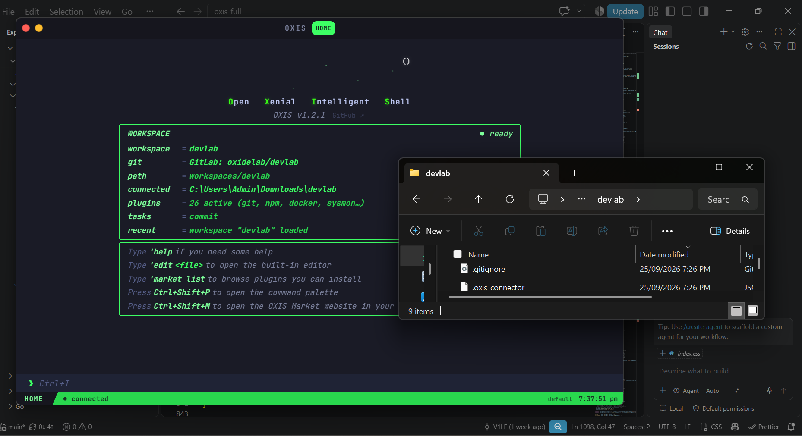
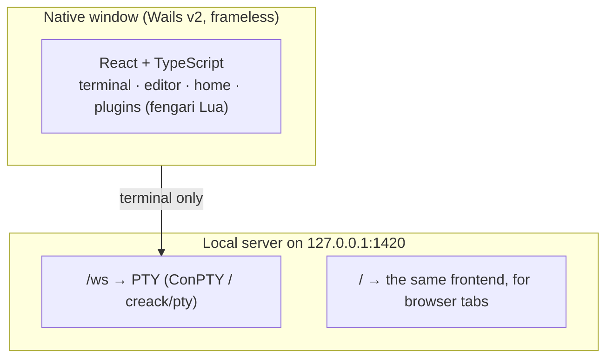

# OXIS

<p align="center">
  <a href="https://github.com/oxlaboratory/oxis"></a>
  <a href="https://github.com/oxlaboratory/oxis"></a>
  <a href="https://github.com/oxlaboratory/oxis"></a>
  <br>
  <a href="https://github.com/oxlaboratory/oxis/releases"></a>
  <a href="https://github.com/oxlaboratory/oxis/actions/workflows/build.yml"></a>
</p>

<p align="center">
  
</p>

**OXIS is a terminal app for Windows and Linux** — the same kind of
program as Windows Terminal or iTerm2, built to be customized. Your
normal shell (PowerShell or bash) works exactly as it always has; on
top of it OXIS adds its own commands, a built-in code editor,
workspaces, and a plugin system with a Market, all scriptable in
[Lua](https://www.lua.org/). "OXIS" stands for **O**pen **X**enial
**I**ntelligent **S**hell.

> Terminals were the beginning.

## Contents

- [What it does](#what-it-does)
- [Getting started](#getting-started)
- [Using OXIS](#using-oxis) — the prompt, keys, copying, window size
- [Commands](#commands)
- [Built-in editor](#built-in-editor)
- [Workspaces](#workspaces) — named workspaces, projects, tasks, workflows, git
- [Plugins](#plugins) — built-ins, manifests, permissions, Market
- [Lua API](#lua-api)
- [Themes](#themes)
- [Your config folder (~/.oxis)](#your-config-folder-oxis)
- [Settings, backup and diagnostics](#settings-backup-and-diagnostics)
- [Auto-update](#auto-update)
- [OXIS Market: premium plugins](#oxis-market-premium-plugins)
- [Architecture](#architecture)
- [Building and CI](#building-and-ci)
- [Contributing](#contributing) · [License](#license)

---

## What it does

- **A real terminal.** Your PowerShell (7 if installed, otherwise
  Windows PowerShell) or bash session runs unchanged. Anything that
  doesn't start with `'` goes straight to it.
- **Its own commands.** Start a line with an apostrophe and OXIS
  handles it: `'edit` opens the editor, `'market` browses plugins,
  `'theme` restyles everything, `'help` lists the rest.
- **One prompt everywhere.** A single command prompt sits at the bottom
  of the window on every screen, with shared history, readline keys and
  reverse search.
- **A built-in editor** with syntax highlighting, tabs, a file tree,
  find/replace, Vim-style modes and live HTML/Markdown preview.
- **Workspaces** that remember a project's tasks, workflows, plugins
  and documents, and can link to a real project folder and its git
  remote.
- **Lua plugins** with declared permissions, a Market to install them
  from, and a publishing flow that opens a GitHub pull request for you.
- **Runs as a desktop app** (Wails) on Windows and Linux, or in a
  browser tab at `http://127.0.0.1:1420` while the app is running.

## Getting started

### Download

Every push to `main` is built by GitHub Actions and published to the
[`latest-build` release](https://github.com/oxlaboratory/oxis/releases/tag/latest-build):

| Platform | Files |
|---|---|
| Windows (x64) | `oxis-<version>.msi` installer, or the bare `oxis.exe` |
| Linux (x64) | `oxis_<version>_amd64.deb`, `oxis-<version>-linux-portable.tar.gz`, or the bare `oxis` binary |

Linux needs GTK 3 and WebKitGTK (`libgtk-3-0`, `libwebkit2gtk-4.1-0`);
the `.deb` pulls them in. Windows needs the WebView2 runtime, which
ships with Windows 10 and 11.

There is no macOS build. Wails supports macOS, so building from source
should work, but it isn't tested.

### Build from source

Requirements: Go 1.22+, Node.js 24+, and on Linux
`libgtk-3-dev libwebkit2gtk-4.1-dev pkg-config`.

```bash
git clone https://github.com/oxlaboratory/oxis.git
cd oxis
npm run setup        # checks tools, installs dependencies
npm run build        # → dist/oxis.exe (Windows) or dist/oxis + .deb (Linux)
npm run build:msi    # Windows installer (WiX, or NSIS as a fallback)
npm run dev          # rebuild and relaunch on every change
```

The frontend is embedded in the Go binary, so `npm run dev` does a full
rebuild on each change (a few seconds) rather than hot reloading.

### Where OXIS keeps data

OXIS keeps its data next to `oxis.exe` when it can write there (a
portable folder). If it can't — an install under Program Files or
`/usr/bin` — it uses `~/Downloads/OXIS` instead, and clones this
repository into `~/Downloads/OXIS/source` in the background the first
time (skipped quietly without git or network).

```
<data folder>/
├── plugins/              Market-installed plugins
├── created-plugins/      plugins you create ('plugin new)
├── created-documents/    files from 'new / 'touch
├── workspaces/           named workspaces (see Workspaces)
│   └── registry.json
└── window.json           window size saved by 'oxis resize
```

Your personal config lives separately, in [`~/.oxis`](#your-config-folder-oxis).

The Windows MSI defaults to `%USERPROFILE%\OXIS` so OXIS can write next
to itself without administrator rights, and it won't install anywhere
outside your profile. Installing over an older version upgrades it in
place.

If you run portable builds and extract a new zip over an old folder,
old workspace data comes along with it. `scripts/clean-install.ps1`
removes OXIS's own leftovers (it asks first, and never touches linked
projects):

```powershell
.\scripts\clean-install.ps1 -DistPath "C:\path\to\old\dist"
```

### Antivirus warnings

`oxis.exe` isn't code-signed, and Windows Defender/SmartScreen
sometimes flags new unsigned Go binaries. That's a reputation
heuristic, not a detection. If it happens with a build you made,
[submit it to Microsoft](https://www.microsoft.com/en-us/wdsi/filesubmission)
or add an exclusion for `dist\oxis.exe` while developing.

---

## Using OXIS

### The prompt

There is one command prompt, fixed to the bottom of the window above
the status bar, on Home, in the terminal and in the editor. Output
scrolls above it and never goes underneath it.

- Lines starting with `'` (or `oxi `) are OXIS commands; everything
  else runs in your shell.
- Pressing Enter on Home switches to the terminal so you can see the
  output. An empty Enter just opens the terminal.
- Typing anywhere that isn't a text field puts the text in the prompt.
  **Ctrl+I** jumps to it from anywhere. Clicking into the editor or
  another field leaves focus there.
- The terminal shows `OXIS` in its top-right corner. There's no startup
  splash; the app opens straight onto Home.

### Keys

| Key | Action |
|---|---|
| ↑ / ↓, Ctrl+P / Ctrl+N | Previous / next command. If you typed something first, only commands starting with it are shown. |
| Ctrl+R | Reverse search through history (Ctrl+R again for older matches, Enter to run, Esc to cancel) |
| Tab | Complete an `'command` name; otherwise passed to the shell |
| Ctrl+A / Ctrl+E | Start / end of line |
| Ctrl+K / Ctrl+U / Ctrl+Y | Cut to end / cut to start / paste the cut text |
| Alt+F / Alt+B, Ctrl+←/→ | Word right / left |
| Alt+D / Alt+Backspace | Delete word right / left |
| Alt+U / Alt+L / Alt+C / Alt+T | Uppercase / lowercase / capitalise / transpose word |
| Shift+arrows, mouse | Select text in the prompt |
| Ctrl+C | Copy the selection; with nothing selected, interrupt the running program |
| Ctrl+Shift+C | Copy the selection (never interrupts) |
| Ctrl+D / Ctrl+Z / Ctrl+\\ | Send EOF / suspend / quit to the shell |
| Ctrl+L | Clear the terminal |
| Ctrl+Shift+F | Find in terminal output (Enter / Shift+Enter to step, Esc to close) |
| PageUp / PageDown | Scroll the output |
| Ctrl+= / Ctrl+- / Ctrl+0 | Zoom in / out / reset (saved as the `fontSize` setting) |
| Ctrl+T / Ctrl+W | Show the terminal / go back to Home |
| Ctrl+Shift+P | Command palette |
| Ctrl+Shift+M | Open the Market website |

With an empty prompt, arrow keys, Home/End, Delete, Tab, Esc and F1–F12
go straight to the running program, so interactive tools still work.

### Selecting and copying output

Terminal output works like VS Code's integrated terminal:

- Drag with the mouse to select one or many lines, including after
  scrolling back through long output. Indentation and line breaks are
  kept when you copy.
- **Ctrl+C** copies a selection. It only interrupts the running
  process when nothing is selected, so copying an error never kills a
  build or server.
- **Right-click** the output for **Copy**, **Select All** and
  **Clear Selection**.
- URLs in the output open in your browser; paths ending in a file
  extension open in the editor.

If the WebView's clipboard is unavailable, OXIS writes to the OS
clipboard directly (Win32 on Windows; `pbcopy`, `xclip`, `xsel` or
`wl-copy` elsewhere).

### Window size

```
'oxis resize                  show the current size and presets
'oxis resize large            small 800×520 · default 940×600 · medium 1100×700
                              · large 1280×800 · xl 1600×1000
'oxis resize 1200x760         any size from 640×400 to 3840×2160
'oxis resize config           open window.json at the width line
```

The window resizes immediately and OXIS reports the size the OS
actually applied (a size larger than the screen gets limited). The size
is saved to `window.json` in the data folder and used on the next
launch. In a browser tab the size belongs to the browser, so the
command only reports it.

---

## Commands

`'help` lists everything, `'help <command>` shows every form of a
command with examples, and `'help <plugin>` lists a plugin's commands.
The command palette (Ctrl+Shift+P) searches the same list.

| Area | Commands |
|---|---|
| Files | `'ls` `'cd` `'pwd` `'cat` `'new`/`'touch` `'mkdir` `'rm` `'cp` `'mv` `'write` `'append` `'hash` `'size` `'edit` `'open` |
| Shell | `'clear` `'run` `'env` `'ps` `'kill` `'ip` `'disk` `'sysinfo` `'which` `'find` `'grep` `'history` `'histclear` `'ports` `'user` `'path` `'alias` |
| App | `'home` `'hide workspace` `'show workspace` `'oxis resize` `'theme` `'config` `'version` `'diagnostics` `'backup` `'restore` `'update` |
| Plugins | `'plugin …` `'market …` |
| Workspaces | `'workspace …` `'project …` `'task` `'workflow …` |

`'new`/`'touch` create files in `created-documents/` (or the active
workspace's `documents/`), using the native file API rather than the
shell, so the file always lands in the same place.

---

## Built-in editor

`'edit <file>` opens a file; `'edit` alone opens the file tree. Relative
paths resolve against the data folder (not the shell's directory);
absolute paths open that exact file, and a leading `/` means the root of
the app's drive on Windows. Quote paths with spaces.

- **Modes.** Normal (hjkl, `0`/`$`, `gg`/`G`, `w`/`b`, `x`, `dd`, `dw`,
  `o`/`O`), Insert (`i`, `a`, `o`…) and Visual (`v`, then `d`/`x`/`y`).
- **Keys.** Ctrl+S save, Ctrl+Z / Ctrl+Y (or Ctrl+Shift+Z) undo/redo,
  Ctrl+F find, Ctrl+H replace, Ctrl+G go to line, Ctrl+B file tree,
  Tab inserts two spaces, Esc closes (asks if there are unsaved changes).
- **Tabs** for several open files, with unsaved markers and Save All.
- **File tree** rooted at the data folder, or at the linked project
  when the active workspace has one. Fully keyboard-driven; drag a file
  onto a folder to move it.
- **Syntax highlighting** for TypeScript/JavaScript, Go, Lua, Python,
  JSON, CSS, HTML, Markdown, shell and YAML; turned off above 500,000
  characters so huge files stay responsive.
- **Change gutter** marking lines changed since the last save.
- **Live preview** for `.html` and `.md` files: a resizable split (or
  full view with Ctrl+Shift+Enter), refreshed shortly after you stop
  typing. Markdown is rendered GitHub-style, including Mermaid
  diagrams. The preview runs in a sandboxed iframe that can't reach
  OXIS itself.

Saving a plugin's `.lua` file reloads the plugin immediately.

---

## Workspaces

### `.oxis/workspace.lua`

Any folder can carry an `.oxis/workspace.lua`. When you `cd` into it,
OXIS loads it (unless a named workspace is active). It runs with the
full [Lua API](#lua-api):

```lua
oxis.theme("midnight")
oxis.plugin.enable("docker")

oxis.command("dev", function() oxis.run("npm run dev") end, "start the dev server")
oxis.task("test", "npm test", "run the tests")

oxis.autocmd("WorkspaceLoaded", function()
  oxis.echo("my-app ready")
end)
```

Edits are picked up automatically (checked every 3 seconds);
`'workspace reload` does it immediately.

### Named workspaces

```
'workspace init "my-app"        create workspaces/my-app/
'workspace list / switch <name> / rename <old> <new> / delete <name>
'workspace switch default       back to the shared default context
'workspace info                 name, tasks, linked folder
'workspace export <name> [path] / import <path> [name]
```

Each named workspace is a folder with its own `.oxis/workspace.lua`,
`documents/`, `plugins/`, `scripts/`, `tasks/` and `workflows/`. While
one is active, `'new` and `'plugin new` write into it, and its own
plugins, tasks and workflows are loaded (the previous workspace's are
unloaded). When OXIS is updated, older workspaces get any new folders
added automatically; nothing existing is changed.

### Linking a real project

```
'workspace link "C:\code\my-app"      connect the active workspace to a folder
'workspace unlink
'workspace newfile src/util.ts        create a file inside the linked folder (opens it)
'workspace newdir  src/lib
'workspace move    notes.md docs      move a file within the linked folder
```

Linking records the folder, drops a small `.oxis-connector.json` marker
in it (and adds it to that folder's `.gitignore`), and switches the
editor's file tree to it. Paths given to `newfile`/`newdir`/`move` can't
escape the linked folder.

Linking also detects the project type and writes runnable tasks to the
workspace's `.oxis/tasks/auto-detected.lua`: Rust, Node (npm, pnpm,
yarn or bun, from the real `scripts`), Python, Go, .NET, Java
(Maven/Gradle), C/C++ (CMake/Make), PHP and Ruby. Tasks are refreshed
when the project changes, but a task you've edited is never
overwritten.

### Git

```
'workspace github <owner/repo or URL> [--force]    set up origin (inits a repo if needed)
'workspace gitlab <owner/repo or URL> [--force]    same, for GitLab
'workspace github unlink [--remove-remote]         disconnect origin
'task commit <message>                             stage, commit and push
```

Git runs as real `git` processes with argument lists (never a shell
string). `'task commit` reports "nothing to commit", pushes when an
`origin` exists, explains push failures (authentication, rejected,
unreachable, missing repo) and can be cancelled with Ctrl+C, which
kills the git process. Unlinking renames `origin` to a timestamped
backup unless you pass `--remove-remote`. Authentication uses whatever
SSH key or credential helper is already set up.

### Projects

```
'project init [dir]    create .oxis/ with workspace.lua, project.lua, tasks/, workflows/ …
'project open [dir]    load it
'project run <name>    run a workflow or task
'project task / 'project workflow   list them
```

### Tasks and workflows

A task is a named shell command: `oxis.task("build", "npm run build")`,
run with `'task build`.

A workflow is a sequence of steps, declared in `workflows/*.lua`:

```lua
oxis.workflow("release", {
  env = { NODE_ENV = "production" },
  steps = {
    { task = "install" },
    { run = "npm run build", retry = 2 },
    { command = "version" },                              -- an 'command
    { run = "npm test", continueOnError = true },
    { condition = "env:DEPLOY", run = "npm run deploy" }, -- skipped unless DEPLOY is set
    { parallel = { { command = "plugin list" }, { command = "workspace info" } } },
  },
}, "build, test and deploy")
```

```
'workflow list / 'workflow <name> / 'workflow info <name> / 'workflow cancel
```

Steps report progress as they run. There's one shell, so inside
`parallel` only `command` steps actually run at the same time; shell
steps still run one after another.

---

## Plugins

A plugin is a Lua file run in its own embedded Lua 5.3 VM
([fengari](https://fengari.io)).

```
'plugin list / enable <n> / enable all / disable <n> / reload <n> / reloadall
'plugin new <n> [--template=basic|dev|devops|system]   create one and open it in the editor
'plugin info <n> / docs <n> / validate <n> / test <n> / doctor
'plugin permissions <n> [grant|revoke <namespace>]
'plugin uninstall <n> [--force] / delete <n> / export <n> [path] / rollback <n>
'plugin publish <n> / unpublish <n>
```

`'plugin doctor` checks every installed plugin at once and suggests a
fix for each problem. `'plugin rollback` restores the version from
before the last `'market update`.

### Built-in plugins

Shortcut plugins (each command runs one shell command, with PowerShell
and POSIX variants):

| Plugin | Default | Commands |
|---|---|---|
| git | on | `gs` `gl` `gd` `ga` `gp` `gpl` `gb` `gst` `gc <msg>` `gco <branch>` |
| npm | on | `ni` `nid` `nb` `nd` `nt` `nr <script>` `nls` |
| sysmon | on | `top` `mem` `cpu` `uptime` |
| files | on | `fsize` `fopen` `fhash` `flatest` `fbig` |
| docker | off | `dps` `dimg` `dup` `ddown` `dlog` `dsh` `drm` |
| network | off | `myip` `wifi` `ports` `ping` `dns` |
| python | off | `py` `pip` `venv` `act` `freeze` `pipu` |
| go | off | `gobuild` `gorun` `gotest` `gotidy` `govet` |
| rust | off | `cb` `cr` `ct` `cc` `cbr` |
| winutil | off | `admin` `events` `sfc` `winver` (Windows only) |

Lua plugins (off by default, `'plugin enable <name>`): `fuzzy`,
`git_advanced`, `lsp_diag`, `http`, `session_notes`, `env_manager`,
`benchmark`, `process_manager`, `project_init`, `clipboard`, `todo`,
`docker_compose`, `file_ops`, `system_health`, `snippets`,
`ssh_manager`. `'help <plugin>` lists each one's commands.

### Manifest

A plugin can declare metadata in a comment block at the top. It's
parsed, never executed:

```lua
--[[@manifest
version: 1.0.0
description: does something useful
author: you
category: dev
min_oxis_version: 1.2.1
os: windows, unix
permissions: fs, net
dependencies: git_advanced>=1.0.0, lsp_diag^1.2.0
]]
```

Before loading, OXIS checks the OXIS version, OS, and dependencies
(missing ones, incompatible versions with `>=`, `^` or exact ranges,
and cycles). A disabled dependency that's installed is enabled
automatically; a missing one has to be installed with `'market install`.

### Permissions

These calls need a permission for the plugin that makes them:
`oxis.fs.*` (fs), `oxis.process.*` (process), `oxis.net.*` (net),
`oxis.system.*` (system), `oxis.workspace()` (workspace),
`oxis.newTerminal()` (terminal), and `oxis.run()`/`oxis.task()` (shell).

- A plugin **without** a manifest asks once per permission ("Plugin X
  wants to …"), and the answer is remembered.
- A plugin **with** a manifest can only ever get what its
  `permissions:` line lists; anything else is refused with an error
  naming the missing permission. `shell` is the exception: it always
  asks once, so older manifests keep working.
- Built-in plugins, `workspace.lua`, workspace tasks/workflows and
  `~/.oxis/config.lua` are your own code and aren't prompted.

`'plugin permissions <name>` shows and changes grants. Plugins each
have their own Lua VM and a Lua error is reported without affecting the
session, but plugins aren't sandboxed from each other beyond that.

### Market

```
'market list / search <q> / info <name> / install <name>
'market update <name> / update all
```

The Market is [oxis-market.pages.dev](https://oxis-market.pages.dev): a
static `index.json` plus `.lua` files, deployed from `cloudflare/` in
this repository. Installed plugins are ordinary Lua plugins.
`'market update` checks compatibility first, backs up the current
version, and restores it automatically if the new one fails to load.

**Publishing.** `'plugin publish <name>` validates the plugin (a
complete manifest is required) and opens a pull request against this
repository adding it to the Market; it goes live once a maintainer
merges it. Run it again to publish an update; `'plugin unpublish`
opens a removal PR. You can also open the PR by hand: add
`cloudflare/plugins/<name>.lua`, an entry in `cloudflare/index.json`,
and a card in `cloudflare/index.html`. See
[CONTRIBUTING.md](CONTRIBUTING.md#plugins).

---

## Lua API

Everything is on the global `oxis` table.

| Call | Does |
|---|---|
| `oxis.command(name, fn(args, rest), description)` | Register `'name`. `args` is a table of words, `rest` the raw text. |
| `oxis.task(name, cmd, description)` | Register a task (`'task name`) |
| `oxis.workflow(name, def, description)` | Register a workflow (see [Workspaces](#tasks-and-workflows)) |
| `oxis.run(cmd)` | Run a command in the shell. Multi-line PowerShell scripts run as one script; `&&` works on Windows PowerShell 5.1 too. |
| `oxis.echo(text)` | Print a line in the terminal |
| `oxis.cwd()` | The shell's current directory |
| `oxis.platform` | `"windows"` or `"unix"` |
| `oxis.theme(name)` | Switch theme |
| `oxis.option(key [, value])` | Get or set a persisted option |
| `oxis.keymap(mode, keys, fn)` | Bind keys, e.g. `oxis.keymap("normal", "<C-g>", fn)`; `<C-x>`, `<A-x>`, `<S-x>`. Modes: `normal`, `insert`, `visual` (editor modes) |
| `oxis.autocmd(event, fn)` | Run `fn` on an event (below) |
| `oxis.plugin.enable(name)` / `.disable(name)` | Toggle a plugin |
| `oxis.workspace(path)` | Mark `path` as the current project (shown on Home) |
| `oxis.newTerminal()` | Switch to the terminal view |
| `oxis.dashboard{ header, theme, shortcuts }` | Customise Home: a header line, a theme, and extra hint lines |
| `oxis.fs.read/write/list/stat/mkdir/remove(path, …, cb)` | File access; `cb(err, result)` |
| `oxis.process.list(cb)` / `.kill(pid, cb)` | Processes |
| `oxis.net.request(opts, cb)` | HTTP request |
| `oxis.system.info(cb)` | OS, architecture, CPU count, Go version, OXIS's own memory use |

Events for `oxis.autocmd`: `ShellOpen` (alias `TerminalOpen`),
`ShellExit`, `ThemeChanged`, `PluginLoaded`, `PluginUnloaded`,
`WorkspaceLoaded`, `WorkspaceUnloaded`, `CommandExecuted`,
`CommandError`, `EditorOpened`, `EditorClosed`, `ModeChanged`.

Branch on `oxis.platform` for shell commands that differ between
PowerShell and bash:

```lua
oxis.command("health", function()
  if oxis.platform == "windows" then
    oxis.run([[Invoke-WebRequest http://localhost:3000/health -UseBasicParsing | Select-Object StatusCode]])
  else
    oxis.run([[curl -s -o /dev/null -w "%{http_code}\n" http://localhost:3000/health]])
  end
end, "check the local server")
```

Not available yet: `oxis.fs.watch`, `oxis.process.spawn`, cross-plugin
calls, and editor buffer access.

### Plugin development guide

1. `'plugin new myplugin` writes a working starter to
   `created-plugins/myplugin.lua` (or the active workspace's
   `plugins/`), loads it, and opens it in the editor.
2. Edit it and press Ctrl+S; it reloads immediately.
3. Add a manifest before publishing, with `permissions:` listing only
   what the plugin uses.
4. Share the `.lua` file (drop it in someone's `plugins/` folder), or
   publish it to the Market with `'plugin publish myplugin`.

```lua
--[[@manifest
version: 1.0.0
description: a small example
author: you
category: utility
min_oxis_version: 1.2.1
os: windows, unix
]]

oxis.command("greet", function(args)
  oxis.echo("Hello, " .. (args[1] or "world") .. "!")
end, "say hello")

oxis.task("serve", "python -m http.server 8080", "serve this folder")

oxis.autocmd("ShellOpen", function()
  oxis.echo("myplugin loaded")
end)
```

---

## Themes

```
'theme                 list themes
'theme <name>          switch
'theme new <name>      visual theme editor with live preview
'theme export <name>   print a theme as JSON
'theme import <file>   add a theme from a JSON file
'theme delete <name>   delete a custom theme
```

Built-in themes: `default`, `midnight`, `slate`, `forest`, `ember`,
`rose`, `dusk`, `void`. A theme is 16 colours:

```json
{
  "name": "mytheme",
  "bg": "#0d1117", "bg1": "#161b22", "bg2": "#21262d", "bg3": "#30363d", "bg4": "#3d444d",
  "border": "#30363d", "border2": "#388bfd",
  "text": "#e6edf3", "muted": "#8b949e", "dim": "#6e7681", "comment": "#3b434b",
  "purple": "#79c0ff", "purple2": "#388bfd", "purple3": "#a5d6ff",
  "grey": "#8b949e", "grey2": "#3d444d"
}
```

`"extends": "midnight"` inherits every colour you don't set. The
`purple*` keys are the accent colours (prompt, highlights, borders).

---

## Your config folder (~/.oxis)

`~/.oxis` (`%USERPROFILE%\.oxis` on Windows) is yours and survives
reinstalls:

```
~/.oxis/
├── config.lua       runs at every startup
└── themes/*.json    extra themes, usable with 'theme <name>
```

`config.lua` has the full Lua API, like a `workspace.lua`:

```lua
oxis.theme("midnight")
oxis.plugin.enable("docker")
oxis.command("hi", function() oxis.echo("hello from config.lua") end, "say hello")
```

`'config edit` opens it (creating it from a template), and
`'config reload` re-runs it and reloads the theme files. Errors are
printed in the terminal and listed by `'diagnostics`.

---

## Settings, backup and diagnostics

```
'config list / get <key> / set <key> <value> / reset <key>
'config export [path] / import <path>
```

| Setting | Default | Effect |
|---|---|---|
| `fontSize` | `13` | Terminal and editor font size in px |
| `cursorStyle` | `block` | Prompt cursor: `block`, `bar` or `underline` |
| `cursorBlink` | `true` | Whether the prompt cursor blinks |
| `updateCheckOnStartup` | `true` | Check for a newer build at startup |

Settings apply immediately and persist. Themes are managed with
`'theme`.

`'backup [path]` writes settings, named workspaces, `created-documents/`
and `created-plugins/` to one JSON file; `'restore <path>` asks first
and only writes files the backup contains. Market plugins aren't
included (reinstall them with `'market install`).

`'diagnostics` shows the version, OS, runtime, plugin counts, active
workspace and the last recorded errors. Nothing is sent anywhere; OXIS
has no telemetry.

---

## Auto-update

A build knows the commit it was built from. At startup (and with
`'update`) OXIS asks GitHub for the latest commit on `main`; if it
differs, the terminal and status bar say a newer build is available.
Builds without that commit stamp (e.g. a plain `go build`) never report
updates.

`'update install` replaces the running app in place:

1. Clones the repository and builds it with `scripts/build-go.js`
   (needs git and Node). If that isn't possible, it downloads the bare
   binary from the `latest-build` release instead.
2. Renames the running executable to a backup, moves the new one into
   the same path, and starts it.
3. If the new build fails to start, or exits within two seconds, the
   backup is restored. Otherwise the new process deletes the backup
   once it has started, and the old one exits.

---

## OXIS Market: premium plugins

Premium plugins are planned as monthly Stripe subscriptions, with 75%
going to the plugin's developer and 25% to OXIS for third-party
plugins. Free plugins stay free. None of it can be purchased yet: every
premium listing is marked `comingSoon`, and payments stay in Stripe
test mode until account verification is finished.

What's built:

- `'market subscribe <name>` opens Stripe Checkout,
  `'market license <email>` sets the email subscriptions are checked
  against, and `'market status <name>` checks one now.
- A premium install fetches the source from a license-checked endpoint
  and stores it encrypted (AES-256-GCM, key derived from this install's
  device ID) in `.oxis/premium/`. The license is re-checked every time
  it loads, and it only exists decrypted in memory. That stops casual
  copying; it isn't DRM against someone determined on their own machine.
- `'plugin publish <name> --price=4.99 --interval=month` runs Stripe
  Connect onboarding and opens the Market PR with the price included.
- **AI DevOps**, the first premium plugin: `'ai explain / fix /
  generate / review / debug / command / plugin <text>` against any
  OpenAI-compatible endpoint, using your own key (`'ai key`,
  `'ai endpoint`, `'ai model`).

The payment backend (Cloudflare Pages Functions) and premium plugin
sources are kept private and aren't part of this repository. The
Market's `/health` endpoint reports which of its secrets and storage
bindings are configured.

---

## Architecture



- `cmd/oxi` starts `internal/wailsapp`, which opens the window, serves
  the embedded frontend to it, and exposes native calls (files, plugins,
  git, window size, clipboard, updates) as `window.go.wailsapp.App.*`.
- Wails' asset server can't carry WebSockets, so `internal/server`
  runs a loopback HTTP server for the PTY WebSocket and also serves the
  frontend, which is how `http://127.0.0.1:1420` works in a browser
  (next free port if 1420 is taken). It only accepts connections from
  the OXIS window and its own origin, so other websites can't reach your
  shell.
- `internal/pty` starts the shell (`OXIS_SHELL` overrides the choice),
  strips terminal escape codes, and keeps UTF-8 characters intact
  across reads. The frontend renders output as plain lines in its own
  theme colours. Carriage-return progress bars update in place.
  Full-screen programs (vim, htop) aren't supported.
- In the browser, the frontend has no native file access, so the editor
  and anything file-based need the desktop app.

```
cmd/oxi/                 entry point, Windows version info and icon
internal/wailsapp/       window, native bindings, self-update, window size
internal/server/         loopback HTTP + PTY WebSocket
internal/pty/            ConPTY (Windows) and creack/pty (Linux) sessions
internal/update/         update check against GitHub
frontend/src/App.tsx     app shell: terminal, prompt, editor, home, commands
frontend/src/terminal/   output model, history, keybinds, themes, workspaces, trackers
frontend/src/plugins/    Lua runtime and API, plugin manager, Market, git, backup
cloudflare/              Market website, index.json and free plugins
scripts/                 build, dev, setup, installer, clean-install
npm/                     npm launcher package (downloads the prebuilt binary)
```

---

## Building and CI

`.github/workflows/build.yml` runs on every push and pull request to
`main`:

| Job | Output |
|---|---|
| `build-linux` (ubuntu-latest) | `oxis`, `.deb`, portable `.tar.gz` |
| `build-windows` (windows-latest) | `.msi` and bare `oxis.exe` |
| `publish-release` (pushes to `main` only) | both of the above, published together to the `latest-build` release |

Both builds stamp the version and commit into the binary
(`-ldflags -X`), which the updater relies on. Locally, `npm run build`
does the same.

---

## Contributing

See [CONTRIBUTING.md](CONTRIBUTING.md). Bug reports and pull requests
are welcome on [GitHub](https://github.com/oxlaboratory/oxis).

## License

OXIS is licensed under the [Apache License 2.0](license).

---

*OXIS — terminals were the beginning.*
