<div align="center">

<a href="https://oxis.space">
<picture>
  <source media="(prefers-color-scheme: dark)" srcset="assets/readme/logo-dark.svg">
  
</picture>
</a>

<br>

<a href="https://oxis.space"></a>

### OXIS is a programmable workspace for automating projects, editing documents and building workflows — with an entirely customizable experience.

<sub>Free and open source · Windows, Linux and macOS (preview) · about 14 MB · no account, no telemetry</sub>

<br>

<a href="https://github.com/oxlaboratory/oxis/releases/tag/latest-build"></a>
<a href="https://oxis.space"></a>
<a href="https://oxis.space/#market"></a>
<a href="#documentation"></a>
<a href="CHANGELOG.md"></a>

<br><br>

<a href="https://github.com/oxlaboratory/oxis/releases/tag/latest-build"></a>
<a href="#auto-update"></a>
<a href="https://github.com/oxlaboratory/oxis/actions/workflows/build.yml"></a>
<a href="https://github.com/oxlaboratory/oxis/stargazers"></a>
<a href="https://github.com/oxlaboratory/oxis"></a>
<a href="LICENSE"></a>


<br><br>


<sub>▲ Recorded from the app itself: every frame is OXIS running those commands in a real project.</sub>

<br><br>

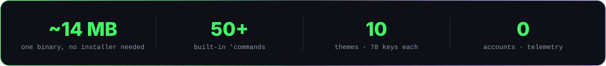

</div>

<br>

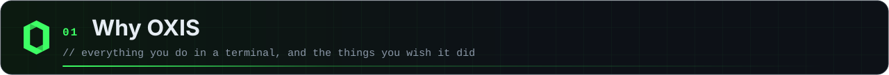

## What is OXIS?

OXIS is one desktop app for the work you do on a project — running
it, editing it, automating it — and every part of it can be programmed
and changed.

- **A real terminal.** Your own PowerShell, Git Bash, WSL, cmd, bash,
  zsh or fish — a different one per tab if you like — not an imitation
  of one, with tabs, split panes, full colour, and programs like vim,
  htop and lazygit. Tab completes files, git branches and npm scripts
  in any shell, history suggests the rest of a command as you type, and
  `src/app.ts:12:5` in a compiler error opens the editor right there.
  Ctrl+Shift+Space copies any URL, path or hash on screen with two keys,
  `'trigger` lights up the log lines that matter, `'broadcast` types into
  every pane at once, `'record` saves a session as an asciinema cast and
  `'imgcat` shows an image in the output. A line that starts with `'` is
  an OXIS command (`'help` lists them); everything else goes to your
  shell.
- **An editor for code and documents.** `'edit` opens any file: errors
  underlined as you type, suggestions, search across the project
  (Ctrl+Shift+F), a live preview for HTML and Markdown, and Vim modes or
  VS Code keys.
- **Automation.** Each project gets tasks (`'task test`), workflows of
  several steps with retries and exit codes (`'workflow release`), and
  watchers that act when files change.
- **Programmable in Lua.** A few lines add a command, a keybinding, a
  task, a workflow or a whole tool. Plugins run programs and read their
  output as it prints, watch files, call web APIs and edit the open
  document. More are in the [Market](https://oxis.space/#market).
- **Workspaces.** Every project keeps its own folder, tasks, plugins,
  git repository and history; `'workspace switch api` moves between them.
- **Change anything.** A Settings window (Ctrl+,), themes with 78
  settings each and a live editor, sound effects you can swap for your
  own, the prompt, the keys, the layout, the Home screen and its
  pixel-art sky — and whatever a plugin adds.

**Who it's for:** people who work in a terminal and want a project's
commands, files and automation in one place they can shape to fit.

<br>

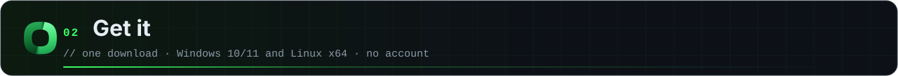

<table>
<tr>
<td width="50%" valign="top">

#### 🪟 Windows 10 / 11

The [installer (.msi)](https://github.com/oxlaboratory/oxis/releases/tag/latest-build), or the portable exe:

```powershell
Invoke-WebRequest https://github.com/oxlaboratory/oxis/releases/download/latest-build/oxis.exe -OutFile oxis.exe; .\oxis.exe
```

</td>
<td width="50%" valign="top">

#### 🐧 Linux x64

A [`.deb` or portable tarball](https://github.com/oxlaboratory/oxis/releases/tag/latest-build), or the bare binary (needs `libgtk-3-0` and `libwebkit2gtk-4.1-0`):

```bash
curl -Lo oxis https://github.com/oxlaboratory/oxis/releases/download/latest-build/oxis && chmod +x oxis && ./oxis
```

</td>
</tr>
</table>

**🍎 macOS (Apple silicon), preview** — [`oxis-<version>-macos-arm64.zip`](https://github.com/oxlaboratory/oxis/releases/tag/latest-build) (OXIS.app). Built and tested on macOS in CI, not yet tried on a Mac by a person; unsigned, so right-click → Open the first time.

**🛠️ From source** — Go 1.22+ and Node.js 24+, and a C compiler for native Lua (Linux has one; on Windows MinGW-w64, e.g. MSYS2's `mingw-w64-x86_64-gcc`; without one, plugins run on fengari):

```bash
git clone https://github.com/oxlaboratory/oxis.git && cd oxis && npm run setup && npm run build
```

Then keep it current from inside OXIS with `'update install`. Every release is on the [releases page](https://github.com/oxlaboratory/oxis/releases).

<br>

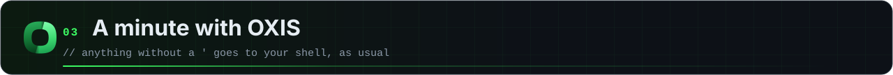

```text
'help                      every command (Ctrl+Shift+P for the palette)
'edit src/app.ts           open the built-in editor
'theme ember               switch theme — 'theme set glow 0.4 tweaks one thing live
'workspace switch api      jump to another project, with its tasks and git remote
'task test                 run a project task
'workflow release          build → test → deploy, with retries and exit codes
'market install autotest   add a plugin from the Market ('autotest then re-runs tests on save)
'version                   exactly which build you're on
```

Anything that doesn't start with `'` goes to your shell, as usual.

<br>

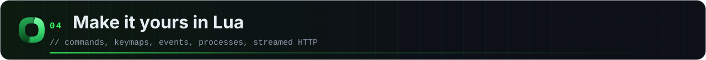

```lua
--[[@manifest
version: 1.0.0
description: open a pull request for a branch
permissions: shell
]]
oxis.command("pr", function(args, rest)
  oxis.run("gh pr create --web --head " .. oxis.quote(rest ~= "" and rest or "HEAD"))
end, "open a GitHub PR")
```

Save it in `created-plugins/` and `'pr my-branch` works. The same API
drives tasks, workflows, keymaps, events and the Home screen, runs
programs and hands you their output as it prints, watches files, edits
the open file, and streams HTTP — so an AI assistant's answer can type
itself into your editor as it's written. See the [Lua API](#lua-api).

<br>

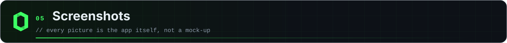

| | |
|---|---|
|  |  |
| Your shell in full colour, with `'` commands and one prompt | The editor catches a mistake as you type and suggests words (`'edit src/cart.ts`) |
| 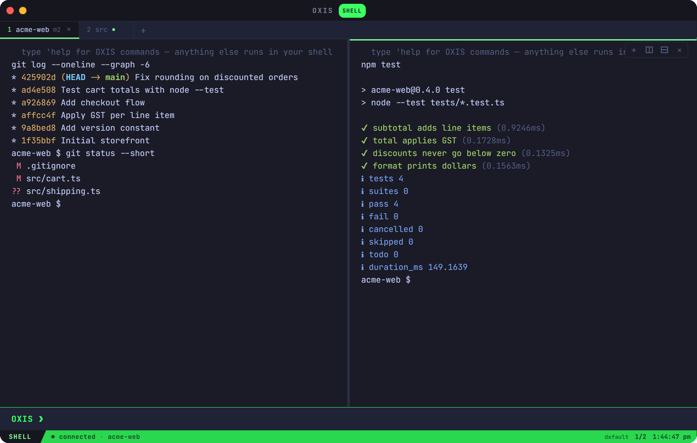 | 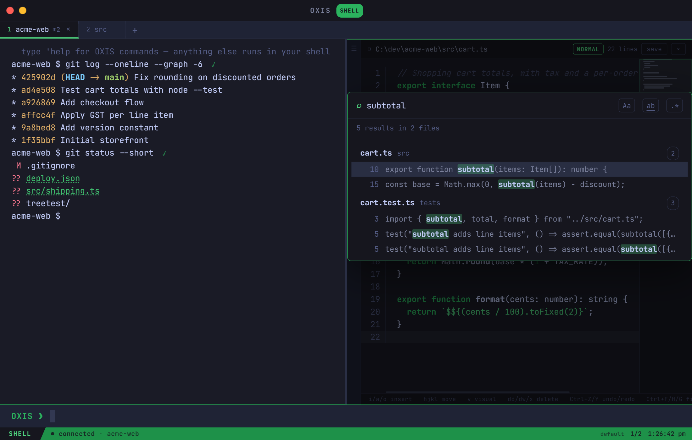 |
| Tabs and split panes, each its own shell (buttons at a pane's top right, or right-click) | Search in files (Ctrl+Shift+F) |
| 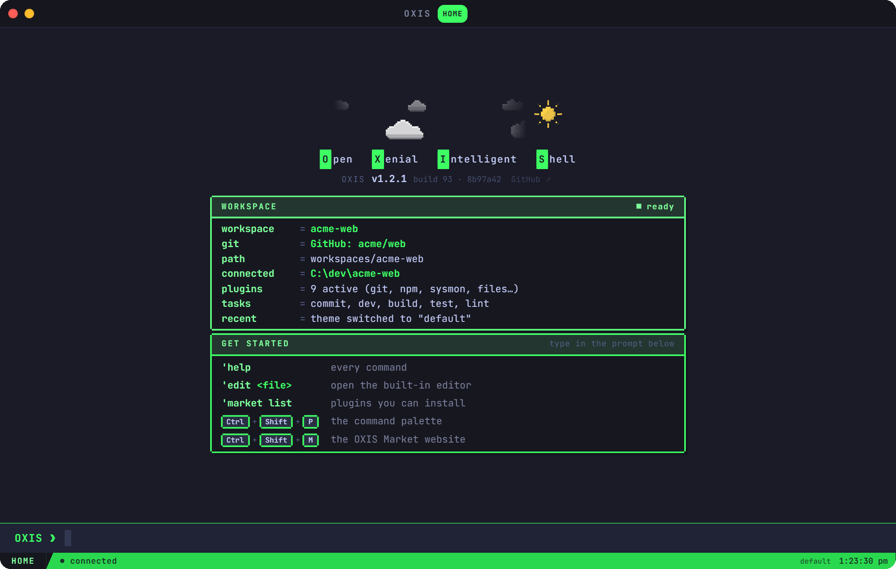 |  |
| Home, under a pixel-art sky that follows the time of day | The command palette (Ctrl+Shift+P) |
|  | 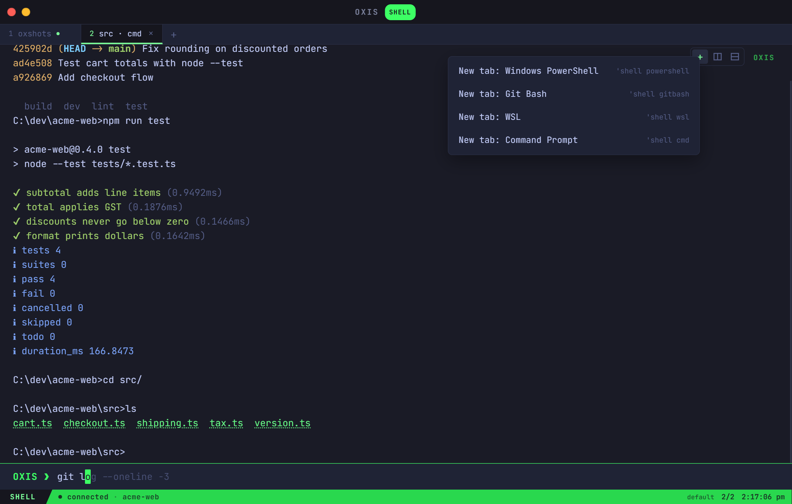 |
| `'version` — the exact build you're running | Tab completion in any shell (here cmd), history suggestions, and a tab with another shell |
|  |  |
| A theme tweaked with four `'theme set` lines | `'theme edit` — every option with a live preview |
|  |  |
| `'autotest` from the Market: tests re-run on every save (a plugin built on `oxis.fs.watch` and `oxis.process.spawn`) | Pictures open in an image viewer, not as bytes |
| 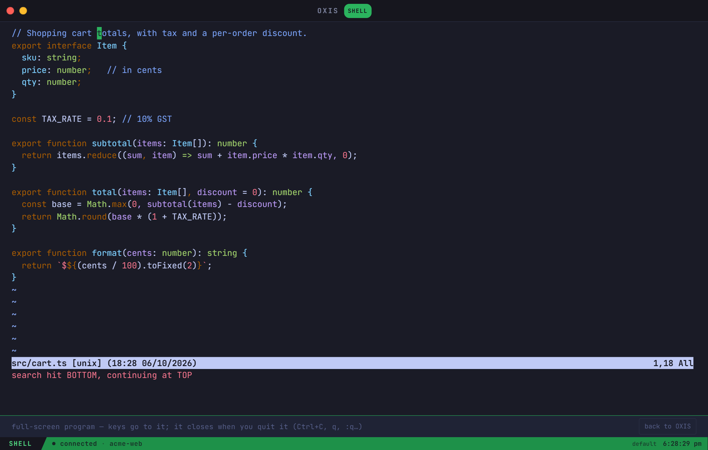 | 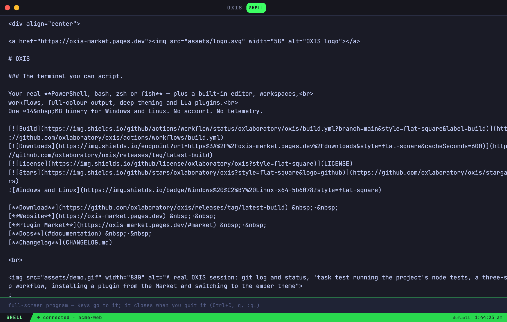 |
| vim inside OXIS, in the theme's colours | `less` paging a file; any full-screen program runs in a real terminal grid |

**Browser mode** — the same UI in a browser tab at `http://127.0.0.1:1420`
while the desktop app is running:

| | |
|---|---|
|  |  |

<p align="center">
  
</p>

<br>

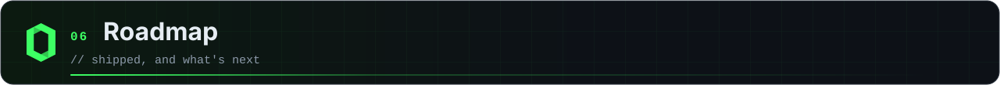

- [x] Colour output: 16, 256 and 24-bit colour
- [x] Self-update from source with rollback, and `'version` build info
- [x] Windows Terminal colour schemes via `'theme import`
- [x] Full-screen programs (vim, less, htop, lazygit) in a real terminal grid
- [x] Arrow-key menus, spinners and progress bars that redraw in place
- [x] Shell integration: each command's status and time, jumping between commands
- [x] Plugin APIs for the editor's open file, file watching and processes
- [x] Streaming HTTP for plugins, for AI assistants that answer as they write
- [x] Tab completion and history suggestions that work the same in every shell
- [x] PowerShell, Git Bash, WSL or cmd tab by tab (`'shell`)
- [x] Clickable `file:line` in compiler output, OSC 8 links, OSC 52 copy, OSC 9;4 progress
- [x] A macOS build, built and tested in CI (preview)
- [ ] The macOS build tried on a real Mac
- [ ] Premium plugins in the Market (AI DevOps first)

Ideas and bug reports are welcome in [issues](https://github.com/oxlaboratory/oxis/issues).

<div align="center">

<br>

<a href="https://star-history.com/#oxlaboratory/oxis&Date">
  <picture>
    <source media="(prefers-color-scheme: dark)" srcset="https://api.star-history.com/svg?repos=oxlaboratory/oxis&type=Date&theme=dark">
    
  </picture>
</a>

<br><br>

**If OXIS is useful to you, a star helps other developers find it.**

<a href="https://github.com/oxlaboratory/oxis/stargazers"></a>

</div>

---

## Documentation

- [Getting started](#getting-started)
- [Using OXIS](#using-oxis) — the prompt, keys, copying, window size
- [Commands](#commands)
- [Built-in editor](#built-in-editor)
- [Workspaces](#workspaces) — named workspaces, projects, tasks, workflows, git
- [Plugins](#plugins) — built-ins, manifests, permissions, Market
- [Lua API](#lua-api)
- [Themes](#themes)
- [Your config folder (~/.oxis)](#your-config-folder-oxis)
- [Settings, backup and diagnostics](#settings-backup-and-diagnostics)
- [Auto-update](#auto-update)
- [OXIS Market: premium plugins](#oxis-market-premium-plugins)
- [Architecture](#architecture)
- [Building and CI](#building-and-ci)
- [Contributing](#contributing) · [License](#license)

---

## Getting started

### Download

Every push to `main` is built by GitHub Actions and published to the
[`latest-build` release](https://github.com/oxlaboratory/oxis/releases/tag/latest-build):

| Platform | Files |
|---|---|
| Windows (x64) | `oxis-<version>.msi` installer, or the bare `oxis.exe` |
| Linux (x64) | `oxis_<version>_amd64.deb`, `oxis-<version>-linux-portable.tar.gz`, or the bare `oxis` binary |
| macOS (Apple silicon) — preview | `oxis-<version>-macos-arm64.zip` (OXIS.app) |

Linux needs GTK 3 and WebKitGTK (`libgtk-3-0`, `libwebkit2gtk-4.1-0`);
the `.deb` pulls them in. Windows needs the WebView2 runtime, which
ships with Windows 10 and 11.

The macOS build is a preview: CI builds it and runs the tests on
macOS, but nobody has used it on a Mac yet, so please report what you
find. It isn't signed, so the first time, right-click OXIS.app → Open
(or run `xattr -dr com.apple.quarantine OXIS.app`).

### Build from source

Requirements: Go 1.22+, Node.js 24+, and on Linux
`libgtk-3-dev libwebkit2gtk-4.1-dev pkg-config`.

```bash
git clone https://github.com/oxlaboratory/oxis.git
cd oxis
npm run setup        # checks tools, installs dependencies
npm run build        # → dist/oxis.exe (Windows), dist/oxis + .deb (Linux), dist/OXIS.app + .zip (macOS)
npm run build:msi    # Windows installer (WiX, or NSIS as a fallback)
npm run dev          # the app with hot reload (see below)
```

`npm run dev` opens the real OXIS window with its UI served by Vite: a
change under `frontend/src` shows up in the window as you save, without
reloading it, and the shells keep running (whatever's in them too). A
change to the Go side (`cmd/`, `internal/`) rebuilds just the Go binary
(a few seconds) and reopens the window, with your tabs as they were.
The dev window has its own profile, so it doesn't touch the settings or
sessions of an installed OXIS, and F12 opens the developer tools.

### Where OXIS keeps data

OXIS keeps its data next to `oxis.exe` when it can write there (a
portable folder). If it can't — an install under Program Files or
`/usr/bin` — it uses your per-user data folder instead:
`~/.local/share/oxis` (or `$XDG_DATA_HOME/oxis`) on Linux and macOS,
`%LOCALAPPDATA%\OXIS` on Windows. Installs from before this change used
`~/Downloads/OXIS`; if that folder exists, OXIS keeps using it. The
first time, it clones this repository into `<data folder>/source` in
the background (skipped quietly without git or network).

```
<data folder>/
├── plugins/              Market-installed plugins
├── created-plugins/      plugins you create ('plugin new)
├── created-documents/    files from 'new / 'touch
├── workspaces/           named workspaces (see Workspaces)
│   └── registry.json
└── window.json           window size saved by 'oxis resize
```

Your personal config lives separately, in [`~/.oxis`](#your-config-folder-oxis).

The Windows MSI defaults to `%USERPROFILE%\OXIS` so OXIS can write next
to itself without administrator rights, and it won't install anywhere
outside your profile. Installing over an older version (or another copy
of the same version) upgrades it in place. If an earlier MSI left your
data in `~/Downloads/OXIS`, OXIS copies it into its own folder the first
time it starts there; the old folder is left alone.

If you run portable builds and extract a new zip over an old folder,
old workspace data comes along with it. `scripts/clean-install.ps1`
removes OXIS's own leftovers (it asks first, and never touches linked
projects):

```powershell
.\scripts\clean-install.ps1 -DistPath "C:\path\to\old\dist"
```

### Antivirus warnings

`oxis.exe` isn't code-signed, and Windows Defender/SmartScreen
sometimes flags new unsigned Go binaries. That's a reputation
heuristic, not a detection. If it happens with a build you made,
[submit it to Microsoft](https://www.microsoft.com/en-us/wdsi/filesubmission)
or add an exclusion for `dist\oxis.exe` while developing.

---

## Using OXIS

### The prompt

There is one command prompt, fixed to the bottom of the window above
the status bar, on Home, in the terminal and in the editor. Output
scrolls above it and never goes underneath it.

- Lines starting with `'` (or `oxi `) are OXIS commands; everything
  else runs in your shell.
- Pressing Enter on Home switches to the terminal so you can see the
  output. An empty Enter just opens the terminal.
- Typing anywhere that isn't a text field puts the text in the prompt.
  **Ctrl+I** jumps to it from anywhere. Clicking into the editor or
  another field leaves focus there.
- A line that starts with a space isn't saved to history, and neither
  is one that hands over a secret (`'ai key sk-…`,
  `$env:OPENAI_API_KEY = "…"`, `export GH_TOKEN=…`).
- The terminal shows `OXIS` in its top-right corner. There's no startup
  splash; the app opens straight onto Home.

### Opening a folder in OXIS

The Windows installer adds **Open in OXIS** to Explorer's right-click
menu, on a folder and on the empty space inside one. `oxis C:\dev\api`
does the same from anywhere. The folder opens as a terminal tab — in the
OXIS that's already running, which comes to the front, or in a new one.

### Choosing the shell

`'shell` lists the shells on this machine — on Windows PowerShell 7,
Windows PowerShell, Git Bash, WSL and Command Prompt; elsewhere your
`$SHELL`, zsh, bash, fish — and `'shell gitbash` (or `wsl`, `cmd`,
`zsh`…) opens a tab with one; so does right-clicking a "+", and
right-clicking a pane's split buttons splits with one. `'config set shell gitbash` makes it what
every new tab and pane starts (`auto`, the default, is PowerShell on
Windows and your `$SHELL` elsewhere). Git Bash gets shell integration
too. A shell picked in OXIS comes before the `OXIS_SHELL` environment
variable.

### Tabs and split panes

Each terminal tab is its own shell. **Ctrl+T** in the terminal (or
`'tab new`, or **+**) opens one, in the folder you're working in (the
focused pane's; setting `newShellHere`); a strip of tabs appears once there are
two, each named after its directory, with a dot on one that printed
while you were elsewhere. The selected tab has the prompt, and it's the
one OXIS commands and plugins act on and whose directory decides the
workspace. `'tab` lists them; `'tab 2`, `'tab next`, `'tab close`.
Right-click a tab to rename it (or double-click its name), duplicate
it (same folder and shell), close it, or close the others. Drag a tab to move it.

A tab can be split, so a dev server runs beside the shell you're
working in: **Ctrl+Shift+\\** (or **Alt+Shift+=**) puts a new shell beside
the one you're in, **Alt+Shift+-** below it. **Alt+arrows** move between
panes, **Alt+Shift+arrows** (or dragging the divider) resize them, and
**Ctrl+Shift+W** closes one. The focused pane, outlined along its top,
has the prompt. `'split right`, `'split down`, `'split close`.

You don't need to remember the keys: hold the pointer over a pane for
buttons at its top right (new tab, split beside, split below, close),
or right-click its output for the same in a menu. A fresh terminal
says the keys on the line under its welcome, and a new tab or pane says
how to get around, for the first few times.

**Broadcast.** `'broadcast` (or ⇶ at the top of a pane, in a split tab)
sends what you type in one pane to every pane of the tab: shell commands,
Enter and Ctrl+C — the same command on several servers, or in several
checkouts, at once. The panes are outlined while it's on; `'broadcast`
again (or `'broadcast off`) stops it. OXIS commands and answers to a
plugin's questions stay in the pane you typed them in.

### Picking up where you left off

When OXIS starts again — after closing it, a restart or a crash — your
terminal tabs come back: each in the directory it was in, with the last
1,000 lines of its output above a *restored from your last session*
line, and the files that were open in its editor, including any text
you hadn't saved yet. It's saved every few seconds, so a crash loses at
most that. Programs that were running aren't brought back (they ended
with the app). Setting `restoreSession` turns it off.

### Keys

On macOS, ⌘ does what Ctrl does below for OXIS's own shortcuts (⌘T a
new tab, ⌘= zoom, ⌘S save in the editor, ⌘K clear, ⌘F search the
output), while Ctrl stays the shell's (Ctrl+C interrupts) and ⌘C ⌘V
are copy and paste.

On Windows, **`` Win+` ``** brings OXIS to the front from any program,
ready to type, and tucks it away again (setting `summonKey`).

| Key | Action |
|---|---|
| ↑ / ↓, Ctrl+P / Ctrl+N | Previous / next command. If you typed something first, only commands starting with it are shown. |
| Ctrl+R | Search everything you've run: a list, newest first, narrowed as you type (the letters in order, so `dclf` finds `docker compose logs -f`). Enter puts it in the prompt to edit, Ctrl+Enter runs it, Shift+Delete forgets it, Esc closes |
| Tab | Complete the word at the cursor: an `'command`, a file or folder where the shell is (only folders after `cd`), a git subcommand, branch, remote or changed file, a package.json script after `npm run`/`pnpm`/`yarn`, a host after `ssh`/`scp`/`sftp` (from `~/.ssh/config`, `known_hosts` and earlier commands; `user@` stays), a Makefile target after `make`, or a command used before. Several matches are listed. While a program runs (node, python…), what's typed goes to it with the Tab, so its own completion fills in its line |
| → / End (at the end of the line) | Take the suggestion from history: as you type, the rest of the newest command that starts with it shows dim after the cursor (Ctrl+F and Ctrl+E take it too) |
| Ctrl+A / Ctrl+E | Start / end of line |
| Ctrl+K / Ctrl+U / Ctrl+Y | Cut to end / cut to start / paste the cut text |
| Alt+F / Alt+B, Ctrl+←/→ | Word right / left |
| Alt+D / Alt+Backspace | Delete word right / left |
| Alt+U / Alt+L / Alt+C / Alt+T | Uppercase / lowercase / capitalise / transpose word |
| Shift+arrows, mouse | Select text in the prompt |
| Ctrl+C | Copy the selection; with nothing selected, interrupt the running program |
| Ctrl+Shift+C | Copy the selection (never interrupts) |
| Ctrl+D / Ctrl+Z / Ctrl+\\ | Send EOF / suspend / quit to the shell |
| Ctrl+L | Clear the terminal |
| Ctrl+Shift+F | Find in terminal output (Enter / Shift+Enter to step, Esc to close); an upper-case letter matches case, `/…/` is a regular expression |
| PageUp / PageDown | Scroll the output |
| Ctrl+= / Ctrl+- / Ctrl+0 | Zoom in / out / reset (saved as the `fontSize` setting) |
| Ctrl+T | Show the terminal from Home; in the terminal, open a new tab |
| Ctrl+W | Go back to Home |
| Ctrl+Tab / Ctrl+Shift+Tab, Ctrl+PageDown / PageUp | Next / previous terminal tab |
| Ctrl+1 … Ctrl+9 | Go to terminal tab 1 … 9 |
| Ctrl+Shift+W | Close the pane (or the tab) and its shell |
| Ctrl+Shift+\\ / Alt+Shift+= / Alt+Shift+- | Split: a new shell beside / beside / below |
| Alt+arrows / Alt+Shift+arrows | Move between panes / resize the pane |
| Ctrl+Shift+Enter | Zoom: the pane fills the tab until you press it again (or ⤢ on the pane) |
| Ctrl+Shift+T | Reopen the last closed tab: its folders, shells, split and recent output |
| Ctrl+↑ / Ctrl+↓ | Jump to the previous / next command in the output |
| Ctrl+Shift+Space | Quick select: every URL, path, file:line, git hash, IP and long number on screen gets a letter; type it to copy that text, or Shift+the letter to put it in the prompt. Esc cancels |
| Ctrl+Shift+P | Command palette: commands, commands you've run, and settings (choosing one opens Settings at it) |
| Ctrl+, | Settings |
| Ctrl+Shift+M | Open the Market website |

With an empty prompt, arrow keys, Home/End, Delete, Tab, Esc and F1–F12
go straight to the running program, so interactive tools still work.
Up and Down are OXIS's history at the shell prompt; while a program
shows an arrow-key menu (`npm create vite`, `gh`, inquirer, clack,
prompts: anything that hides the cursor to draw one), they and Space
go to the menu.

### Sound effects

OXIS plays a short sound when a command fails, when one that ran three
seconds or more finishes, when a program rings the terminal bell, when
a plugin wants your attention, a plugin is installed, a tab opens or
something is copied. They're synthesised as they play, quiet by default
(`soundVolume` 40), and each one can be changed, to another sound or
your own file:

```
'sound                       what plays when, and the sounds there are
'sound play                  hear every sound in turn
'sound play error            hear one event's sound (or a sound: 'sound play coin)
'sound set done coin         change an event's sound
'sound set error C:\sfx\nope.wav   your own sound (wav, mp3, ogg, flac, m4a)
'sound pack C:\sfx           a folder of them: error.wav, done.mp3, bell.ogg…
'sound reset [event]         back to the default
'sound volume 25  ·  'sound off  ·  'sound on
```

The sounds: chime, bonk, bell, ping, sparkle, pop, tick, click, blip,
coin, soft, success, or none. Starting OXIS and typing in the prompt can
have sounds too (`'sound set start chime`, `'sound set key click`); they
have none by default. Plugins can play them with `oxis.sound()`; the
monitoring plugin's alerts do.

### Menus, spinners and progress bars

The line view plays the shell's output on a model of the terminal's
screen, the way a terminal does, so a program that goes back and
redraws (an arrow-key menu, a spinner, `docker pull`'s progress bars, a
task list) changes the lines it drew instead of printing a new copy
underneath. When it's done, only the final state is left in the
output: `✔ Project name · my-app`, not every frame of the menu. This
holds when the window is resized mid-menu too. Cleared screens
(`clear`, `cls`) stay in the history above.

### Shell integration

OXIS starts PowerShell, bash, zsh and fish with a small prompt hook
(after your own profile or rc files, which run as usual) that reports
each command's exit status and the working directory, as VS Code and
Windows Terminal do. With it:

- Every command you run gets a mark at the end of its line: `✓`, or
  `✗` and the exit code, plus how long it took if that was a second or
  more. Hover it for the details.
- **Ctrl+↑ / Ctrl+↓** jump to the previous / next command.
- Right-click a command's output: **Run Again**, **Copy Command**,
  **Copy Output** or **Copy Command and Output**.
- Hover a command's line and click **▾** to fold its output away
  ("▸ 120 lines"); click again to see it.
- Scrolled up into long output, the command that printed it stays
  pinned at the top; click it to jump to it.
- A command that ran 10 seconds or more and finishes while OXIS is in
  the background flashes its taskbar button (setting `notifyAfter`).
- OXIS follows the directory exactly (`cd`, `z`, `Push-Location`,
  scripts that change it), so the workspace there is detected, without
  sending anything to your shell.
- Plugins get `ShellCommandDone` and `DirectoryChanged` events (see
  [Lua API](#lua-api)).

Set `OXIS_SHELL_INTEGRATION=0` to start shells without it. A custom
`OXIS_SHELL` gets it when it's just bash (Git Bash or MSYS2, with or
without `-i`); anything more, such as `--login`, is used as it is. Without it (or in `cmd.exe`) OXIS finds the
directory by asking the shell after a `cd`, as before. The bash and zsh
startup files OXIS uses are in `~/.oxis/shell`.

### Links in the output

URLs open in your browser. File paths open in the editor, at the line
and column when the output gives one, the way compilers, linters and
test runners print them: `src/app.ts:12:5`, `src/app.ts(12,5)` (tsc),
`./main.go:40`, `File "app.py", line 3`. Relative paths start at the
shell's folder; a bare name counts when it has an extension code uses
(`.ts`, `.go`, `.py`, `.json`…), so `example.com` or `v1.2.1` stay text.
A path coloured in pieces (tsc, eslint) is still one link.
Links programs make themselves (OSC 8: `ls --hyperlink`, gcc, cargo,
`gh`, delta) work too: web links open in the browser, `file://` links in
the editor.

Programs can copy to the clipboard with OSC 52 (tmux, Neovim, a remote
shell); the status bar says when one does. They can't read it.
Progress a program reports (OSC 9;4 — winget, PowerShell 7.4+, cargo)
shows as a bar in the status bar, and on Windows on the taskbar button.

### Images in the output

`'imgcat chart.png [width]` shows an image in the terminal (png, jpg,
gif, webp, bmp, svg; the width in columns, or `300px`, `50%`). On Linux
and macOS, programs can show images themselves the iTerm2 way (OSC 1337:
`imgcat`, matplotlib's inline backends, `chafa`, `timg`, yazi's preview),
sized as they ask; on Windows the console layer between OXIS and the
shell drops those, so use `'imgcat` there. A restored session shows
where an image was, not the image.

### Full-screen programs

vim, less, htop, lazygit, fzf, Microsoft Edit and anything else that
takes over the whole terminal run in a real terminal grid (xterm.js)
that covers the output while they're open. Every key, the mouse and
the window size go to the program; when it exits, OXIS is back where
it was, with nothing repeated. The grid uses the theme's colours and
font, and loads only the first time it's needed. If a program crashes
without closing its screen, **back to OXIS** in the bar below returns
to the normal view.

Pagers stay off by default (`PAGER` and `GIT_PAGER` are `cat`), so
`git log` and `git diff` print straight into the terminal; set your own
pager and it opens full screen.

### Selecting and copying output

Terminal output works like VS Code's integrated terminal:

- Drag with the mouse to select one or many lines, including after
  scrolling back through long output. Indentation and line breaks are
  kept when you copy.
- **Ctrl+C** copies a selection. It only interrupts the running
  process when nothing is selected, so copying an error never kills a
  build or server.
- **Right-click** the output for **Copy**, **Select All** and
  **Clear Selection**.
- URLs in the output open in your browser; paths ending in a file
  extension open in the editor.

If the WebView's clipboard is unavailable, OXIS writes to the OS
clipboard directly (Win32 on Windows; `pbcopy`, `xclip`, `xsel` or
`wl-copy` elsewhere).

### Triggers

`'trigger add <pattern> [colour] [sound=<name>] [notify]` watches the
output: a line that matches is highlighted (`err`, `warn`, `ok` or
`accent`), plays one of the [sounds](#sound-effects), and with `notify`
flashes the taskbar when OXIS is in the background and shows the line in
the status bar. The pattern is text, found anywhere in a line and
ignoring case unless it has capitals, or a `/regular expression/`:

```
'trigger add ERROR err sound=error
'trigger add "listening on" ok notify
'trigger add /took [0-9]{3,}ms/ warn
'trigger                 the triggers, numbered
'trigger remove 2  ·  'trigger clear  ·  'trigger test <text>
```

### Recording a session

`'record [name]` records the tab, everything the shell and its programs
print with when they printed it, until `'record stop` (or the tab
closes); the status bar shows **● REC** and how long. The recording is an
[asciinema](https://asciinema.org) cast in `created-documents/recordings/`
(or the path you give): `asciinema play` replays it in any terminal, and
asciinema.org or its web player put it on a page, as sharp as text,
selectable and tiny. What you type isn't recorded apart from what the
shell echoes, so a password typed at a prompt stays out of it.

### Window size

```
'oxis resize                  show the current size and presets
'oxis resize large            small 800×520 · default 940×600 · medium 1100×700
                              · large 1280×800 · xl 1600×1000
'oxis resize 1200x760         any size from 640×400 to 3840×2160
'oxis resize config           open window.json at the width line
```

The window resizes immediately and OXIS reports the size the OS
actually applied (a size larger than the screen gets limited). The size
is saved to `window.json` in the data folder and used on the next
launch. In a browser tab the size belongs to the browser, so the
command only reports it.

---

## Commands

`'help` lists everything, `'help <command>` shows every form of a
command with examples, `'help <plugin>` lists a plugin's commands, and
`'help hotkeys` every keyboard shortcut (the terminal, the app, the editor
and plugins' own).
The command palette (Ctrl+Shift+P) searches the same list.

| Area | Commands |
|---|---|
| Files | `'ls` `'cd` `'pwd` `'cat` `'new`/`'touch` `'mkdir` `'rm` `'cp` `'mv` `'write` `'append` `'hash` `'size` `'edit` `'open` |
| Shell | `'shell` `'save-output` `'clear` `'run` `'env` `'ps` `'kill` `'ip` `'disk` `'sysinfo` `'which` `'find` `'grep` `'history` `'histclear` `'ports` `'user` `'path` `'alias` |
| App | `'home` `'hide workspace` `'show workspace` `'oxis resize` `'theme` `'config` `'version` `'diagnostics` `'backup` `'restore` `'update` |
| Plugins | `'plugin …` `'market …` |
| Workspaces | `'workspace …` `'project …` `'task` `'workflow …` |

`'new`/`'touch` create files in `created-documents/` (or the active
workspace's `documents/`), using the native file API rather than the
shell, so the file always lands in the same place.

---

## Built-in editor

`'edit <file>` opens a file; `'edit` alone opens the file tree. A
relative path opens from the shell's current folder, or from the data
folder if it only exists there (`'edit created-documents/notes.md`); a
new file is created in the current folder. Absolute paths open that
exact file, and a leading `/` means the root of the app's drive on
Windows. Quote paths with spaces.

- **Mistakes shown as you type.** Syntax errors are underlined with the
  message at the end of the line, a count in the editor bar, a list
  under the text (click one to go there) and red or yellow line numbers.
  Hover a squiggle for the message; F8 / Shift+F8 step through them.
  Checked: JavaScript and TypeScript (JSX too; parsed off the main
  thread), HTML (an attribute left open like `src="js/app.js</script>`,
  unclosed or mismatched tags, duplicate ids, and the scripts and styles
  inside), CSS, JSON (comments allowed in `tsconfig.json` and
  `.vscode/`), Lua, brackets and strings in Python, Go, Rust and C-like
  languages, tabs in YAML, and leftover merge-conflict markers.
- **Minimap** beside the text: the whole file in miniature with the
  visible part outlined, and markers for mistakes, find matches and
  unsaved changes. Click or drag it to scroll (setting `editorMinimap`).
- **Suggestions while typing:** words already in the file and the
  language's keywords, in a list under the caret (↑/↓ choose, Enter or
  Tab accepts, Esc closes, Ctrl+Space asks). Letters can be skipped:
  `gtU` finds `getUser` (setting `editorSuggest`). In a Lua file, a
  dot after `oxis`, `oxis.fs`, `oxis.editor`… or `string`, `table`,
  `math`, `os` lists that library's functions with their arguments,
  for writing plugins.
- **Go to a file** with Ctrl+P: type letters of its name or path. It
  searches the project the open file is in (skipping `node_modules`,
  `dist` and other build folders); open tabs come first.
- **Search in files** with Ctrl+Shift+F: every matching line in the
  project, grouped by file with the match picked out; Enter opens the
  file with the match selected. Match case, whole words and regular
  expressions (Alt+C / Alt+W / Alt+R). Text selected in the editor is
  searched for straight away.
- **Find and replace** highlights every match, the current one
  brighter, and what a replace will change.
- **Editing keys** like VS Code's: Ctrl+/ comments lines, Alt+↑/↓ moves
  them, Shift+Alt+↑/↓ copies them, Ctrl+Shift+K deletes them, Ctrl+D
  selects the word and then its next appearance, Ctrl+L selects lines,
  Tab/Shift+Tab indent and outdent a selection, Enter keeps the
  indentation, brackets and quotes close themselves, Home goes to the
  first character, Shift+Alt+F formats JSON. The caret's line, matching
  bracket and other uses of the word under it are highlighted.
- **Status line:** line and column, the selection's size, the language,
  line endings and encoding.
- **Keys.** Ctrl+S save, Ctrl+Z / Ctrl+Y (or Ctrl+Shift+Z) undo/redo,
  Ctrl+F find, Ctrl+H replace, Ctrl+G go to line, Ctrl+B file tree.
  `'help hotkeys` lists every key in OXIS.
- **Modes.** Normal, Insert and Visual, as in Vim; the editing keys
  above work in all of them. Click the mode in the editor bar (or
  `'config set editorVim false`) for an editor that just types.

  | | Keys |
  |---|---|
  | Move | `h` `j` `k` `l` (and the arrows), `w` `b` `e`, `0` `^` `$`, `gg` `G`, `5G` to line 5; `j`/`k` keep their column |
  | Counts | a number first repeats: `3j`, `2dd`, `d3w`, `5x` |
  | Insert | `i` `a` `I` `A`, `o` `O`; Esc back to Normal |
  | Delete / change | `x` `X`, `dd`, `dw` `de` `db` `d$` `dj` `dk`, `D`; `cc` (keeps the indentation), `cw` `ce` `c$`, `C`, `s` `S`, `r<char>` |
  | Copy / paste | `yy` `Y` `yw` `y$`, then `p` (after) or `P` (before); what `y`, `d`, `c` and `x` take goes to the clipboard too, and `p` with nothing taken yet pastes the clipboard |
  | Other edits | `J` joins lines, `~` flips case, `>>` `<<` indent, `u` undo, Ctrl+R redo |
  | Search | `/` opens find, `n` `N` next and previous match, `*` `#` the word under the cursor |
  | Visual | `v`, move, then `d` `x` `c` `s` `y` `p` `~` `>` `<` |
- **Tabs** for several open files, with unsaved markers and Save All.
- **File tree** rooted at the data folder, or at the linked project
  when the active workspace has one. Fully keyboard-driven; drag a file
  onto a folder to move it. Right-click for New File, New Folder,
  Rename (F2, typed in place; open tabs follow), Duplicate (Ctrl+D,
  "name copy" beside it, folders included) and Delete (Delete key),
  which moves it to the Recycle Bin or Trash after asking.
- **Syntax highlighting** for TypeScript/JavaScript, Go, Lua, Python,
  JSON, CSS, HTML, Markdown, shell and YAML; turned off above 500,000
  characters so huge files stay responsive.
- **Change gutter** marking lines changed since the last save.
- **Live preview** for `.html` and `.md` files: a resizable split (or
  full view with Ctrl+Shift+Enter), refreshed shortly after you stop
  typing. In the desktop app the page is served from its own folder on
  a private local address, so it looks the way it will on a real
  server: stylesheets, ES modules, images and fonts all load, and
  **↗ browser** opens it in your web browser. Markdown is rendered
  GitHub-style, including Mermaid diagrams and the README's own
  relative images. Your unsaved text is what's shown, and the page
  can't reach OXIS itself.
- **Images** (png, jpg, gif, webp, avif, bmp, ico, svg) open in an image
  viewer: its size, type and file size, fit or actual size, zoom with
  `+`/`−` or Ctrl+wheel, and a checkerboard, dark or light background.
  An SVG can be opened as text with **edit source**. Other binary files
  (an `.exe`, a zip) get a notice instead of a screen of garbage.
- Closing the last file closes the editor (and its file tree); with
  only the file tree open, Esc or **close editor** leaves it.

Saving a plugin's `.lua` file reloads the plugin immediately.

---

## Workspaces

### `.oxis/workspace.lua`

Any folder can carry an `.oxis/workspace.lua`. When you `cd` into it,
OXIS loads it (unless a named workspace is active). It runs with the
full [Lua API](#lua-api):

```lua
oxis.theme("midnight")
oxis.plugin.enable("docker")

oxis.command("dev", function() oxis.run("npm run dev") end, "start the dev server")
oxis.task("test", "npm test", "run the tests")

oxis.autocmd("WorkspaceLoaded", function()
  oxis.echo("my-app ready")
end)
```

Edits are picked up automatically (checked every 3 seconds);
`'workspace reload` does it immediately.

### Named workspaces

```
'workspace init "my-app"        create workspaces/my-app/
'workspace list / switch <name> / rename <old> <new> / delete <name>
'workspace switch default       back to the shared default context
'workspace info                 name, tasks, linked folder
'workspace export <name> [path] / import <path> [name]
```

Each named workspace is a folder with its own `.oxis/workspace.lua`,
`documents/`, `plugins/`, `scripts/`, `tasks/` and `workflows/`. While
one is active, `'new` and `'plugin new` write into it, and its own
plugins, tasks and workflows are loaded (the previous workspace's are
unloaded). OXIS reopens the workspace you were last in when it starts.
When OXIS is updated, older workspaces get any new folders added
automatically; nothing existing is changed.

### Linking a real project

```
'workspace link "C:\code\my-app"      connect the active workspace to a folder
'workspace unlink
'workspace newfile src/util.ts        create a file inside the linked folder (opens it)
'workspace newdir  src/lib
'workspace move    notes.md docs      move a file within the linked folder
```

Linking records the folder, drops a small `.oxis-connector.json` marker
in it (and adds it to that folder's `.gitignore`), and switches the
editor's file tree to it. Paths given to `newfile`/`newdir`/`move` can't
escape the linked folder.

Linking also detects the project type and writes runnable tasks to the
workspace's `.oxis/tasks/auto-detected.lua`: Rust, Node (npm, pnpm,
yarn or bun, from the real `scripts`), Python, Go, .NET, Java
(Maven/Gradle), C/C++ (CMake/Make), PHP and Ruby. Tasks are refreshed
when the project changes, but a task you've edited is never
overwritten.

### Git

```
'workspace github <owner/repo or URL> [--force]    set up origin (inits a repo if needed)
'workspace gitlab <owner/repo or URL> [--force]    same, for GitLab
'workspace github unlink [--remove-remote]         disconnect origin
'task commit <message>                             stage, commit and push
```

Git runs as real `git` processes with argument lists (never a shell
string). `'task commit` reports "nothing to commit", pushes when an
`origin` exists, explains push failures (authentication, rejected,
unreachable, missing repo) and can be cancelled with Ctrl+C, which
kills the git process. Unlinking renames `origin` to a timestamped
backup unless you pass `--remove-remote`. Authentication uses whatever
SSH key or credential helper is already set up.

### Projects

```
'project init [dir]    create .oxis/ with workspace.lua, project.lua, tasks/, workflows/ …
'project open [dir]    load it
'project run <name>    run a workflow or task
'project task / 'project workflow   list them
```

### Tasks and workflows

A task is a named shell command: `oxis.task("build", "npm run build")`,
run with `'task build`.

A workflow is a sequence of steps, declared in `workflows/*.lua`:

```lua
oxis.workflow("release", {
  env = { NODE_ENV = "production" },
  steps = {
    { task = "install" },
    { run = "npm run build", retry = 2 },
    { command = "version" },                              -- an 'command
    { run = "npm test", continueOnError = true },
    { condition = "env:DEPLOY", run = "npm run deploy" }, -- skipped unless DEPLOY is set
    { parallel = { { command = "plugin list" }, { command = "workspace info" } } },
  },
}, "build, test and deploy")
```

```
'workflow list / 'workflow <name> / 'workflow info <name> / 'workflow cancel
```

Steps report progress as they run. There's one shell, so inside
`parallel` only `command` steps actually run at the same time; shell
steps still run one after another.

---

## Plugins

A plugin is a Lua file run in a Lua VM of its own: real Lua 5.4,
in OXIS itself ([Native Lua](#native-lua)), or Lua 5.3 in the page
([fengari](https://fengari.io)) in a build without it.

```
'plugin list / enable <n> / enable all / disable <n> / reload <n> / reloadall
'plugin new <n> [--template=basic|dev|devops|system|interactive]   create one and open it in the editor
'plugin info <n> / docs <n> / validate <n> / test <n> / doctor
'plugin permissions <n> [grant|revoke <namespace>]
'plugin uninstall <n> [--force] / delete <n> / export <n> [path] / rollback <n>
'plugin publish <n> / unpublish <n>
```

`'plugin doctor` checks every installed plugin at once and suggests a
fix for each problem. `'plugin rollback` restores the version from
before the last `'market update`.

### Native Lua

Plugins, `config.lua`, `workspace.lua` and workspace tasks and
workflows run on **Lua 5.4.9** inside OXIS, each in a state of its own
on a thread of its own: a plugin doing heavy work, or stuck in a loop,
never freezes the window, and unloading it stops it even mid-loop.
It's also about 7× faster than the old engine: a CPU-heavy test
(`fib(27)` and a 1.3 MB string built from 200,000 pieces) takes 180 ms
on native Lua and 1.3 s on fengari.
Every `oxis.*` call works the same as before. `'version` says what's
running plugins (`lua  Lua 5.4.9 — native, C modules work`), and
`'plugin info <name>` says what one runs on.

- **The whole language and standard library:** integers, `//`, `goto`,
  `<const>` and `<close>` variables, `utf8`, `string.pack`, coroutines.
  `print` writes to the terminal, like `oxis.echo`.
- **`require`** finds modules in `~/.oxis/lua/` (`require("mylib")`
  loads `~/.oxis/lua/mylib.lua` or `mylib/init.lua`), in LuaRocks' user
  tree (`luarocks install --local --lua-version 5.4 <rock>`:
  `%APPDATA%\luarocks` on Windows, `~/.luarocks` on Linux), on
  `LUA_PATH_5_4` / `LUA_CPATH_5_4`, and on Linux in the distribution's
  Lua 5.4 folders.
- **C modules** load too: luafilesystem, luasocket, lua-cjson, any rock
  with C code built for Lua 5.4. On Windows OXIS runs plugins on
  `lua54.dll`, which modules link against, so they share the plugin's
  Lua; on Linux Lua is part of the binary and exports its API to them.
- **Lua's own libraries follow the plugin's permissions.** Files
  (`io.open`, `io.lines`, `os.remove`, `os.rename`, `dofile`,
  `loadfile`…) need `fs`; `os.execute` and `io.popen` need `shell`; C
  modules, `package.loadlib` and the `debug` library need `native`
  (native code can do anything). `os.exit` is refused (it would close
  OXIS), `load` takes text only (precompiled chunks aren't checked by
  Lua), and a plugin can hold at most 512 MB.
- `'config set luaEngine fengari` runs plugins in the page instead, as
  older versions did; `auto` (the default) uses native Lua when the
  build has it. A build made without a C compiler only has fengari.

### Built-in plugins

Shortcut plugins (each command runs one shell command, with PowerShell
and POSIX variants):

| Plugin | Default | Commands |
|---|---|---|
| git | on | `gs` `gl` `gd` `ga` `gp` `gpl` `gb` `gst` `gc <msg>` `gco <branch>` |
| npm | on | `ni` `nid` `nb` `nd` `nt` `nr <script>` `nls` |
| sysmon | on | `top` `mem` `cpu` `uptime` |
| files | on | `fsize` `fopen` `fhash` `flatest` `fbig` |

Lua plugins, off until `'plugin enable <name>` (built-ins are trusted,
so they never ask for permissions):

| Plugin | Commands | Does |
|---|---|---|
| notes | `'note <text>`, `'note - [ ] <task>`, `'notes [n]`, `'notes find`, `'notes done <n>`, `'notes edit` | Notes and tasks for each project, in Markdown in its `.oxis/notes.md` |
| todo | `'todo`, `'todo fixme`, `'todo mine`, `'todo count` | Every TODO, FIXME, HACK and BUG in the project, each linked to its line |
| snippets | `'snip add <name> <text>`, `'snip <name> [args]`, `'snip run <name>` | Saved commands; `{1}` `{2}` `{*}` take arguments. `'snip <name>` puts it in the prompt to check first |
| http | `'http [method] <url> [name=value …] [-H "K: v"] [-d body] [-i] [-f]` | HTTP requests with status, time and size, JSON laid out |
| env | `'dotenv`, `'dotenv get <KEY> [show]`, `'dotenv check`, `'dotenv files` | The project's `.env` with secrets masked, checked against `.env.example` |

`'help <plugin>` lists any plugin's commands. A plugin can't replace one
of OXIS's own commands (`'help`, `'edit`…): it's told so, and OXIS's
stays.

### Manifest

A plugin can declare metadata in a comment block at the top. It's
parsed, never executed:

```lua
--[[@manifest
version: 1.0.0
description: does something useful
author: you
category: dev
min_oxis_version: 1.2.1
os: windows, unix
permissions: fs, net
dependencies: git_advanced>=1.0.0, lsp_diag^1.2.0
demo: https://youtu.be/abc123
]]
```

`demo` is optional: a video of the plugin running (a YouTube, Vimeo or
Loom link, or an `.mp4`/`.webm` file), shown on its Market card.

Before loading, OXIS checks the OXIS version, OS, and dependencies
(missing ones, incompatible versions with `>=`, `^` or exact ranges,
and cycles). A disabled dependency that's installed is enabled
automatically; a missing one has to be installed with `'market install`.

### Permissions

These calls need a permission for the plugin that makes them:
`oxis.fs.*` (fs), `oxis.process.*` (process), `oxis.net.*` (net),
`oxis.system.*` (system), `oxis.workspace()` (workspace),
`oxis.newTerminal()` (terminal), and `oxis.run()`/`oxis.task()` (shell).
On native Lua, so do Lua's own libraries: files (fs), running programs
(shell), and C modules or the `debug` library (native).

- A plugin **without** a manifest asks once per permission, in the
  prompt: "🔐 X wants to read/write files on your computer. Allow?
  (yes / no)". Nothing else freezes while it waits. A yes is remembered;
  a no lasts until OXIS restarts. Ctrl+C counts as no.
- A plugin **with** a manifest can only ever get what its
  `permissions:` line lists; anything else is refused with an error
  naming the missing permission. `shell` is the exception: it always
  asks once, so older manifests keep working.
- Built-in plugins, `workspace.lua`, workspace tasks/workflows and
  `~/.oxis/config.lua` are your own code and aren't prompted.

`'plugin permissions <name>` shows and changes grants. Plugins each
have their own Lua VM and a Lua error is reported without affecting the
session, but plugins aren't sandboxed from each other beyond that.

### Market

```
'market list / search <q> / info <name> / install <name>
'market update <name> / update all
```

The Market is [oxis.space](https://oxis.space): a
static `index.json` plus `.lua` files, deployed from `cloudflare/` in
this repository. Installed plugins are ordinary Lua plugins.
`'market update` checks compatibility first, backs up the current
version, and restores it automatically if the new one fails to load.

| Plugin | What it gives you |
|---|---|
| **games** | `'pokies` (5 animated reels that stop one by one, 9 paylines, wilds, scatters, free spins, wins that count up, `'pokies auto <n>`), `'blackjack` (double down, split), `'roll <n> [bet]` (the die tumbles, then lands; "yes 5" to go again), `'coinflip` (the coin spins in the air), `'guess`, `'hangman`, `'8ball`, and one chip bank across them (`'chips`). You answer in the prompt; Ctrl+C leaves any table |
| **monitoring** | `'mon` (live CPU and memory with a sparkline), `'top` and `'watch-mem` (who's using memory and what's growing), `'tail <log>` (followed, errors in red), `'healthcheck <url>… [every n]` (status, latency, up/down), `'alert cpu|mem <percent>` |
| **autotest** | `'autotest`: re-runs the project's tests on every save (npm, Go, Cargo or pytest found by itself) and says in one line whether they pass |
| **scripts** | `'scripts`: the project's package.json scripts (with what each runs) and Makefile targets, numbered — type a number or name to run one; `'scripts <name>` runs it straight away |
| **git-tools** | `'branches` (most recent first, with when and what; pick one to switch to), `'gclean` (delete branches merged into main, after asking), `'gundo` (undo the last commit, keeping its changes, after asking) |
| **docker** | `'containers` (running containers, kept current until Ctrl+C; `'containers all` for stopped ones too), `'dlogs <name>` (logs that stream), `'dprune` (asks, then prunes) |
| **json** | `'json <file> [path]` (indented, coloured, or one value: `scripts.build`, `items[0].name`), `'json-check <file>` |
| **timer** | `'timer 25m [what for]` (a countdown with a bar, ticking in place), `'pomodoro [25m] [5m]` (rounds of work and breaks); Ctrl+C stops |
| **ai-devops** | Premium: an AI assistant for the terminal and editor |

Every plugin above has a demo video on its card at
[oxis.space](https://oxis.space/#plugins), recorded in OXIS
(the docker one with sample containers), and the card shows how many
times it's been installed or downloaded. `'market info <name>` shows both
too. The count is real: `'market install` and the website's download
button each add one, once a day per address and plugin, with nothing
else sent (setting `countInstalls` turns it off in OXIS).

**Publishing.** `'plugin publish <name>` validates the plugin (a
complete manifest is required) and opens a GitHub issue on this
repository, labelled `plugin-submission`: its details (version, author,
category, permissions, platforms, size, demo video) in a table and its
source. A demo video is optional: `demo:` in the manifest, or
`'plugin publish <name> --demo=<link>`, puts a "watch demo" button on
its card (it goes in the `index.json` entry as `"demo"`). A
maintainer reviews it and adds `cloudflare/plugins/<name>.lua` and its
`cloudflare/index.json` entry; from then on `'market` and the website
(which read `index.json` from `main`) list it, with no redeploy. Run it
again to send an update; `'plugin unpublish` opens a removal request.
See [CONTRIBUTING.md](CONTRIBUTING.md#plugins).

The Market backend opens the issue itself when it has a `GITHUB_TOKEN`
(a fine-grained token for this repository with *Issues* read and write
and *Contents* read), set as a secret in the Cloudflare Pages project;
its `/health` page says whether it's there. Without it, OXIS opens
GitHub's new-issue page with the issue filled in, to submit from your
own account (a plugin too long for that page's address goes on the
clipboard, to paste in). OXIS makes its Market requests
itself rather than from the page, so they aren't subject to CORS; for
OXIS in a browser tab, the backend allows `127.0.0.1`/`localhost` and
the app's own origins. To use your own Market backend, set
`localStorage["oxis-market-base"]` to its URL.

---

## Lua API

Everything is on the global `oxis` table.

| Call | Does |
|---|---|
| `oxis.command(name, fn(args, rest, raw), description)` | Register `'name`. `args` is a table of words (quotes removed), `rest` the words joined by spaces, `raw` the text after the command name exactly as typed (quotes, backslashes and tabs kept). |
| `oxis.task(name, cmd, description)` | Register a task (`'task name`) |
| `oxis.workflow(name, def, description)` | Register a workflow (see [Workspaces](#tasks-and-workflows)) |
| `oxis.run(cmd)` | Run a command in the shell. Multi-line scripts run as one script file (`.ps1` on Windows, bash elsewhere), so a `Read-Host`/`read` prompt gets your answer rather than the next line; `&&` works on Windows PowerShell 5.1 too. |
| `oxis.quote(text)` | `text` quoted as one argument for the platform's shell, safe to splice into `oxis.run()` (e.g. `oxis.run("git blame -- " .. oxis.quote(rest))`) |
| `oxis.echo(text [, kind])` | Print a line in the terminal; `kind` colours it like OXIS's own messages: `"ok"`, `"err"`, `"warn"`, `"dim"`, `"accent"` |
| `oxis.notify(title [, body [, always]])` | A desktop notification, shown while OXIS is in the background (or always, with `always`), unless the user has turned them off. The monitoring plugin uses it when a service goes down or an alert fires |
| `oxis.sound([name])` | Play one of OXIS's sound effects: an event (`"notify"`, the default, `"done"`, `"error"`…, as the user has set it) or a sound by name (`"chime"`, `"ping"`…). Nothing plays when the user has sounds off |
| `oxis.cwd()` | The shell's current directory |
| `oxis.platform` | `"windows"` or `"unix"` |
| `oxis.theme(name)` | Switch theme |
| `oxis.option(key [, value])` | Get or set a persisted option |
| `oxis.keymap(mode, keys, fn)` | Bind keys, e.g. `oxis.keymap("normal", "<C-g>", fn)`; `<C-x>`, `<A-x>`, `<S-x>`. Modes: `normal`, `insert`, `visual` (editor modes) |
| `oxis.autocmd(event, fn)` | Run `fn` on an event (below) |
| `oxis.plugin.enable(name)` / `.disable(name)` | Toggle a plugin |
| `oxis.workspace(path)` | Mark `path` as the current project (shown on Home) |
| `oxis.newTerminal()` | Switch to the terminal view |
| `oxis.dashboard{ header, shortcuts }` | Customise Home: a header line and extra hint lines (the theme stays the user's; use `oxis.theme` in a command for that) |
| `oxis.fs.read/write/list/stat/mkdir/remove(path, …, cb)` | File access; `cb(err, result)`. Relative paths start at the shell's current folder |
| `oxis.fs.watch(path, fn, opts)` | Changes to a file or folder, as they happen ([below](#watching-files)) |
| `oxis.process.spawn(opts, callbacks)` | Run a program and get its output as it prints ([below](#running-programs)) |
| `oxis.process.list(cb)` / `.kill(pid, cb)` | Processes |
| `oxis.net.request(opts, cb)` | HTTP request: `{ url, method, headers, body, timeout }` (seconds, default 60) → `{ status, ok, body, headers }`. In the desktop app OXIS makes the request itself, so servers without CORS headers (local and self-hosted APIs) work |
| `oxis.net.stream(opts, callbacks)` | HTTP response as it arrives: server-sent events and JSON lines, for AI answers that appear as they're written ([below](#streaming-http)) |
| `oxis.json.encode(value)` / `.decode(text)` | JSON ↔ Lua tables |
| `oxis.editor.*` | The file open in the editor ([below](#the-editor)) |
| `oxis.system.info(cb)` | The machine now: `osName`, `hostname`, `numCPU`, `cpuPercent`, `memUsedMB`/`memTotalMB`, `uptimeSec`, `load` (not on Windows) and `disks` (`{ mount, totalGB, freeGB }`) |
| `oxis.fs.search(root, query [, opts], cb)` | The editor's Search in files: `opts` `{ regex, caseSensitive, wholeWord, max }` → `{ matches = { { path, line, col, text } }, files, truncated }`; skips dependency and build folders and binary files |
| `oxis.ask(question, fn(answer) [, { label, cancel }])` | Ask in the terminal: the next line typed is the answer (the prompt shows `label ❯` meanwhile); Ctrl+C calls `cancel`. Ask again from `fn` for a conversation ([below](#asking-and-timing)) |
| `oxis.after(seconds, fn)` / `oxis.every(seconds, fn [, { foreground, stop }])` | Run later, or again and again until `h:stop()`. A `foreground` one also stops on Ctrl+C, then `stop` runs |
| `oxis.line(text [, kind])` | A line that can be rewritten in place: `l:set(text [, kind])` redraws it (a kind left out keeps its colour). For animations, progress and live readouts ([below](#animation)) |
| `oxis.store.get(key)` / `.set(key, value)` | The plugin's own values, kept between runs (no permission needed) |
| `oxis.input(text)` | Put text in the prompt, ready to edit or run |

### Asking and timing

A plugin can hold a conversation in the terminal. `oxis.ask` prints a
question and hands the next line typed to its function; asking again
from there keeps it going, and Ctrl+C walks away. `oxis.every` with
`foreground = true` is something live (a monitor, an auto-spin) that
Ctrl+C stops, the way it stops a program in the shell. What you type
while it runs waits, as type-ahead does in a terminal: it answers that
plugin's next question (Enter during a spin spins again), or runs as
typed once nothing is running; Ctrl+C throws it away.

```lua
oxis.command("pick", function()
  local secret = math.random(1, 10)
  local function ask()
    oxis.ask("Guess 1-10:", function(answer)
      local n = tonumber(answer)
      if n == secret then return oxis.echo("Got it!", "ok") end
      oxis.echo(n and n < secret and "higher" or "lower", "dim")
      ask()
    end, { label = "pick" })
  end
  ask()
end, "guess a number")

oxis.command("clock", function()
  oxis.every(1, function() oxis.echo(os.date("%H:%M:%S")) end,
    { foreground = true, stop = function() oxis.echo("clock stopped", "dim") end })
end, "a clock until Ctrl+C")
```

### Animation

`oxis.line` prints a line and gives it back to you; `l:set()` redraws
it where it is. Drive the frames with `oxis.every` (down to 0.03 s);
with `foreground = true`, Ctrl+C ends the animation and `stop` can show
the final frame. This is how the games plugin spins its reels, tosses
its coin and rolls its dice.

```lua
oxis.command("spin", function()
  local frames = { "⠋", "⠙", "⠹", "⠸", "⠼", "⠴", "⠦", "⠧", "⠇", "⠏" }
  local l, i = oxis.line("⠋ working…", "accent"), 0
  local h
  h = oxis.every(0.08, function()
    i = i + 1
    l:set(frames[i % #frames + 1] .. " working… " .. i * 2 .. "%")
    if i >= 50 then h:stop() end
  end, { foreground = true, stop = function() l:set("✓ done", "ok") end })
end, "a spinner")
```

Events for `oxis.autocmd`: `ShellOpen` (alias `TerminalOpen`),
`ShellExit`, `ThemeChanged`, `PluginLoaded`, `PluginUnloaded`,
`WorkspaceLoaded`, `WorkspaceUnloaded`, `CommandExecuted`,
`CommandError`, `EditorOpened`, `EditorChanged`, `EditorSaved`,
`EditorClosed`, `ModeChanged`, `ShellCommandDone` and `DirectoryChanged`.
The function gets the event's details as a table (`{ path = ... }` for
the editor events and `DirectoryChanged`; `{ command, code, ms }` for
`ShellCommandDone`, a command run at the prompt that finished, with its
exit code and how long it took).

```lua
-- Say when a long build or test run is over.
oxis.autocmd("ShellCommandDone", function(e)
  if e.ms > 10000 then
    oxis.echo(e.command .. (e.code == 0 and " finished" or " failed") ..
      string.format(" after %.0f s", e.ms / 1000), e.code == 0 and "ok" or "err")
  end
end)
```

An error in a plugin's code, including a denied permission, is an
ordinary Lua error: `pcall` catches it. What a plugin starts (programs,
watchers, streamed requests, event handlers) is stopped when it's
unloaded, reloaded or disabled.

Branch on `oxis.platform` for shell commands that differ between
PowerShell and bash:

```lua
oxis.command("health", function()
  if oxis.platform == "windows" then
    oxis.run([[Invoke-WebRequest http://localhost:3000/health -UseBasicParsing | Select-Object StatusCode]])
  else
    oxis.run([[curl -s -o /dev/null -w "%{http_code}\n" http://localhost:3000/health]])
  end
end, "check the local server")
```

### Running programs

`oxis.process.spawn` runs a program without the shell tab, and hands its
output to the plugin as it's printed. It needs the `shell` permission,
like `oxis.run`.

```lua
local server = oxis.process.spawn({
  cmd = "npm", args = { "run", "dev" },   -- or shell = "npm run dev | tee dev.log"
  cwd = oxis.cwd(),                        -- the default
  env = { PORT = "3000" },
  lines = true,                            -- whole lines instead of chunks
}, {
  start  = function(pid) oxis.echo("dev server pid " .. pid) end,
  stdout = function(line) if line:find("ready") then oxis.echo("✓ up on :3000") end end,
  stderr = function(line) oxis.echo("⚠ " .. line) end,
  exit   = function(code, err) oxis.echo("dev server stopped: " .. tostring(err or code)) end,
})

server.write("rs\n")   -- to its stdin (server:write works too)
server.closeInput()     -- end of input
server.kill()           -- stops it and everything it started
```

`shell` runs a command line in PowerShell on Windows (pwsh when it's
installed, with UTF-8 output) and `/bin/sh` elsewhere. `kill()` stops
the whole process tree: a dev server started by `npm` goes too. Programs
still running when OXIS closes are stopped.

### Watching files

```lua
local w = oxis.fs.watch("src", function(change)
  -- change.path (absolute), change.op: "create", "write", "remove", "rename"
  oxis.echo(change.op .. " " .. change.path)
end, {
  recursive = true,                        -- the default for a folder
  ignore = { ".git", "node_modules" },     -- the default; names skipped anywhere below
  debounce = 100,                          -- ms; a burst is reported once per path
})
w.close()
```

A relative path is taken from the shell's current folder. Pass
`{ change = fn, ready = fn }` instead of `fn` to know when watching has
started. An editor's save (often a write, a rename and a chmod) is
reported as one `write`.

### Streaming HTTP

`oxis.net.stream` delivers a response while it's still arriving, which is
how AI APIs send an answer as they write it. Server-sent events
(OpenAI, Anthropic and most hosted APIs) arrive as `event`s; JSON lines
(Ollama) as `line`s; `data` gets the raw text.

```lua
oxis.command("ask", function(_, question)
  local answer = {}
  oxis.net.stream({
    url = "http://localhost:11434/api/chat",   -- Ollama; no API key needed
    method = "POST",
    body = oxis.json.encode({ model = "llama3.2", messages = { { role = "user", content = question } } }),
    timeout = 60,   -- seconds to wait for the answer to start
    idle = 120,     -- seconds it may go quiet
  }, {
    line = function(l)
      local piece = oxis.json.decode(l).message.content
      answer[#answer + 1] = piece
      oxis.editor.insert(piece)          -- write it into the open file as it arrives
    end,
    done = function(err, res)
      oxis.echo(err and ("✗ " .. err) or ("✓ " .. #table.concat(answer) .. " characters"))
    end,
  })
end, "ask a local model; the answer streams into the editor")
```

For a server-sent-events API, use `event = function(ev) ... end` (`ev.event`,
`ev.data`, `ev.id`); `response = function(status, headers)` runs when the
answer starts. The handle's `cancel()` stops it. In the desktop app OXIS
makes the request itself, so CORS doesn't apply.

### The editor

Lines and columns count from 1. Every change is one step in the
editor's undo history (a run of changes from a streamed answer undoes in
one go). These need the `editor` permission.

| Call | Does |
|---|---|
| `oxis.editor.current()` | `{ path, text, language, dirty, lines, line, col, selection, selectionStart, selectionEnd }`, or `nil` when no file is open |
| `oxis.editor.open(path [, line])` | Open a file (a picture opens in the image viewer) |
| `oxis.editor.insert(text)` | Insert at the cursor, replacing the selection |
| `oxis.editor.replaceLines(first, last, text)` | Replace whole lines |
| `oxis.editor.setText(text)` | Replace everything |
| `oxis.editor.select(line, col [, toLine, toCol])` | Move the cursor, or select |
| `oxis.editor.save([cb])` | Save; `cb(err, path)` |
| `oxis.editor.on(event, fn)` | `"open"`, `"change"` (once typing pauses), `"save"`, `"close"`; `fn({ path = ... })` |

Not available yet: cross-plugin calls.

### Plugin development guide

1. `'plugin new myplugin` writes a working starter to
   `created-plugins/myplugin.lua` (or the active workspace's
   `plugins/`), loads it, and opens it in the editor.
2. Edit it and press Ctrl+S; it reloads immediately.
3. Add a manifest before publishing, with `permissions:` listing only
   what the plugin uses.
4. Share the `.lua` file (drop it in someone's `plugins/` folder), or
   publish it to the Market with `'plugin publish myplugin`.

```lua
--[[@manifest
version: 1.0.0
description: a small example
author: you
category: utility
min_oxis_version: 1.2.1
os: windows, unix
]]

oxis.command("greet", function(args)
  oxis.echo("Hello, " .. (args[1] or "world") .. "!")
end, "say hello")

oxis.task("serve", "python -m http.server 8080", "serve this folder")

oxis.autocmd("ShellOpen", function()
  oxis.echo("myplugin loaded")
end)
```

---

## Themes

<p align="center">
  
</p>

```
'theme                     list themes
'theme <name>              switch
'theme set <key> <value>   change one thing about the active theme
'theme unset <key>         put one thing back to its default
'theme keys                every option with the active theme's value
'theme edit [name]         the theme editor (live preview)
'theme new <name>          the editor, starting a new theme
'theme export [name]       print a theme as JSON
'theme import <file>       add a theme from a JSON file
'theme delete <name>       delete a custom theme
```

Built-in themes: `default`, `midnight`, `slate`, `forest`, `ember`,
`rose`, `dusk`, `void`, `paper` (light) and `matrix`.

`'theme set` works on the active theme. A built-in theme is never
changed: the first `'theme set` makes a `<name>-custom` copy that
extends it and switches to it, so you can go back with `'theme <name>`.

```
'theme set promptText ~/acme λ
'theme set backgroundGradient radial-gradient(ellipse at top right, #3b2a6b 0%, #080810 65%)
'theme set glow 0.45
'theme set fontSize 15
```

<p align="center">
  
  
</p>

### What a theme can set

A theme is 16 core colours plus any of the options below. Anything it
leaves out is worked out from the core colours, so a theme only lists
what it changes. `"extends": "<theme>"` inherits everything you don't
set.

| Group | Keys |
|---|---|
| Core colours | `bg` `bg1`–`bg4` backgrounds, `border` `border2`, `text` `muted` `dim` `comment`, `purple` `purple2` `purple3` (the accents), `grey` `grey2` |
| Status colours | `success` `error` `warning` `link` |
| Interface | `selection` `caret` `promptColor` `promptBg` `promptBorder` `statusBg` `statusText` `titlebarBg` `titlebarText` `cornerMark` `scrollbar` `scrollbarHover` |
| Terminal colours | the 16 colours programs print with: `ansiBlack` `ansiRed` `ansiGreen` `ansiYellow` `ansiBlue` `ansiMagenta` `ansiCyan` `ansiWhite` and `ansiBright…` of each |
| Syntax (editor) | `synKeyword` `synString` `synNumber` `synComment` `synFunction` |
| Sky (Home) | colours `sun` `cloud` `moon` `star`; `skyMode` auto/sun/moon (auto follows the clock), `cloudCount` 0–10, `cloudSpeed` 0.2–4, `starCount` 0–24; your own pixel art in `sunArt` and `moonArt` (rows split by `/`: `#` a pixel, `1`–`9` dimmer, `.` empty, e.g. `.##./####/####/.##.`); `skyImage` (an `https://` or `data:image/` URL) in place of the pixel sky |
| Text | `font` (a CSS font list), `fontSize` 9–28, `lineHeight` 1–2.4, `letterSpacing` −1–4, `fontWeight` 300–700, `ligatures` on/off |
| Shape & effects | `radius` 0–14, `padding` 4–64 (terminal side padding), `scrollbarWidth` 2–14, `glow` 0–1 |
| Cursor | `cursorStyle` block/bar/underline, `cursorBlink` on/off |
| Prompt & Home | `promptText` (up to 24 characters), `showSky` on/off, `showCornerMark` on/off |
| Background | `backgroundImage` (an `https://` or `data:image/` URL), `backgroundGradient` (a CSS gradient), `backgroundOpacity` 0–1, `backgroundBlur` 0–30, `backgroundFit` cover/contain/tile |
| Advanced | `css`: any extra CSS, applied while the theme is active |

Colours are any CSS colour (`#rrggbb`, `rgba(…)`, `color-mix(…)`).
Your own `'config set fontSize`, `cursorStyle` and `cursorBlink` win over
a theme's; `'config reset <key>` hands them back to the theme.

```json
{
  "name": "harbour",
  "extends": "slate",
  "purple": "#5cc8ff", "purple2": "#2f8fd8", "purple3": "#a6e3ff",
  "success": "#7ee787", "statusBg": "#1f6fb2",
  "font": "'Fira Code', monospace", "fontSize": 14, "ligatures": true,
  "promptText": "⚓ ❯", "glow": 0.25,
  "backgroundGradient": "linear-gradient(160deg, #0e1018 40%, #12304a)",
  "backgroundOpacity": 0.8
}
```

Save theme files in `~/.oxis/themes/` (they load at startup) or add one
with `'theme import <file>`. Unknown keys and invalid values are
ignored, and `'theme import` lists them.

**Bring your colour scheme.** `'theme import` also takes a Windows
Terminal colour scheme (an entry from its `settings.json` `schemes`, or
any of the published scheme collections). Its 16 colours become the
terminal colours, and the rest of OXIS is built from its background,
foreground and blues: `'theme import one-half-dark.json`, then
`'theme one-half-dark`.

---

## Your config folder (~/.oxis)

`~/.oxis` (`%USERPROFILE%\.oxis` on Windows) is yours and survives
reinstalls:

```
~/.oxis/
├── config.lua       runs at every startup
└── themes/*.json    extra themes, usable with 'theme <name>
```

`config.lua` has the full Lua API, like a `workspace.lua`:

```lua
oxis.theme("midnight")
oxis.plugin.enable("docker")
oxis.command("hi", function() oxis.echo("hello from config.lua") end, "say hello")
```

`'config edit` opens it (creating it from a template), and
`'config reload` re-runs it and reloads the theme files. Errors are
printed in the terminal and listed by `'diagnostics`.

---

## Settings, backup and diagnostics

**Ctrl+,** (or `'settings`) opens the Settings window: every setting
below, grouped and searchable, each with a switch, a list, a slider or
a box to type in, and ↺ to put back one you've changed. Sounds can be
played from there, and the shell list shows the shells you have.
`'config` changes the same settings from the prompt:

```
'config list / get <key> / set <key> <value> / reset <key>
'config export [path] / import <path>
```

| Setting | Default | Effect |
|---|---|---|
| `fontSize` | theme's (`13`) | Terminal and editor font size in px |
| `cursorStyle` | theme's (`block`) | Prompt cursor: `block`, `bar` or `underline` |
| `cursorBlink` | theme's (`true`) | Whether the prompt cursor blinks |
| `updateCheckOnStartup` | `true` | Check for a newer build at startup |
| `promptColors` | `true` | Colour the prompt and the commands you ran |
| `editorVim` | `true` | The editor's Normal, Insert and Visual modes; off, it just types |
| `luaEngine` | `auto` | What runs Lua plugins: `native` (Lua 5.4 in OXIS; C modules work), `fengari` (Lua 5.3 in the page), or `auto` (native when the build has it) |
| `editorMinimap` | `true` | The minimap beside the editor's text |
| `countInstalls` | `true` | Add one to the public counts at oxis.space: the re-downloads when `'update install` builds a new version, a plugin's downloads when `'market install` installs it (nothing else is sent) |
| `sounds` | `true` | Sound effects (see [Sound effects](#sound-effects)) |
| `soundVolume` | `40` | How loud they are, 0 to 100 |
| `soundError`, `soundDone`, `soundBell`, `soundNotify`, `soundInstall`, `soundTab`, `soundCopy`, `soundStart`, `soundKey` | see `'sound` | Each event's sound: a sound's name, `none`, or the path of your own sound file |
| `homeInsights` | `true` | Cards beside Home: today's activity, tasks and recent files on the left; the project's Git state, its workflow and what OXIS suggests next on the right. They follow the workspace, scale with the window and move under the centre when it's narrow |
| `homeSky` | `auto` | The pixel sky on Home: `day` (the sun and clouds only), `night` (the moon and stars only), `off`, or `auto` (the sun from 6 am to 6 pm, the moon at night, unless the theme picks one) |
| `startIn` | `home` | What OXIS opens on: `home` or `terminal` |
| `copyOnSelect` | `false` | Copy output text as soon as it's selected with the mouse |
| `newShellHere` | `true` | Open a new tab or split pane in the focused pane's folder, not the default one |
| `shell` | `auto` | The shell new tabs and panes start: `auto`, or a name `'shell` lists (`gitbash`, `wsl`, `cmd`, `pwsh`, `zsh`…) |
| `summonKey` | `` Win+` `` | A key that works from any program: OXIS comes to the front ready to type, or is tucked away when it's already there (Windows). Like `Ctrl+Alt+T` or `Alt+Space`; empty turns it off. If another program holds it (Windows Terminal holds that key while it runs), pick another |
| `notifyAfter` | `10` | When a command that ran this many seconds or more finishes while OXIS is in the background, flash its taskbar button (Windows) and show a desktop notification; `0` turns it off |
| `desktopNotify` | `true` | Those desktop notifications (a toast on Windows, `notify-send` on Linux, the notifier on macOS): how the command ended and how long it took, or the line a `'trigger … notify` matched |
| `restoreSession` | `true` | Bring back tabs, their directories and output, open files and unsaved text at startup |
| `editorSuggest` | `true` | Suggest words and keywords while typing in the editor |

Settings apply immediately and persist. The first three follow the
theme until you set them; `'config reset` hands them back to it. Themes
are managed with `'theme`.

`'backup [path]` writes settings, named workspaces, `created-documents/`
and `created-plugins/` to one JSON file; `'restore <path>` asks first
and only writes files the backup contains. Market plugins aren't
included (reinstall them with `'market install`).

`'version` shows exactly which build is running:

```
OXIS  v1.2.1  ·  build 57  ·  4f2a9c1

version    1.2.1+57.4f2a9c1
commit     4f2a9c1  4f2a9c1e0b7d…
tag        v1.2.1-7-g4f2a9c1  ·  latest-build
channel    latest-build · prebuilt by CI from main
built      2026-09-27 09:14 UTC (3 h ago)
committed  2026-09-27 09:02 UTC (3 h ago)
update     up to date with main
os         Windows 11 24H2 (build 26100) · amd64
shell      PowerShell 7+ (pwsh)
engine     Go 1.22.12 · WebView2 140
mode       desktop app
```

`'version --json` prints the same as JSON and `'version --copy` puts it
on the clipboard for a bug report. The build number counts the commits
on `main`, and the tag is the nearest `v*` release tag (in `git
describe` form when the build is past it).

`'diagnostics` shows the version, OS, runtime, plugin counts, active
workspace and the last recorded errors. Nothing is sent anywhere; OXIS
has no telemetry. The one thing it ever reports: after `'update install`
builds a new version from source, it adds one to the public download
count at oxis.space (a bare request, with no ID or data; setting
`countInstalls` turns it off). A prebuilt download is counted by GitHub
instead.

For output that renders wrongly, start OXIS with `OXIS_PTY_TRACE` set
to a file path: everything the shell sends, escape sequences included,
is appended to it. Attach that file to the bug report.

---

## Auto-update

A build knows the commit it was built from. At startup (and with
`'update`) OXIS asks GitHub for the latest commit on `main` and how far
apart the two are; if `main` has commits this build doesn't, the
terminal and status bar say a newer build is available and how many
commits behind you are. A build that is only *ahead* of `main` (your
own unpushed work) isn't offered an "update".
When GitHub can't be reached (offline, rate limited) `'update` says so
rather than claiming you're up to date. A build without a commit stamp
(built by hand, e.g. a plain `go build`) can't tell whether it's
current: `'update` shows the latest commit, and `'update install
--force` installs it anyway. Updating is a desktop-app feature; in a
browser tab `'update` points to the latest release instead.

`'update install` replaces the running app in place:

1. Clones the repository and builds it with `scripts/build-go.js`
   (needs git and Node). If that isn't possible, it downloads the bare
   binary from the `latest-build` release instead.
2. Renames the running executable to a backup, moves the new one into
   the same path, and starts it.
3. If the new build fails to start, or exits within two seconds, the
   backup is restored. Otherwise the new process deletes the backup
   once it has started, and the old one exits.

The badges at the top count the two apart: **new-downloads** is how
many times the build has been downloaded from GitHub, and
**re-downloads** how many updates `'update install` has built and put
in place (one a day per address; nothing else is sent, and the setting
`countInstalls` turns it off).

---

## OXIS Market: premium plugins

Premium plugins are planned as monthly Stripe subscriptions, with 75%
going to the plugin's developer and 25% to OXIS for third-party
plugins. Free plugins stay free. None of it can be purchased yet: every
premium listing is marked `comingSoon`, and payments stay in Stripe
test mode until account verification is finished.

What's built:

- `'market subscribe <name>` opens Stripe Checkout,
  `'market license <email>` sets the email subscriptions are checked
  against, and `'market status <name>` checks one now (and whether this
  device is activated).
- A license is your checkout email and runs on **up to 3 devices**.
  The first time a device checks it, it's activated there;
  `'market devices <name>` lists where it's activated, and
  `'market deactivate <name> <id>` frees a device you no longer use
  (a new laptop, a test VM) so another can take its place.
- A premium install fetches the source for an activated device only
  and stores it encrypted (AES-256-GCM, key derived from this install's
  random device ID — not a hardware fingerprint) in `.oxis/premium/`.
  It only exists decrypted in memory. A package copied to another
  machine is downloaded again there if that machine is activated;
  otherwise it doesn't run, with a message saying so.
- The license is re-checked every time a plugin loads. If the Market
  can't be reached, a license confirmed in the last **30 days** keeps
  working offline.
- When a premium plugin can't load at startup, OXIS says why (not
  activated on this device, subscription ended, offline for too long)
  instead of leaving it out silently.
- That stops casual copying and sharing; it isn't DRM against someone
  determined on their own machine.
- `'plugin publish <name> --price=4.99 --interval=month` runs Stripe
  Connect onboarding and opens the Market PR with the price included.
- **AI DevOps**, the first premium plugin: `'ai explain / fix /
  generate / review / debug / command / plugin <text>` against any
  OpenAI-compatible endpoint, using your own key (`'ai key`,
  `'ai endpoint`, `'ai model`).

The payment backend (Cloudflare Pages Functions) and premium plugin
sources are kept private and aren't part of this repository. The
Market's `/health` endpoint reports which of its secrets and storage
bindings are configured.

**Deploying the website.** `npm run deploy:site` publishes `cloudflare/`
to Cloudflare Pages (log in once with `npx wrangler login`, or set
`CLOUDFLARE_API_TOKEN`). It uploads only `index.html`, `404.html`,
`index.json`, `assets/` and `plugins/`, compiles the private
`functions/` backend alongside them, and never uploads
`premium-source/` or secrets. Secrets and bindings stay as configured
in the Cloudflare dashboard. `--dry-run` stages and compiles without
uploading.

---

## Architecture

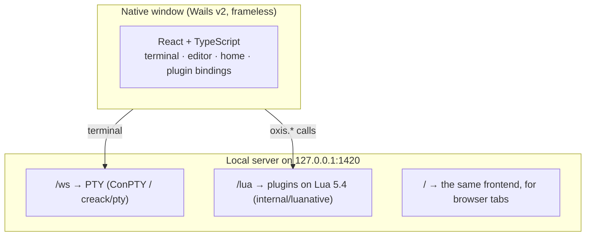
```mermaid
flowchart TB
    subgraph WIN["Native window (Wails v2, frameless)"]
        UI["React + TypeScript<br>terminal · editor · home · plugin bindings"]
    end
    subgraph SRV["Local server on 127.0.0.1:1420"]
        WS["/ws → PTY (ConPTY / creack/pty)"]
        LUA["/lua → plugins on Lua 5.4 (internal/luanative)"]
        WEB["/ → the same frontend, for browser tabs"]
    end
    WIN -->|"terminal"| WS
    WIN -->|"oxis.* calls"| LUA
```

- `cmd/oxi` starts `internal/wailsapp`, which opens the window, serves
  the embedded frontend to it, and exposes native calls (files, plugins,
  git, window size, clipboard, updates) as `window.go.wailsapp.App.*`.
- Wails' asset server can't carry WebSockets, so `internal/server`
  runs a loopback HTTP server for the PTY WebSocket and also serves the
  frontend, which is how `http://127.0.0.1:1420` works in a browser
  (next free port if 1420 is taken). It only accepts connections from
  the OXIS window and its own origin, so other websites can't reach your
  shell.
- `internal/pty` starts the shell (`OXIS_SHELL` overrides the choice)
  and plays its output on a screen model (`linescreen.go`) that sends
  the page its lines with their colours: new text as it arrives, and a
  "rewind" when a program redraws lines it already drew. The model is
  checked against xterm.js on recorded random output
  (`testdata/xterm_screens.json`). A full-screen program's output goes
  to xterm.js untouched. The frontend renders colours with the theme's
  terminal palette (`terminal/ansi.ts`). `OXIS_PTY_TRACE=<file>` records
  the raw output, plus each read's length and the terminal size in
  `<file>.reads`, for diagnosing rendering problems.
- In the browser, the frontend has no native file access, so the editor
  and anything file-based need the desktop app.

```
cmd/oxi/                 entry point, Windows version info and icon
internal/wailsapp/       window, native bindings, self-update, window size
internal/server/         loopback HTTP + PTY WebSocket
internal/pty/            ConPTY (Windows) and creack/pty (Linux) sessions
internal/update/         update check against GitHub
frontend/src/App.tsx     app shell: terminal, prompt, editor, home, commands
frontend/src/terminal/   output model, history, keybinds, themes, workspaces, trackers
frontend/src/plugins/    Lua runtime and API, plugin manager, Market, git, backup
cloudflare/              Market website, index.json and free plugins
scripts/                 build, dev, setup, installer, clean-install
npm/                     npm launcher package (downloads the prebuilt binary)
```

---

## Building and CI

`.github/workflows/build.yml` runs on every push and pull request to
`main`:

| Job | Output |
|---|---|
| `build-linux` (ubuntu-latest) | `oxis`, `.deb`, portable `.tar.gz` |
| `build-windows` (windows-latest) | `.msi` and bare `oxis.exe` |
| `publish-release` (pushes to `main` only) | both of the above, published together to the `latest-build` release |

Both build jobs also run the Go tests (`go test ./internal/...`), so the
process, file-watching and streaming code is tested on Windows, Linux and macOS.
The Linux job runs the frontend's tests too (`cd frontend && npm test`,
Vitest): output and colour parsing, readline editing, sessions, editor
suggestions, Go to symbol, the directory probe and history filtering.

The icons (`cmd/oxi/oxis.ico`, `frontend/public/favicon.ico` and
`logo.png`) are drawn from the logo's geometry by
`python scripts/make-icons.py`, sharp at every size from 16 px up; after
changing them, the Windows build re-embeds the icon in `oxis.exe`.

Every build is stamped by `scripts/buildstamp.js` with its version,
commit, nearest release tag, build number and dates: into the binary
(`-ldflags -X`, package `internal/buildinfo`), which the updater relies
on, and into the page, which `'version` shows. Locally, `npm run build`
and `build-linux.sh` do the same. Bumping `version` in `package.json`
makes CI tag the first build of `main` that carries it as
`v<version>`.

Replacing the release's files starts GitHub's download counts from
zero, so `publish-release` first saves the count so far in a comment in
the release notes (`<!-- downloads: … -->`; leave it in place if you
edit them). The website and the README's downloads badge (the site's
`/downloads` endpoint) add the current files' downloads to it.

---

## Contributing

See [CONTRIBUTING.md](CONTRIBUTING.md). Bug reports and pull requests
are welcome on [GitHub](https://github.com/oxlaboratory/oxis).

## License

OXIS is licensed under the [Apache License 2.0](LICENSE).

<br>

<a href="https://github.com/oxlaboratory/oxis/stargazers"></a>

<p align="center"><sub><i>OXIS — terminals were the beginning.</i></sub></p>
