<div align="center">

<a href="https://oxis-market.pages.dev"></a>

# OXIS

### The terminal you can script.

Your real **PowerShell, bash, zsh or fish** — plus a built-in editor, workspaces,<br>
workflows, full-colour output, deep theming and Lua plugins.<br>
One ~14&nbsp;MB binary for Windows and Linux. No account. No telemetry.

[](https://github.com/oxlaboratory/oxis/actions/workflows/build.yml)
[](https://github.com/oxlaboratory/oxis/releases/tag/latest-build)
[](LICENSE)
[](https://github.com/oxlaboratory/oxis/stargazers)


[**Download**](https://github.com/oxlaboratory/oxis/releases/tag/latest-build) &nbsp;·&nbsp;
[**Website**](https://oxis-market.pages.dev) &nbsp;·&nbsp;
[**Plugin Market**](https://oxis-market.pages.dev/#market) &nbsp;·&nbsp;
[**Docs**](#documentation) &nbsp;·&nbsp;
[**Changelog**](CHANGELOG.md)

<br>

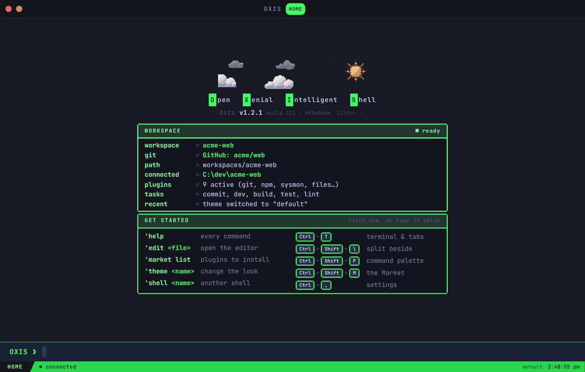

<sub>Recorded from the app itself: every frame is a screenshot of OXIS running those commands in a real project.</sub>

</div>

## Why OXIS

<table>
<tr>
<td width="33%" valign="top">

**🐚 Your shell, unchanged**<br>
PowerShell 7, Windows PowerShell, bash, zsh or fish, with your profile, aliases and tools, in full 24-bit colour.

</td>
<td width="33%" valign="top">

**⚡ `'commands` on top**<br>
Start a line with `'` for 50+ built-ins: history, reverse search, tab completion and a command palette.

</td>
<td width="33%" valign="top">

**📝 An editor, built in**<br>
Tabs, a file tree, Vim modes, find & replace, an image viewer, and a live preview that renders your page like a real server.

</td>
</tr>
<tr>
<td valign="top">

**🗂️ Workspaces**<br>
Each project keeps its tasks, multi-step workflows (retries, conditions, exit codes), plugins and git remote.

</td>
<td valign="top">

**🧩 Lua plugins**<br>
Commands, keymaps and events in plain Lua — plus programs, file watching, the open file and streamed AI answers — with permissions, a Market and one-command publishing.

</td>
<td valign="top">

**🎨 Themes**<br>
10 built in, 78 keys each, a live theme editor, and your Windows Terminal colour scheme imports straight in.

</td>
</tr>
</table>

## Get it

**Windows 10/11** — [installer (.msi)](https://github.com/oxlaboratory/oxis/releases/tag/latest-build) or the portable exe:

```powershell
Invoke-WebRequest https://github.com/oxlaboratory/oxis/releases/download/latest-build/oxis.exe -OutFile oxis.exe; .\oxis.exe
```

**Linux x64** — [`.deb` or portable tarball](https://github.com/oxlaboratory/oxis/releases/tag/latest-build), or the bare binary (needs `libgtk-3-0` and `libwebkit2gtk-4.1-0`):

```bash
curl -Lo oxis https://github.com/oxlaboratory/oxis/releases/download/latest-build/oxis && chmod +x oxis && ./oxis
```

**From source** — Go 1.22+ and Node.js 24+:

```bash
git clone https://github.com/oxlaboratory/oxis.git && cd oxis && npm run setup && npm run build
```

Then keep it current from inside OXIS with `'update install`.

## A minute with OXIS

```text
'help                      every command (Ctrl+Shift+P for the palette)
'edit src/app.ts           open the built-in editor
'theme ember               switch theme — 'theme set glow 0.4 tweaks one thing live
'workspace switch api      jump to another project, with its tasks and git remote
'task test                 run a project task
'workflow release          build → test → deploy, with retries and exit codes
'market install autotest   add a plugin from the Market ('autotest then re-runs tests on save)
'version                   exactly which build you're on
```

Anything that doesn't start with `'` goes to your shell, as usual.

## Make it yours in Lua

```lua
--[[@manifest
version: 1.0.0
description: open a pull request for a branch
permissions: shell
]]
oxis.command("pr", function(args, rest)
  oxis.run("gh pr create --web --head " .. oxis.quote(rest ~= "" and rest or "HEAD"))
end, "open a GitHub PR")
```

Save it in `created-plugins/` and `'pr my-branch` works. The same API
drives tasks, workflows, keymaps, events and the Home screen, runs
programs and hands you their output as it prints, watches files, edits
the open file, and streams HTTP — so an AI assistant's answer can type
itself into your editor as it's written. See the [Lua API](#lua-api).

## Screenshots

| | |
|---|---|
| 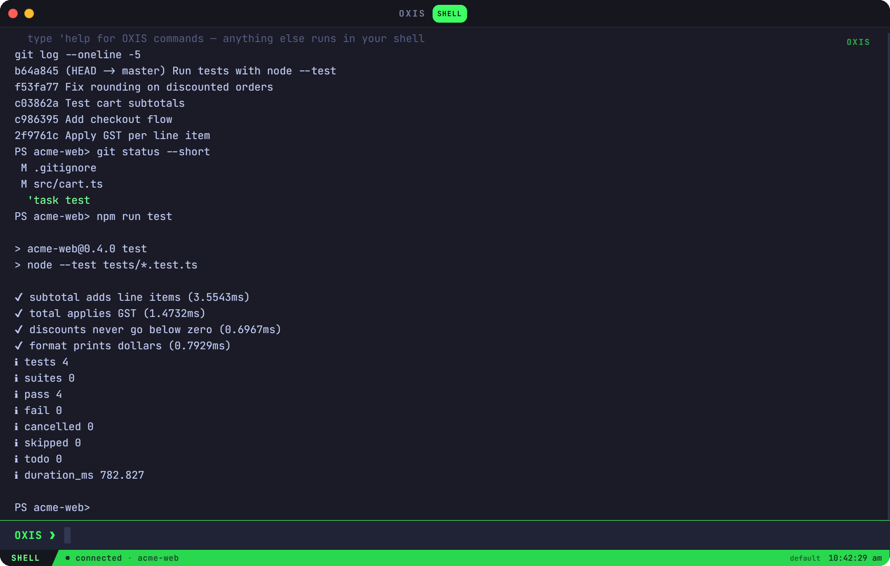 | 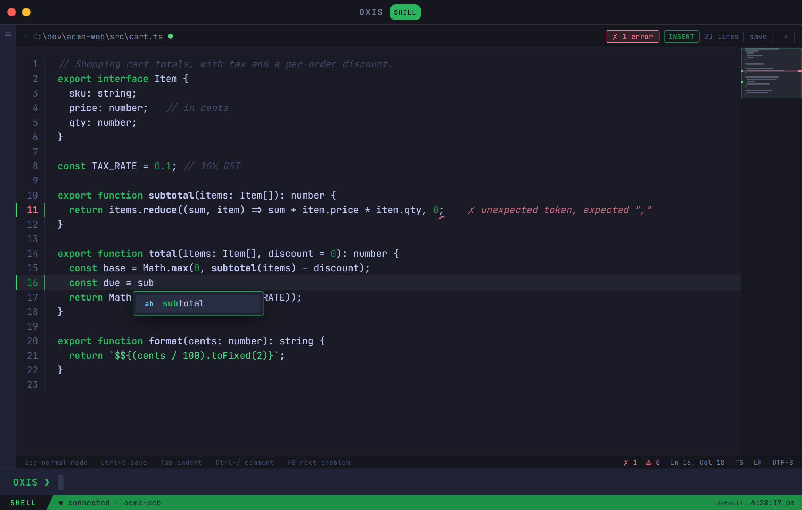 |
| Your shell in full colour, with `'` commands and one prompt | The built-in editor (`'edit src/cart.ts`) |
| 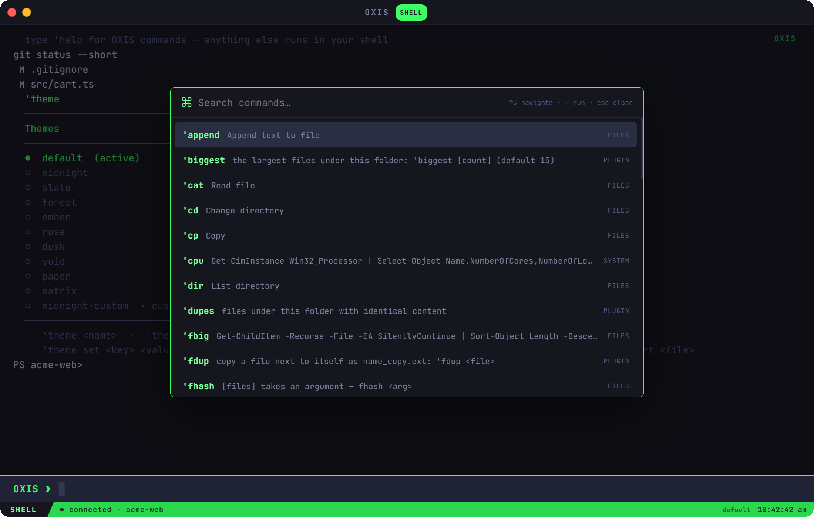 | 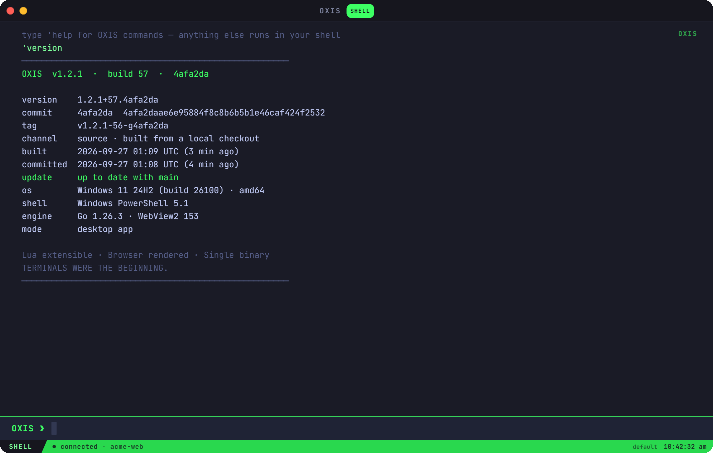 |
| The command palette (Ctrl+Shift+P) | `'version` — the exact build you're running |
| 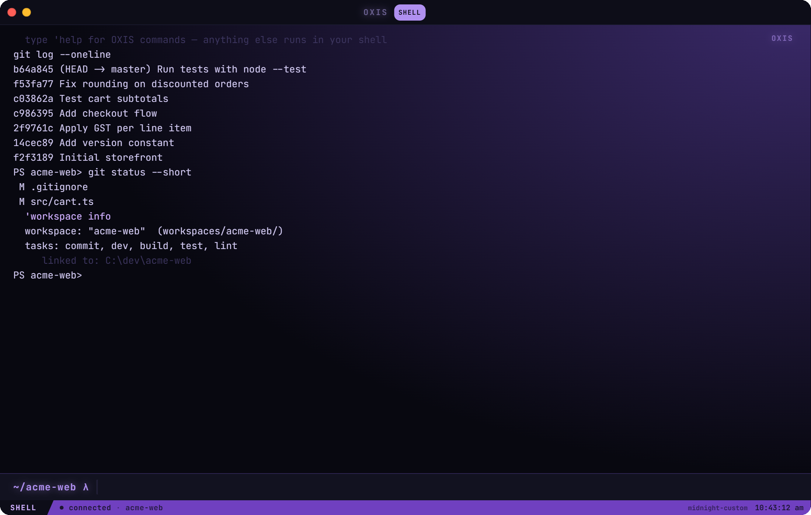 | 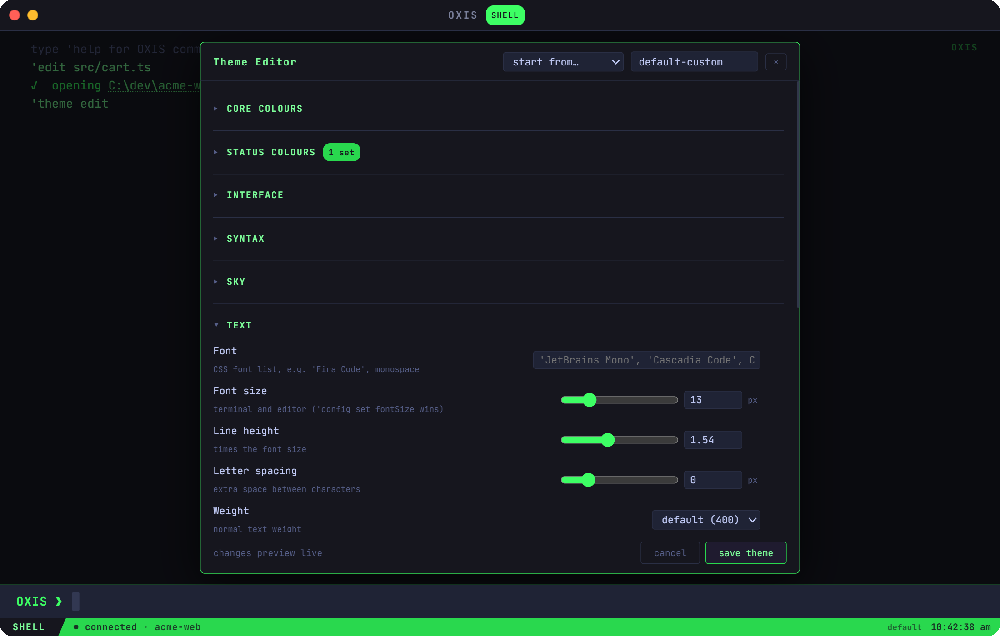 |
| A theme tweaked with four `'theme set` lines | `'theme edit` — every option with a live preview |
| 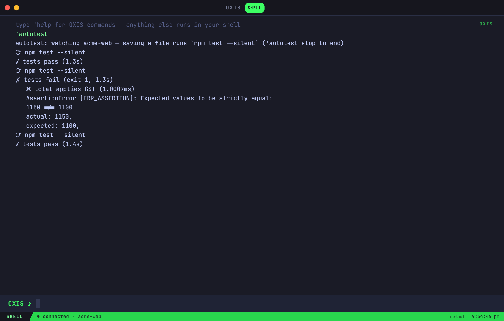 | 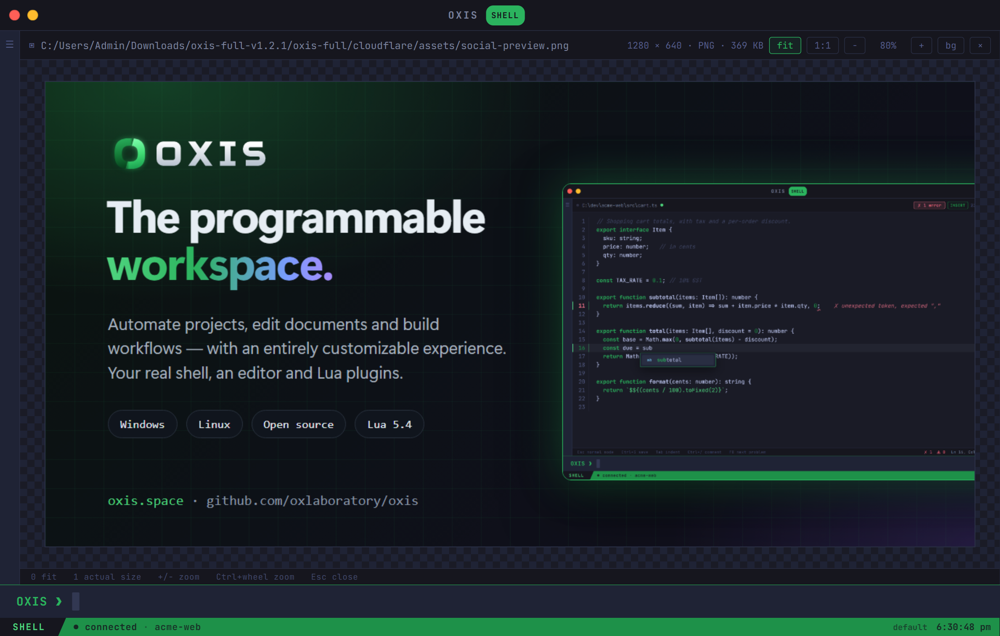 |
| `'autotest` from the Market: tests re-run on every save (a plugin built on `oxis.fs.watch` and `oxis.process.spawn`) | Pictures open in an image viewer, not as bytes |

**Browser mode** — the same UI in a browser tab at `http://127.0.0.1:1420`
while the desktop app is running:

| | |
|---|---|
| 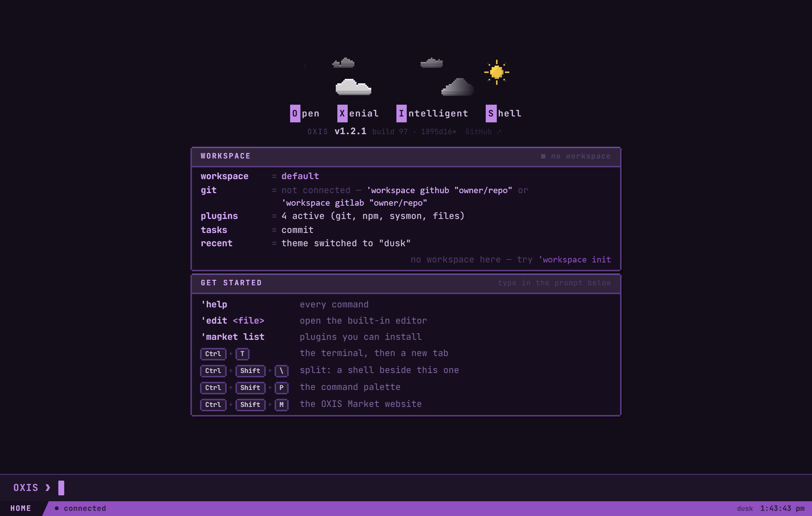 | 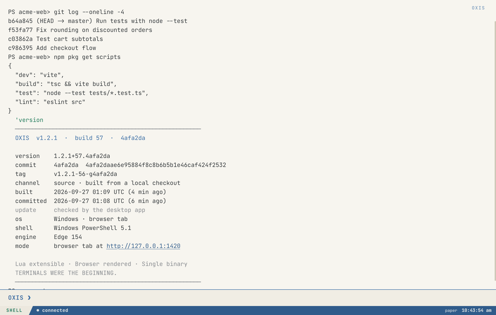 |

<p align="center">
  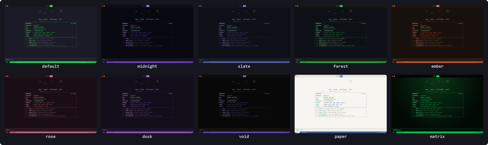
</p>

## Roadmap

- [x] Colour output: 16, 256 and 24-bit colour
- [x] Self-update from source with rollback, and `'version` build info
- [x] Windows Terminal colour schemes via `'theme import`
- [ ] A tested macOS build (Wails supports it; nobody has tried it yet)
- [ ] Plugin APIs for the editor's open file, file watching and processes
- [ ] Streaming HTTP for plugins, for AI assistants that answer as they write
- [ ] Premium plugins in the Market (AI DevOps first)

Ideas and bug reports are welcome in [issues](https://github.com/oxlaboratory/oxis/issues).
**If OXIS is useful to you, a ⭐ helps other developers find it.**

---

## Documentation

- [Getting started](#getting-started)
- [Using OXIS](#using-oxis) — the prompt, keys, copying, window size
- [Commands](#commands)
- [Built-in editor](#built-in-editor)
- [Workspaces](#workspaces) — named workspaces, projects, tasks, workflows, git
- [Plugins](#plugins) — built-ins, manifests, permissions, Market
- [Lua API](#lua-api)
- [Themes](#themes)
- [Your config folder (~/.oxis)](#your-config-folder-oxis)
- [Settings, backup and diagnostics](#settings-backup-and-diagnostics)
- [Auto-update](#auto-update)
- [OXIS Market: premium plugins](#oxis-market-premium-plugins)
- [Architecture](#architecture)
- [Building and CI](#building-and-ci)
- [Contributing](#contributing) · [License](#license)

---

## Getting started

### Download

Every push to `main` is built by GitHub Actions and published to the
[`latest-build` release](https://github.com/oxlaboratory/oxis/releases/tag/latest-build):

| Platform | Files |
|---|---|
| Windows (x64) | `oxis-<version>.msi` installer, or the bare `oxis.exe` |
| Linux (x64) | `oxis_<version>_amd64.deb`, `oxis-<version>-linux-portable.tar.gz`, or the bare `oxis` binary |

Linux needs GTK 3 and WebKitGTK (`libgtk-3-0`, `libwebkit2gtk-4.1-0`);
the `.deb` pulls them in. Windows needs the WebView2 runtime, which
ships with Windows 10 and 11.

There is no macOS build. Wails supports macOS, so building from source
should work, but it isn't tested.

### Build from source

Requirements: Go 1.22+, Node.js 24+, and on Linux
`libgtk-3-dev libwebkit2gtk-4.1-dev pkg-config`.

```bash
git clone https://github.com/oxlaboratory/oxis.git
cd oxis
npm run setup        # checks tools, installs dependencies
npm run build        # → dist/oxis.exe (Windows) or dist/oxis + .deb (Linux)
npm run build:msi    # Windows installer (WiX, or NSIS as a fallback)
npm run dev          # rebuild and relaunch on every change
```

The frontend is embedded in the Go binary, so `npm run dev` does a full
rebuild on each change (a few seconds) rather than hot reloading.

### Where OXIS keeps data

OXIS keeps its data next to `oxis.exe` when it can write there (a
portable folder). If it can't — an install under Program Files or
`/usr/bin` — it uses your per-user data folder instead:
`~/.local/share/oxis` (or `$XDG_DATA_HOME/oxis`) on Linux and macOS,
`%LOCALAPPDATA%\OXIS` on Windows. Installs from before this change used
`~/Downloads/OXIS`; if that folder exists, OXIS keeps using it. The
first time, it clones this repository into `<data folder>/source` in
the background (skipped quietly without git or network).

```
<data folder>/
├── plugins/              Market-installed plugins
├── created-plugins/      plugins you create ('plugin new)
├── created-documents/    files from 'new / 'touch
├── workspaces/           named workspaces (see Workspaces)
│   └── registry.json
└── window.json           window size saved by 'oxis resize
```

Your personal config lives separately, in [`~/.oxis`](#your-config-folder-oxis).

The Windows MSI defaults to `%USERPROFILE%\OXIS` so OXIS can write next
to itself without administrator rights, and it won't install anywhere
outside your profile. Installing over an older version (or another copy
of the same version) upgrades it in place. If an earlier MSI left your
data in `~/Downloads/OXIS`, OXIS copies it into its own folder the first
time it starts there; the old folder is left alone.

If you run portable builds and extract a new zip over an old folder,
old workspace data comes along with it. `scripts/clean-install.ps1`
removes OXIS's own leftovers (it asks first, and never touches linked
projects):

```powershell
.\scripts\clean-install.ps1 -DistPath "C:\path\to\old\dist"
```

### Antivirus warnings

`oxis.exe` isn't code-signed, and Windows Defender/SmartScreen
sometimes flags new unsigned Go binaries. That's a reputation
heuristic, not a detection. If it happens with a build you made,
[submit it to Microsoft](https://www.microsoft.com/en-us/wdsi/filesubmission)
or add an exclusion for `dist\oxis.exe` while developing.

---

## Using OXIS

### The prompt

There is one command prompt, fixed to the bottom of the window above
the status bar, on Home, in the terminal and in the editor. Output
scrolls above it and never goes underneath it.

- Lines starting with `'` (or `oxi `) are OXIS commands; everything
  else runs in your shell.
- Pressing Enter on Home switches to the terminal so you can see the
  output. An empty Enter just opens the terminal.
- Typing anywhere that isn't a text field puts the text in the prompt.
  **Ctrl+I** jumps to it from anywhere. Clicking into the editor or
  another field leaves focus there.
- A line that starts with a space isn't saved to history, and neither
  is one that hands over a secret (`'ai key sk-…`,
  `$env:OPENAI_API_KEY = "…"`, `export GH_TOKEN=…`).
- The terminal shows `OXIS` in its top-right corner. There's no startup
  splash; the app opens straight onto Home.

### Keys

| Key | Action |
|---|---|
| ↑ / ↓, Ctrl+P / Ctrl+N | Previous / next command. If you typed something first, only commands starting with it are shown. |
| Ctrl+R | Reverse search through history (Ctrl+R again for older matches, Enter to run, Esc to cancel) |
| Tab | Complete an `'command` name; otherwise passed to the shell |
| Ctrl+A / Ctrl+E | Start / end of line |
| Ctrl+K / Ctrl+U / Ctrl+Y | Cut to end / cut to start / paste the cut text |
| Alt+F / Alt+B, Ctrl+←/→ | Word right / left |
| Alt+D / Alt+Backspace | Delete word right / left |
| Alt+U / Alt+L / Alt+C / Alt+T | Uppercase / lowercase / capitalise / transpose word |
| Shift+arrows, mouse | Select text in the prompt |
| Ctrl+C | Copy the selection; with nothing selected, interrupt the running program |
| Ctrl+Shift+C | Copy the selection (never interrupts) |
| Ctrl+D / Ctrl+Z / Ctrl+\\ | Send EOF / suspend / quit to the shell |
| Ctrl+L | Clear the terminal |
| Ctrl+Shift+F | Find in terminal output (Enter / Shift+Enter to step, Esc to close) |
| PageUp / PageDown | Scroll the output |
| Ctrl+= / Ctrl+- / Ctrl+0 | Zoom in / out / reset (saved as the `fontSize` setting) |
| Ctrl+T / Ctrl+W | Show the terminal / go back to Home |
| Ctrl+Shift+P | Command palette |
| Ctrl+Shift+M | Open the Market website |

With an empty prompt, arrow keys, Home/End, Delete, Tab, Esc and F1–F12
go straight to the running program, so interactive tools still work.

### Selecting and copying output

Terminal output works like VS Code's integrated terminal:

- Drag with the mouse to select one or many lines, including after
  scrolling back through long output. Indentation and line breaks are
  kept when you copy.
- **Ctrl+C** copies a selection. It only interrupts the running
  process when nothing is selected, so copying an error never kills a
  build or server.
- **Right-click** the output for **Copy**, **Select All** and
  **Clear Selection**.
- URLs in the output open in your browser; paths ending in a file
  extension open in the editor.

If the WebView's clipboard is unavailable, OXIS writes to the OS
clipboard directly (Win32 on Windows; `pbcopy`, `xclip`, `xsel` or
`wl-copy` elsewhere).

### Window size

```
'oxis resize                  show the current size and presets
'oxis resize large            small 800×520 · default 940×600 · medium 1100×700
                              · large 1280×800 · xl 1600×1000
'oxis resize 1200x760         any size from 640×400 to 3840×2160
'oxis resize config           open window.json at the width line
```

The window resizes immediately and OXIS reports the size the OS
actually applied (a size larger than the screen gets limited). The size
is saved to `window.json` in the data folder and used on the next
launch. In a browser tab the size belongs to the browser, so the
command only reports it.

---

## Commands

`'help` lists everything, `'help <command>` shows every form of a
command with examples, and `'help <plugin>` lists a plugin's commands.
The command palette (Ctrl+Shift+P) searches the same list.

| Area | Commands |
|---|---|
| Files | `'ls` `'cd` `'pwd` `'cat` `'new`/`'touch` `'mkdir` `'rm` `'cp` `'mv` `'write` `'append` `'hash` `'size` `'edit` `'open` |
| Shell | `'clear` `'run` `'env` `'ps` `'kill` `'ip` `'disk` `'sysinfo` `'which` `'find` `'grep` `'history` `'histclear` `'ports` `'user` `'path` `'alias` |
| App | `'home` `'hide workspace` `'show workspace` `'oxis resize` `'theme` `'config` `'version` `'diagnostics` `'backup` `'restore` `'update` |
| Plugins | `'plugin …` `'market …` |
| Workspaces | `'workspace …` `'project …` `'task` `'workflow …` |

`'new`/`'touch` create files in `created-documents/` (or the active
workspace's `documents/`), using the native file API rather than the
shell, so the file always lands in the same place.

---

## Built-in editor

`'edit <file>` opens a file; `'edit` alone opens the file tree. A
relative path opens from the shell's current folder, or from the data
folder if it only exists there (`'edit created-documents/notes.md`); a
new file is created in the current folder. Absolute paths open that
exact file, and a leading `/` means the root of the app's drive on
Windows. Quote paths with spaces.

- **Modes.** Normal (hjkl, `0`/`$`, `gg`/`G`, `w`/`b`, `x`, `dd`, `dw`,
  `o`/`O`), Insert (`i`, `a`, `o`…) and Visual (`v`, then `d`/`x`/`y`).
- **Keys.** Ctrl+S save, Ctrl+Z / Ctrl+Y (or Ctrl+Shift+Z) undo/redo,
  Ctrl+F find, Ctrl+H replace, Ctrl+G go to line, Ctrl+B file tree,
  Tab inserts two spaces, Esc closes (asks if there are unsaved changes).
- **Tabs** for several open files, with unsaved markers and Save All.
- **File tree** rooted at the data folder, or at the linked project
  when the active workspace has one. Fully keyboard-driven; drag a file
  onto a folder to move it.
- **Syntax highlighting** for TypeScript/JavaScript, Go, Lua, Python,
  JSON, CSS, HTML, Markdown, shell and YAML; turned off above 500,000
  characters so huge files stay responsive.
- **Change gutter** marking lines changed since the last save.
- **Live preview** for `.html` and `.md` files: a resizable split (or
  full view with Ctrl+Shift+Enter), refreshed shortly after you stop
  typing. In the desktop app the page is served from its own folder on
  a private local address, so it looks the way it will on a real
  server: stylesheets, ES modules, images and fonts all load, and
  **↗ browser** opens it in your web browser. Markdown is rendered
  GitHub-style, including Mermaid diagrams and the README's own
  relative images. Your unsaved text is what's shown, and the page
  can't reach OXIS itself.
- **Images** (png, jpg, gif, webp, avif, bmp, ico, svg) open in an image
  viewer: its size, type and file size, fit or actual size, zoom with
  `+`/`−` or Ctrl+wheel, and a checkerboard, dark or light background.
  An SVG can be opened as text with **edit source**. Other binary files
  (an `.exe`, a zip) get a notice instead of a screen of garbage.
- Closing the last file closes the editor (and its file tree); with
  only the file tree open, Esc or **close editor** leaves it.

Saving a plugin's `.lua` file reloads the plugin immediately.

---

## Workspaces

### `.oxis/workspace.lua`

Any folder can carry an `.oxis/workspace.lua`. When you `cd` into it,
OXIS loads it (unless a named workspace is active). It runs with the
full [Lua API](#lua-api):

```lua
oxis.theme("midnight")
oxis.plugin.enable("docker")

oxis.command("dev", function() oxis.run("npm run dev") end, "start the dev server")
oxis.task("test", "npm test", "run the tests")

oxis.autocmd("WorkspaceLoaded", function()
  oxis.echo("my-app ready")
end)
```

Edits are picked up automatically (checked every 3 seconds);
`'workspace reload` does it immediately.

### Named workspaces

```
'workspace init "my-app"        create workspaces/my-app/
'workspace list / switch <name> / rename <old> <new> / delete <name>
'workspace switch default       back to the shared default context
'workspace info                 name, tasks, linked folder
'workspace export <name> [path] / import <path> [name]
```

Each named workspace is a folder with its own `.oxis/workspace.lua`,
`documents/`, `plugins/`, `scripts/`, `tasks/` and `workflows/`. While
one is active, `'new` and `'plugin new` write into it, and its own
plugins, tasks and workflows are loaded (the previous workspace's are
unloaded). OXIS reopens the workspace you were last in when it starts.
When OXIS is updated, older workspaces get any new folders added
automatically; nothing existing is changed.

### Linking a real project

```
'workspace link "C:\code\my-app"      connect the active workspace to a folder
'workspace unlink
'workspace newfile src/util.ts        create a file inside the linked folder (opens it)
'workspace newdir  src/lib
'workspace move    notes.md docs      move a file within the linked folder
```

Linking records the folder, drops a small `.oxis-connector.json` marker
in it (and adds it to that folder's `.gitignore`), and switches the
editor's file tree to it. Paths given to `newfile`/`newdir`/`move` can't
escape the linked folder.

Linking also detects the project type and writes runnable tasks to the
workspace's `.oxis/tasks/auto-detected.lua`: Rust, Node (npm, pnpm,
yarn or bun, from the real `scripts`), Python, Go, .NET, Java
(Maven/Gradle), C/C++ (CMake/Make), PHP and Ruby. Tasks are refreshed
when the project changes, but a task you've edited is never
overwritten.

### Git

```
'workspace github <owner/repo or URL> [--force]    set up origin (inits a repo if needed)
'workspace gitlab <owner/repo or URL> [--force]    same, for GitLab
'workspace github unlink [--remove-remote]         disconnect origin
'task commit <message>                             stage, commit and push
```

Git runs as real `git` processes with argument lists (never a shell
string). `'task commit` reports "nothing to commit", pushes when an
`origin` exists, explains push failures (authentication, rejected,
unreachable, missing repo) and can be cancelled with Ctrl+C, which
kills the git process. Unlinking renames `origin` to a timestamped
backup unless you pass `--remove-remote`. Authentication uses whatever
SSH key or credential helper is already set up.

### Projects

```
'project init [dir]    create .oxis/ with workspace.lua, project.lua, tasks/, workflows/ …
'project open [dir]    load it
'project run <name>    run a workflow or task
'project task / 'project workflow   list them
```

### Tasks and workflows

A task is a named shell command: `oxis.task("build", "npm run build")`,
run with `'task build`.

A workflow is a sequence of steps, declared in `workflows/*.lua`:

```lua
oxis.workflow("release", {
  env = { NODE_ENV = "production" },
  steps = {
    { task = "install" },
    { run = "npm run build", retry = 2 },
    { command = "version" },                              -- an 'command
    { run = "npm test", continueOnError = true },
    { condition = "env:DEPLOY", run = "npm run deploy" }, -- skipped unless DEPLOY is set
    { parallel = { { command = "plugin list" }, { command = "workspace info" } } },
  },
}, "build, test and deploy")
```

```
'workflow list / 'workflow <name> / 'workflow info <name> / 'workflow cancel
```

Steps report progress as they run. There's one shell, so inside
`parallel` only `command` steps actually run at the same time; shell
steps still run one after another.

---

## Plugins

A plugin is a Lua file run in its own embedded Lua 5.3 VM
([fengari](https://fengari.io)).

```
'plugin list / enable <n> / enable all / disable <n> / reload <n> / reloadall
'plugin new <n> [--template=basic|dev|devops|system]   create one and open it in the editor
'plugin info <n> / docs <n> / validate <n> / test <n> / doctor
'plugin permissions <n> [grant|revoke <namespace>]
'plugin uninstall <n> [--force] / delete <n> / export <n> [path] / rollback <n>
'plugin publish <n> / unpublish <n>
```

`'plugin doctor` checks every installed plugin at once and suggests a
fix for each problem. `'plugin rollback` restores the version from
before the last `'market update`.

### Built-in plugins

Shortcut plugins (each command runs one shell command, with PowerShell
and POSIX variants):

| Plugin | Default | Commands |
|---|---|---|
| git | on | `gs` `gl` `gd` `ga` `gp` `gpl` `gb` `gst` `gc <msg>` `gco <branch>` |
| npm | on | `ni` `nid` `nb` `nd` `nt` `nr <script>` `nls` |
| sysmon | on | `top` `mem` `cpu` `uptime` |
| files | on | `fsize` `fopen` `fhash` `flatest` `fbig` |
| docker | off | `dps` `dimg` `dup` `ddown` `dlog` `dsh` `drm` |
| network | off | `myip` `wifi` `ping` `dns` |
| python | off | `py` `pip` `venv` `act` `freeze` `pipu` |
| go | off | `gobuild` `gorun` `gotest` `gotidy` `govet` |
| rust | off | `cb` `cr` `ct` `cc` `cbr` |
| winutil | off | `admin` `events` `sfc` `winver` (Windows only) |

Lua plugins (off by default, `'plugin enable <name>`): `fuzzy`,
`git_advanced`, `lsp_diag`, `http`, `session_notes`, `env_manager`,
`benchmark`, `process_manager`, `project_init`, `clipboard`, `todo`,
`docker_compose`, `file_ops`, `system_health`, `snippets`,
`ssh_manager`. `'help <plugin>` lists each one's commands. All of them
work on Windows and Linux, and take their input as arguments (`'ff cfg`,
`'pfind 3000`, `'note call Sam back`), asking only when it's missing.
On Linux, `clipboard` needs wl-clipboard, xclip or xsel, and `http`
uses curl (and jq to format JSON, if installed).

### Manifest

A plugin can declare metadata in a comment block at the top. It's
parsed, never executed:

```lua
--[[@manifest
version: 1.0.0
description: does something useful
author: you
category: dev
min_oxis_version: 1.2.1
os: windows, unix
permissions: fs, net
dependencies: git_advanced>=1.0.0, lsp_diag^1.2.0
]]
```

Before loading, OXIS checks the OXIS version, OS, and dependencies
(missing ones, incompatible versions with `>=`, `^` or exact ranges,
and cycles). A disabled dependency that's installed is enabled
automatically; a missing one has to be installed with `'market install`.

### Permissions

These calls need a permission for the plugin that makes them:
`oxis.fs.*` (fs), `oxis.process.*` (process), `oxis.net.*` (net),
`oxis.system.*` (system), `oxis.workspace()` (workspace),
`oxis.newTerminal()` (terminal), and `oxis.run()`/`oxis.task()` (shell).

- A plugin **without** a manifest asks once per permission ("Plugin X
  wants to …"), and the answer is remembered.
- A plugin **with** a manifest can only ever get what its
  `permissions:` line lists; anything else is refused with an error
  naming the missing permission. `shell` is the exception: it always
  asks once, so older manifests keep working.
- Built-in plugins, `workspace.lua`, workspace tasks/workflows and
  `~/.oxis/config.lua` are your own code and aren't prompted.

`'plugin permissions <name>` shows and changes grants. Plugins each
have their own Lua VM and a Lua error is reported without affecting the
session, but plugins aren't sandboxed from each other beyond that.

### Market

```
'market list / search <q> / info <name> / install <name>
'market update <name> / update all
```

The Market is [oxis-market.pages.dev](https://oxis-market.pages.dev): a
static `index.json` plus `.lua` files, deployed from `cloudflare/` in
this repository. Installed plugins are ordinary Lua plugins.
`'market update` checks compatibility first, backs up the current
version, and restores it automatically if the new one fails to load.

**Publishing.** `'plugin publish <name>` validates the plugin (a
complete manifest is required) and opens a pull request against this
repository: one commit with `cloudflare/plugins/<name>.lua`, one with
its `cloudflare/index.json` entry (version, author, permissions,
platforms, size). Once a maintainer merges it, it's live: `'market`
and the website both read `index.json` from `main`, so the plugin can
be installed straight away and the website shows its card, built from
that entry, without a redeploy. Run it again to publish an update;
`'plugin unpublish` opens a removal PR. You can also open the PR by
hand with the same two files. See
[CONTRIBUTING.md](CONTRIBUTING.md#plugins).

Publishing needs the Market backend's `GITHUB_TOKEN` (a fine-grained
token for this repository with *Contents* and *Pull requests* set to
read and write), set as a secret in the Cloudflare Pages project; its
`/health` page says whether it's there. OXIS makes its Market requests
itself rather than from the page, so they aren't subject to CORS; for
OXIS in a browser tab, the backend allows `127.0.0.1`/`localhost` and
the app's own origins. To use your own Market backend, set
`localStorage["oxis-market-base"]` to its URL.

---

## Lua API

Everything is on the global `oxis` table.

| Call | Does |
|---|---|
| `oxis.command(name, fn(args, rest, raw), description)` | Register `'name`. `args` is a table of words (quotes removed), `rest` the words joined by spaces, `raw` the text after the command name exactly as typed (quotes, backslashes and tabs kept). |
| `oxis.task(name, cmd, description)` | Register a task (`'task name`) |
| `oxis.workflow(name, def, description)` | Register a workflow (see [Workspaces](#tasks-and-workflows)) |
| `oxis.run(cmd)` | Run a command in the shell. Multi-line scripts run as one script file (`.ps1` on Windows, bash elsewhere), so a `Read-Host`/`read` prompt gets your answer rather than the next line; `&&` works on Windows PowerShell 5.1 too. |
| `oxis.quote(text)` | `text` quoted as one argument for the platform's shell, safe to splice into `oxis.run()` (e.g. `oxis.run("git blame -- " .. oxis.quote(rest))`) |
| `oxis.echo(text)` | Print a line in the terminal |
| `oxis.cwd()` | The shell's current directory |
| `oxis.platform` | `"windows"` or `"unix"` |
| `oxis.theme(name)` | Switch theme |
| `oxis.option(key [, value])` | Get or set a persisted option |
| `oxis.keymap(mode, keys, fn)` | Bind keys, e.g. `oxis.keymap("normal", "<C-g>", fn)`; `<C-x>`, `<A-x>`, `<S-x>`. Modes: `normal`, `insert`, `visual` (editor modes) |
| `oxis.autocmd(event, fn)` | Run `fn` on an event (below) |
| `oxis.plugin.enable(name)` / `.disable(name)` | Toggle a plugin |
| `oxis.workspace(path)` | Mark `path` as the current project (shown on Home) |
| `oxis.newTerminal()` | Switch to the terminal view |
| `oxis.dashboard{ header, theme, shortcuts }` | Customise Home: a header line, a theme, and extra hint lines |
| `oxis.fs.read/write/list/stat/mkdir/remove(path, …, cb)` | File access; `cb(err, result)` |
| `oxis.fs.watch(path, fn, opts)` | Changes to a file or folder, as they happen ([below](#watching-files)) |
| `oxis.process.spawn(opts, callbacks)` | Run a program and get its output as it prints ([below](#running-programs)) |
| `oxis.process.list(cb)` / `.kill(pid, cb)` | Processes |
| `oxis.net.request(opts, cb)` | HTTP request: `{ url, method, headers, body, timeout }` (seconds, default 60) → `{ status, ok, body, headers }`. In the desktop app OXIS makes the request itself, so servers without CORS headers (local and self-hosted APIs) work |
| `oxis.net.stream(opts, callbacks)` | HTTP response as it arrives: server-sent events and JSON lines, for AI answers that appear as they're written ([below](#streaming-http)) |
| `oxis.json.encode(value)` / `.decode(text)` | JSON ↔ Lua tables |
| `oxis.editor.*` | The file open in the editor ([below](#the-editor)) |
| `oxis.system.info(cb)` | OS, architecture, CPU count, Go version, OXIS's own memory use |

Events for `oxis.autocmd`: `ShellOpen` (alias `TerminalOpen`),
`ShellExit`, `ThemeChanged`, `PluginLoaded`, `PluginUnloaded`,
`WorkspaceLoaded`, `WorkspaceUnloaded`, `CommandExecuted`,
`CommandError`, `EditorOpened`, `EditorChanged`, `EditorSaved`,
`EditorClosed`, `ModeChanged`. The function gets the event's details as
a table (`{ path = ... }` for the editor events).

An error in a plugin's code, including a denied permission, is an
ordinary Lua error: `pcall` catches it. What a plugin starts (programs,
watchers, streamed requests, event handlers) is stopped when it's
unloaded, reloaded or disabled.

Branch on `oxis.platform` for shell commands that differ between
PowerShell and bash:

```lua
oxis.command("health", function()
  if oxis.platform == "windows" then
    oxis.run([[Invoke-WebRequest http://localhost:3000/health -UseBasicParsing | Select-Object StatusCode]])
  else
    oxis.run([[curl -s -o /dev/null -w "%{http_code}\n" http://localhost:3000/health]])
  end
end, "check the local server")
```

### Running programs

`oxis.process.spawn` runs a program without the shell tab, and hands its
output to the plugin as it's printed. It needs the `shell` permission,
like `oxis.run`.

```lua
local server = oxis.process.spawn({
  cmd = "npm", args = { "run", "dev" },   -- or shell = "npm run dev | tee dev.log"
  cwd = oxis.cwd(),                        -- the default
  env = { PORT = "3000" },
  lines = true,                            -- whole lines instead of chunks
}, {
  start  = function(pid) oxis.echo("dev server pid " .. pid) end,
  stdout = function(line) if line:find("ready") then oxis.echo("✓ up on :3000") end end,
  stderr = function(line) oxis.echo("⚠ " .. line) end,
  exit   = function(code, err) oxis.echo("dev server stopped: " .. tostring(err or code)) end,
})

server.write("rs\n")   -- to its stdin (server:write works too)
server.closeInput()     -- end of input
server.kill()           -- stops it and everything it started
```

`shell` runs a command line in PowerShell on Windows (pwsh when it's
installed, with UTF-8 output) and `/bin/sh` elsewhere. `kill()` stops
the whole process tree: a dev server started by `npm` goes too. Programs
still running when OXIS closes are stopped.

### Watching files

```lua
local w = oxis.fs.watch("src", function(change)
  -- change.path (absolute), change.op: "create", "write", "remove", "rename"
  oxis.echo(change.op .. " " .. change.path)
end, {
  recursive = true,                        -- the default for a folder
  ignore = { ".git", "node_modules" },     -- the default; names skipped anywhere below
  debounce = 100,                          -- ms; a burst is reported once per path
})
w.close()
```

A relative path is taken from the shell's current folder. Pass
`{ change = fn, ready = fn }` instead of `fn` to know when watching has
started. An editor's save (often a write, a rename and a chmod) is
reported as one `write`.

### Streaming HTTP

`oxis.net.stream` delivers a response while it's still arriving, which is
how AI APIs send an answer as they write it. Server-sent events
(OpenAI, Anthropic and most hosted APIs) arrive as `event`s; JSON lines
(Ollama) as `line`s; `data` gets the raw text.

```lua
oxis.command("ask", function(_, question)
  local answer = {}
  oxis.net.stream({
    url = "http://localhost:11434/api/chat",   -- Ollama; no API key needed
    method = "POST",
    body = oxis.json.encode({ model = "llama3.2", messages = { { role = "user", content = question } } }),
    timeout = 60,   -- seconds to wait for the answer to start
    idle = 120,     -- seconds it may go quiet
  }, {
    line = function(l)
      local piece = oxis.json.decode(l).message.content
      answer[#answer + 1] = piece
      oxis.editor.insert(piece)          -- write it into the open file as it arrives
    end,
    done = function(err, res)
      oxis.echo(err and ("✗ " .. err) or ("✓ " .. #table.concat(answer) .. " characters"))
    end,
  })
end, "ask a local model; the answer streams into the editor")
```

For a server-sent-events API, use `event = function(ev) ... end` (`ev.event`,
`ev.data`, `ev.id`); `response = function(status, headers)` runs when the
answer starts. The handle's `cancel()` stops it. In the desktop app OXIS
makes the request itself, so CORS doesn't apply.

### The editor

Lines and columns count from 1. Every change is one step in the
editor's undo history (a run of changes from a streamed answer undoes in
one go). These need the `editor` permission.

| Call | Does |
|---|---|
| `oxis.editor.current()` | `{ path, text, language, dirty, lines, line, col, selection, selectionStart, selectionEnd }`, or `nil` when no file is open |
| `oxis.editor.open(path [, line])` | Open a file (a picture opens in the image viewer) |
| `oxis.editor.insert(text)` | Insert at the cursor, replacing the selection |
| `oxis.editor.replaceLines(first, last, text)` | Replace whole lines |
| `oxis.editor.setText(text)` | Replace everything |
| `oxis.editor.select(line, col [, toLine, toCol])` | Move the cursor, or select |
| `oxis.editor.save([cb])` | Save; `cb(err, path)` |
| `oxis.editor.on(event, fn)` | `"open"`, `"change"` (once typing pauses), `"save"`, `"close"`; `fn({ path = ... })` |

Not available yet: cross-plugin calls.

### Plugin development guide

1. `'plugin new myplugin` writes a working starter to
   `created-plugins/myplugin.lua` (or the active workspace's
   `plugins/`), loads it, and opens it in the editor.
2. Edit it and press Ctrl+S; it reloads immediately.
3. Add a manifest before publishing, with `permissions:` listing only
   what the plugin uses.
4. Share the `.lua` file (drop it in someone's `plugins/` folder), or
   publish it to the Market with `'plugin publish myplugin`.

```lua
--[[@manifest
version: 1.0.0
description: a small example
author: you
category: utility
min_oxis_version: 1.2.1
os: windows, unix
]]

oxis.command("greet", function(args)
  oxis.echo("Hello, " .. (args[1] or "world") .. "!")
end, "say hello")

oxis.task("serve", "python -m http.server 8080", "serve this folder")

oxis.autocmd("ShellOpen", function()
  oxis.echo("myplugin loaded")
end)
```

---

## Themes

<p align="center">
  
</p>

```
'theme                     list themes
'theme <name>              switch
'theme set <key> <value>   change one thing about the active theme
'theme unset <key>         put one thing back to its default
'theme keys                every option with the active theme's value
'theme edit [name]         the theme editor (live preview)
'theme new <name>          the editor, starting a new theme
'theme export [name]       print a theme as JSON
'theme import <file>       add a theme from a JSON file
'theme delete <name>       delete a custom theme
```

Built-in themes: `default`, `midnight`, `slate`, `forest`, `ember`,
`rose`, `dusk`, `void`, `paper` (light) and `matrix`.

`'theme set` works on the active theme. A built-in theme is never
changed: the first `'theme set` makes a `<name>-custom` copy that
extends it and switches to it, so you can go back with `'theme <name>`.

```
'theme set promptText ~/acme λ
'theme set backgroundGradient radial-gradient(ellipse at top right, #3b2a6b 0%, #080810 65%)
'theme set glow 0.45
'theme set fontSize 15
```

<p align="center">
  
  
</p>

### What a theme can set

A theme is 16 core colours plus any of the options below. Anything it
leaves out is worked out from the core colours, so a theme only lists
what it changes. `"extends": "<theme>"` inherits everything you don't
set.

| Group | Keys |
|---|---|
| Core colours | `bg` `bg1`–`bg4` backgrounds, `border` `border2`, `text` `muted` `dim` `comment`, `purple` `purple2` `purple3` (the accents), `grey` `grey2` |
| Status colours | `success` `error` `warning` `link` |
| Interface | `selection` `caret` `promptColor` `promptBg` `promptBorder` `statusBg` `statusText` `titlebarBg` `titlebarText` `cornerMark` `scrollbar` `scrollbarHover` |
| Terminal colours | the 16 colours programs print with: `ansiBlack` `ansiRed` `ansiGreen` `ansiYellow` `ansiBlue` `ansiMagenta` `ansiCyan` `ansiWhite` and `ansiBright…` of each |
| Syntax (editor) | `synKeyword` `synString` `synNumber` `synComment` `synFunction` |
| Sky (Home) | `sun` `cloud` `moon` `star` |
| Text | `font` (a CSS font list), `fontSize` 9–28, `lineHeight` 1–2.4, `letterSpacing` −1–4, `fontWeight` 300–700, `ligatures` on/off |
| Shape & effects | `radius` 0–14, `padding` 4–64 (terminal side padding), `scrollbarWidth` 2–14, `glow` 0–1 |
| Cursor | `cursorStyle` block/bar/underline, `cursorBlink` on/off |
| Prompt & Home | `promptText` (up to 24 characters), `showSky` on/off, `showCornerMark` on/off |
| Background | `backgroundImage` (an `https://` or `data:image/` URL), `backgroundGradient` (a CSS gradient), `backgroundOpacity` 0–1, `backgroundBlur` 0–30, `backgroundFit` cover/contain/tile |
| Advanced | `css`: any extra CSS, applied while the theme is active |

Colours are any CSS colour (`#rrggbb`, `rgba(…)`, `color-mix(…)`).
Your own `'config set fontSize`, `cursorStyle` and `cursorBlink` win over
a theme's; `'config reset <key>` hands them back to the theme.

```json
{
  "name": "harbour",
  "extends": "slate",
  "purple": "#5cc8ff", "purple2": "#2f8fd8", "purple3": "#a6e3ff",
  "success": "#7ee787", "statusBg": "#1f6fb2",
  "font": "'Fira Code', monospace", "fontSize": 14, "ligatures": true,
  "promptText": "⚓ ❯", "glow": 0.25,
  "backgroundGradient": "linear-gradient(160deg, #0e1018 40%, #12304a)",
  "backgroundOpacity": 0.8
}
```

Save theme files in `~/.oxis/themes/` (they load at startup) or add one
with `'theme import <file>`. Unknown keys and invalid values are
ignored, and `'theme import` lists them.

**Bring your colour scheme.** `'theme import` also takes a Windows
Terminal colour scheme (an entry from its `settings.json` `schemes`, or
any of the published scheme collections). Its 16 colours become the
terminal colours, and the rest of OXIS is built from its background,
foreground and blues: `'theme import one-half-dark.json`, then
`'theme one-half-dark`.

---

## Your config folder (~/.oxis)

`~/.oxis` (`%USERPROFILE%\.oxis` on Windows) is yours and survives
reinstalls:

```
~/.oxis/
├── config.lua       runs at every startup
└── themes/*.json    extra themes, usable with 'theme <name>
```

`config.lua` has the full Lua API, like a `workspace.lua`:

```lua
oxis.theme("midnight")
oxis.plugin.enable("docker")
oxis.command("hi", function() oxis.echo("hello from config.lua") end, "say hello")
```

`'config edit` opens it (creating it from a template), and
`'config reload` re-runs it and reloads the theme files. Errors are
printed in the terminal and listed by `'diagnostics`.

---

## Settings, backup and diagnostics

```
'config list / get <key> / set <key> <value> / reset <key>
'config export [path] / import <path>
```

| Setting | Default | Effect |
|---|---|---|
| `fontSize` | theme's (`13`) | Terminal and editor font size in px |
| `cursorStyle` | theme's (`block`) | Prompt cursor: `block`, `bar` or `underline` |
| `cursorBlink` | theme's (`true`) | Whether the prompt cursor blinks |
| `updateCheckOnStartup` | `true` | Check for a newer build at startup |

Settings apply immediately and persist. The first three follow the
theme until you set them; `'config reset` hands them back to it. Themes
are managed with `'theme`.

`'backup [path]` writes settings, named workspaces, `created-documents/`
and `created-plugins/` to one JSON file; `'restore <path>` asks first
and only writes files the backup contains. Market plugins aren't
included (reinstall them with `'market install`).

`'version` shows exactly which build is running:

```
OXIS  v1.2.1  ·  build 57  ·  4f2a9c1

version    1.2.1+57.4f2a9c1
commit     4f2a9c1  4f2a9c1e0b7d…
tag        v1.2.1-7-g4f2a9c1  ·  latest-build
channel    latest-build · prebuilt by CI from main
built      2026-09-27 09:14 UTC (3 h ago)
committed  2026-09-27 09:02 UTC (3 h ago)
update     up to date with main
os         Windows 11 24H2 (build 26100) · amd64
shell      PowerShell 7+ (pwsh)
engine     Go 1.22.12 · WebView2 140
mode       desktop app
```

`'version --json` prints the same as JSON and `'version --copy` puts it
on the clipboard for a bug report. The build number counts the commits
on `main`, and the tag is the nearest `v*` release tag (in `git
describe` form when the build is past it).

`'diagnostics` shows the version, OS, runtime, plugin counts, active
workspace and the last recorded errors. Nothing is sent anywhere; OXIS
has no telemetry.

For output that renders wrongly, start OXIS with `OXIS_PTY_TRACE` set
to a file path: everything the shell sends, escape sequences included,
is appended to it. Attach that file to the bug report.

---

## Auto-update

A build knows the commit it was built from. At startup (and with
`'update`) OXIS asks GitHub for the latest commit on `main` and how far
apart the two are; if `main` has commits this build doesn't, the
terminal and status bar say a newer build is available and how many
commits behind you are. A build that is only *ahead* of `main` (your
own unpushed work) isn't offered an "update".
When GitHub can't be reached (offline, rate limited) `'update` says so
rather than claiming you're up to date. A build without a commit stamp
(built by hand, e.g. a plain `go build`) can't tell whether it's
current: `'update` shows the latest commit, and `'update install
--force` installs it anyway. Updating is a desktop-app feature; in a
browser tab `'update` points to the latest release instead.

`'update install` replaces the running app in place:

1. Clones the repository and builds it with `scripts/build-go.js`
   (needs git and Node). If that isn't possible, it downloads the bare
   binary from the `latest-build` release instead.
2. Renames the running executable to a backup, moves the new one into
   the same path, and starts it.
3. If the new build fails to start, or exits within two seconds, the
   backup is restored. Otherwise the new process deletes the backup
   once it has started, and the old one exits.

---

## OXIS Market: premium plugins

Premium plugins are planned as monthly Stripe subscriptions, with 75%
going to the plugin's developer and 25% to OXIS for third-party
plugins. Free plugins stay free. None of it can be purchased yet: every
premium listing is marked `comingSoon`, and payments stay in Stripe
test mode until account verification is finished.

What's built:

- `'market subscribe <name>` opens Stripe Checkout,
  `'market license <email>` sets the email subscriptions are checked
  against, and `'market status <name>` checks one now.
- A premium install fetches the source from a license-checked endpoint
  and stores it encrypted (AES-256-GCM, key derived from this install's
  device ID) in `.oxis/premium/`. The license is re-checked every time
  it loads, and it only exists decrypted in memory. That stops casual
  copying; it isn't DRM against someone determined on their own machine.
- `'plugin publish <name> --price=4.99 --interval=month` runs Stripe
  Connect onboarding and opens the Market PR with the price included.
- **AI DevOps**, the first premium plugin: `'ai explain / fix /
  generate / review / debug / command / plugin <text>` against any
  OpenAI-compatible endpoint, using your own key (`'ai key`,
  `'ai endpoint`, `'ai model`).

The payment backend (Cloudflare Pages Functions) and premium plugin
sources are kept private and aren't part of this repository. The
Market's `/health` endpoint reports which of its secrets and storage
bindings are configured.

**Deploying the website.** `npm run deploy:site` publishes `cloudflare/`
to Cloudflare Pages (log in once with `npx wrangler login`, or set
`CLOUDFLARE_API_TOKEN`). It uploads only `index.html`, `404.html`,
`index.json`, `assets/` and `plugins/`, compiles the private
`functions/` backend alongside them, and never uploads
`premium-source/` or secrets. Secrets and bindings stay as configured
in the Cloudflare dashboard. `--dry-run` stages and compiles without
uploading.

---

## Architecture

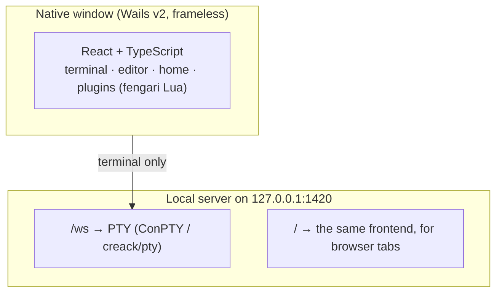
```mermaid
flowchart TB
    subgraph WIN["Native window (Wails v2, frameless)"]
        UI["React + TypeScript<br>terminal · editor · home · plugins (fengari Lua)"]
    end
    subgraph SRV["Local server on 127.0.0.1:1420"]
        WS["/ws → PTY (ConPTY / creack/pty)"]
        WEB["/ → the same frontend, for browser tabs"]
    end
    WIN -->|"terminal only"| WS
```

- `cmd/oxi` starts `internal/wailsapp`, which opens the window, serves
  the embedded frontend to it, and exposes native calls (files, plugins,
  git, window size, clipboard, updates) as `window.go.wailsapp.App.*`.
- Wails' asset server can't carry WebSockets, so `internal/server`
  runs a loopback HTTP server for the PTY WebSocket and also serves the
  frontend, which is how `http://127.0.0.1:1420` works in a browser
  (next free port if 1420 is taken). It only accepts connections from
  the OXIS window and its own origin, so other websites can't reach your
  shell.
- `internal/pty` starts the shell (`OXIS_SHELL` overrides the choice),
  keeps colour and style codes but strips other escape sequences, and
  keeps UTF-8 characters intact across reads. The frontend renders the
  colours with the theme's terminal palette (`terminal/ansi.ts`).
  Carriage-return progress bars and spinners update in place.
  Full-screen programs (vim, htop) aren't supported.
- In the browser, the frontend has no native file access, so the editor
  and anything file-based need the desktop app.

```
cmd/oxi/                 entry point, Windows version info and icon
internal/wailsapp/       window, native bindings, self-update, window size
internal/server/         loopback HTTP + PTY WebSocket
internal/pty/            ConPTY (Windows) and creack/pty (Linux) sessions
internal/update/         update check against GitHub
frontend/src/App.tsx     app shell: terminal, prompt, editor, home, commands
frontend/src/terminal/   output model, history, keybinds, themes, workspaces, trackers
frontend/src/plugins/    Lua runtime and API, plugin manager, Market, git, backup
cloudflare/              Market website, index.json and free plugins
scripts/                 build, dev, setup, installer, clean-install
npm/                     npm launcher package (downloads the prebuilt binary)
```

---

## Building and CI

`.github/workflows/build.yml` runs on every push and pull request to
`main`:

| Job | Output |
|---|---|
| `build-linux` (ubuntu-latest) | `oxis`, `.deb`, portable `.tar.gz` |
| `build-windows` (windows-latest) | `.msi` and bare `oxis.exe` |
| `publish-release` (pushes to `main` only) | both of the above, published together to the `latest-build` release |

Both build jobs also run the Go tests (`go test ./internal/...`), so the
process, file-watching and streaming code is tested on Windows and Linux.

Every build is stamped by `scripts/buildstamp.js` with its version,
commit, nearest release tag, build number and dates: into the binary
(`-ldflags -X`, package `internal/buildinfo`), which the updater relies
on, and into the page, which `'version` shows. Locally, `npm run build`
and `build-linux.sh` do the same. Bumping `version` in `package.json`
makes CI tag the first build of `main` that carries it as
`v<version>`.

Replacing the release's files starts GitHub's download counts from
zero, so `publish-release` first saves the count so far in a comment in
the release notes (`<!-- downloads: … -->`; leave it in place if you
edit them). The website and the README's downloads badge (the site's
`/downloads` endpoint) add the current files' downloads to it.

---

## Contributing

See [CONTRIBUTING.md](CONTRIBUTING.md). Bug reports and pull requests
are welcome on [GitHub](https://github.com/oxlaboratory/oxis).

## License

OXIS is licensed under the [Apache License 2.0](LICENSE).

---

*OXIS — terminals were the beginning.*
